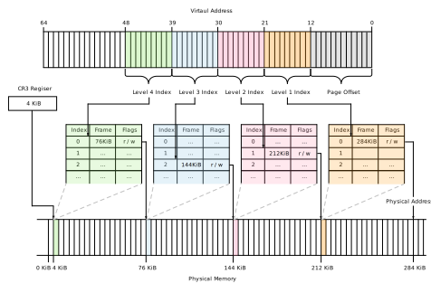
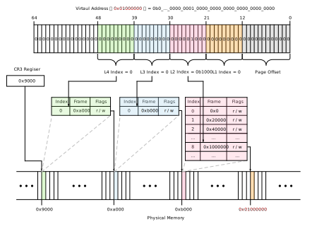

# Setup registers of vCPU

In this document, we will describe the configuration of vCPU registers. While registers are commonly discussed collectively, there are various types of registers, making it complex to determine how to set each of them. The content related to registers explained in this document focuses solely on the aspect of starting a virtual machine (VM). Additionally, as we want to boot the Guest OS in 64-bit mode, we will briefly explain some settings required for transitioning to 64-bit mode and the associated paging.

## Setup vCPU general-purpose registers

Configuration of the vCPU's general-purpose registers can be done through the KVM `set_regs` API. For this example, we will set the values of the registers as follows (detailed explanations of each register are omitted):

| Register | Value                                 | Meaning                                         |
|----------|---------------------------------------|-------------------------------------------------|
| RFLAGS   | 2                                     | The bit at 0x02 must be set as a reserved bit   |
| RIP      | KERNEL START ADDRESS (`0x0100_0000`)  | Address of the entry point obtained from the ELF |
| RSP      | BOOT STACK POINTER (`0x8ff0`)         | Address of the Stack Pointer used during boot   |
| RBP      | BOOT STACK POINTER (`0x8ff0`)         | Set to match RSP before boot processing         |
| RSI      | `boot_params` ADDRESS (`0x7000`)      | Address where `boot_params` information is stored |

The RIP should store the instruction start address when the vCPU is launched. In this case, we specify the address of the kernel's entry point. Since we plan to execute in 64-bit Long Mode, RIP's address will be treated as a virtual memory address. However, to implement Paging with Identity Mapping, the virtual memory address will be equal to the physical memory address. For RSP and RBP, we put the addresses necessary for the boot stack. These values can be obtained from available memory. RSI should contain the address where the `boot_params` structure is stored. ToyVMM is created by mimicking Firecracker's values, so the address values stored in RSP, RBP, and RSI are mimicked from Firecracker.

## Setup vCPU special registers

Configuration of vCPU special registers can be done through the KVM `set_sregs` API. In this section, we will focus on the registers that are actually configured while briefly mentioning the background. The following explanations may introduce some unfamiliar terms. If you encounter such terms, please take the time to look them up.

#### IDT (Interrupt Descriptor Table)

The [IDT (Interrupt Descriptor Table)](https://wiki.osdev.org/Interrupt_Descriptor_Table) is a data structure that holds information about interrupts and exceptions in Protected Mode and Long Mode. Originally, in Real Mode, there was the Interrupt Vector Table (IVT), which served the purpose of informing the CPU where the Interrupt Service Routines (ISRs) were located. In other words, it held handlers for each interrupt or exception, allowing the system to determine which handler to invoke when they occurred.

In Protected Mode and Long Mode, the address representation is different from Real Mode, so IDT is a mechanism that provides similar capabilities but adapted to these modes. The IDT is a table with a maximum of 255 entries, and the IDT's address needs to be set in the IDTR register. When an interrupt occurs, the CPU references the IDT from the IDTR value and executes the specified interrupt handler.

According to the [64-bit Boot Protocol](https://docs.kernel.org/x86/boot.html#id1), interrupts should be set to "Disabled." Therefore, the IDT-related configuration is omitted in the ToyVMM (Firecracker) implementation, and we won't delve into the details of the IDT here.

#### Segmentation, GDT (Global Descriptor Table), LDT (Local Descriptor Table)

Before discussing GDT, let's briefly introduce segmentation. Memory segmentation is a memory management method where programs and data are managed in variable-sized blocks called segments. Segments are groups of information categorized by attributes in memory, and they are one of the memory management methods used to implement virtual memory and memory protection. In Linux, segmentation is used in conjunction with paging, assuming a flat memory model. For the rest of this discussion, we will proceed with this assumption.

The [GDT (Global Descriptor Table)](https://wiki.osdev.org/Interrupt_Descriptor_Table) is a data structure used to manage memory segments. This structure closely resembles the IDT. The GDT is a table with multiple entries called Segment Descriptors, and the GDT's address needs to be set in the GDTR register. The entries in this table are accessed by the Segment Selector, and they provide information about which address range is covered, what operations are allowed in that region, and other details. The Segment Selector appears in Segmentation Registers and the format of each Entry in the IDT, such as the Gate Descriptor and Task State Segment. We will omit detailed explanations here, so please research further if needed.

The [LDT (Local Descriptor Table)](https://wiki.osdev.org/Local_Descriptor_Table) is a data structure used to manage segments, similar to GDT. However, LDT can be held separately for each task or thread, distinguishing it from GDT. Having a separate GDT descriptor for each task allows segments to be shared among a task's own programs while keeping them separate from segments used by different tasks, enhancing security between tasks. Since LDT is not relevant to this implementation, we will also skip detailed explanations about it.

### GDT setup for 64-bit mode

As specified in the [64-bit Boot Protocol](https://docs.kernel.org/x86/boot.html#id1), in 64-bit mode, each Segment Descriptor must be set up as a 4G flat segment. Code and Data Segments should be assigned the appropriate permissions. The [Global Descriptor Table](https://wiki.osdev.org/Global_Descriptor_Table) indicates that in 64-bit mode, base and limit are essentially ignored, and each Descriptor covers the entire linear address space, except for the flags. Therefore, it seems that the values for flags other than the flags are not critical. Nonetheless, in this example, explicit setup is done to ensure a flat segment. Additionally, it is mentioned that the values for `DS`, `ES`, and `SS` should be the same as `DS`, so this is implemented accordingly.

Subsequently, we will examine how these settings are configured in ToyVMM (you can read it as Firecracker). These settings are done in the `configure_seguments_and_sregs` function. To make it easier to understand, some comments have been added:

```rust
fn configure_segments_and_sregs(sregs: &mut kvm_sregs, mem: &GuestMemoryMmap) -> Result<(), RegError> {
    let gdt_table: [u64; BOOT_GDT_MAX as usize] = [
        gdt::gdt_entry(0, 0, 0),            // NULL
        gdt::gdt_entry(0xa09b, 0, 0xfffff), // CODE
        gdt::gdt_entry(0xc093, 0, 0xfffff), // DATA
        gdt::gdt_entry(0x808b, 0, 0xfffff), // TSS
    ];
    // > https://wiki.osdev.org/Global_Descriptor_Table
    //
    //              55 52     47     40 39        31               16 15                0
    // CODE: 0b0..._1010_1111_1001_1011_0000_0000_0000_0000_0000_0000_1111_1111_1111_1111
    //              <-f->     <-Access-><---------------------------> <----- limit ----->
    // - Flags  : 1010      => G(limit is in 4KiB), L(Long mode)
    // - Access : 1001_1011 => P(must 1), S(code/data type), E(executable), RW(readable/writable), A(CPU access allowed)
    //   - 0xa09b of A,9,B represents above values
    //
    // DATA: 0b0..._1100_1111_1001_0011_0000_0000_0000_0000_0000_0000_1111_1111_1111_1111
    // - Flags  : 1100      => G(limit is in 4KiB), DB(32-bit protected mode)
    // - Access : 1001_0011 => P(must 1), S(code/data type), RW(readable/writable), A(CPU access allowed)
    //
    // TSS
    // - Flags  : 1000      => G(limit is in 4KiB)
    // - Access : 1000_1011 => P(must 1), E(executable), RW(readable/writable), A(CPU access allowed)
    //    - TSS requires to support Intel VT
    let code_seg = gdt::kvm_segment_from_gdt(gdt_table[1], 1);
    let data_seg = gdt::kvm_segment_from_gdt(gdt_table[2], 2);
    let tss_seg = gdt::kvm_segment_from_gdt(gdt_table[3], 3);

    // Write segments
    write_gdt_table(&gdt_table[..], mem)?;
    sregs.gdt.base = BOOT_GDT_OFFSET as u64;
    sregs.gdt.limit = mem::size_of_val(&gdt_table) as u16 - 1;

    write_idt_value(0, mem)?;
    sregs.idt.base = BOOT_IDT_OFFSET as u64;
    sregs.idt.limit = mem::size_of::<u64>() as u16 - 1;

    sregs.cs = code_seg;
    sregs.ds = data_seg;
    sregs.es = data_seg;
    sregs.fs = data_seg;
    sregs.gs = data_seg;
    sregs.ss = data_seg;
    sregs.tr = tss_seg;

    // 64-bit protected mode
    sregs.cr0 |= X86_CR0_PE;
    sregs.efer |= EFER_LME | EFER_LMA;
    Ok(())
}
```

In the above code, a table with 4 entries is created as the GDT to set up. The first entry must be Null as required by the GDT. For the rest, it can be seen that settings for the CODE Segment, DATA Segment, and TSS Segment are made for the entire memory region.
The TSS setting is done to meet the requirements of Intel VT, and it's not substantially used within the scope of this document.

Now, when creating this GDT, a function called `gdt_entry` is called to create each entry. Here's the code for this function:

```rust
pub fn gdt_entry(flags: u16, base: u32, limit: u32) -> u64 {
    ((u64::from(base) & 0xff00_0000u64) << (56 - 24))
        | ((u64::from(flags) & 0x0000_f0ffu64) << 40)
        | ((u64::from(limit) & 0x000f_0000u64) << (48 - 16))
        | ((u64::from(base) & 0x00ff_ffffu64) << 16)
        | (u64::from(limit) & 0x0000_ffffu64)
}
```

For this function, all entries have `0x0` as the base and `0xFFFFF` (`2^5 = 32-bit = 4GB`) as the limit, which makes it a flat segmentation. The `flags` argument for each entry is configured individually, which in turn corresponds to the values in GDT's `Flags` and `AccessByte`. If you look at the comments in the code, you can see the values returned by `gdt_entry` for each entry and what those values represent when parsed. According to the comments, as required by the [64-bit Boot Protocol](https://docs.kernel.org/x86/boot.html#id1), the CODE Segment has Execute/Read permission and the "long mode (64-bit code segment)" flag, while the DATA Segment has Read/Write permission.

The GDT created as mentioned above is written to GuestMemory using the `write_gdt_table` function, and the starting address of that is stored in `sregs.gdt.base`.

Regarding the subsequent IDT settings, as mentioned earlier, it appears to be disabled. Therefore, nothing is written to memory. However, the code decides on which address in GuestMemory to use and stores that address in `sregs.idt.base`.

Continuing, other register values are set. As mentioned earlier, `CS` is set with information about the CODE Segment, and `DS`, `ES`, `SS` are set with information about the DATA Segment, while `TR` is set with information about the TSS Segment. In the code above, `FS` and `GS` are also set with information about the DATA Segment, but these segment values may not need to be configured.

Finally, settings are made for CR0 and EFER registers, which will be explained later.

### 64-bit protected mode

The `Long mode` is the native mode for x86_64 processors, offering several additional features compared to the legacy x86 mode. However, we won't go into the details of these additional features here. `Long mode` consists of two submodes: `64-bit mode` and `compatibility mode`.

To switch to 64-bit mode, you need to perform the following steps:

1. Set `CR4.PAE` to enable Physical Address Extension (PAE).
2. Create the Page Table and load the address of the top-level page table into `CR3` register.
3. Set `CR0.PG` to enable Paging.
4. Set `EFER.LME` to enable Long Mode.

Setting the values in the registers involves updating the corresponding fields in the `kvm_sregs` structure and then configuring them using `set_sregs`. The key part is creating the Page Table.

#### 4-Level Page Table for entering 64-bit mode

The processes related to booting the Linux Kernel are categorized into several stages based on the available memory address space. Immediately after booting, the process of setting up and interacting with physical memory addresses is known as `x16 Real-Mode`, which operates in a 16-bit memory alignment.

On the other hand, as many readers are aware, familiar operating systems like ours can be either 32-bit or 64-bit. These distinctions are made possible through a feature known as CPU mode switching, which transitions the CPU into modes called `x32 Protected Mode` and `x64 Long Mode`. Once switched to these modes, the CPU can only utilize virtual memory addresses.

Especially in the x64 CPU architecture, a 4-level page table is typically used to translate 64-bit virtual addresses into physical addresses. This means that before switching to `x64 Long Mode`, a 4-level page table must be constructed and conveyed to the CPU. This process is implemented as part of the BootLoader's functionality.

Now, another crucial point to consider is that while the RIP value currently contains the **physical address** value indicating the kernel's entry point, when handling it in `x64 Long Mode`, this address is used as a **virtual address**. Therefore, if this address were to be mapped to a different physical address, the OS would fail to boot.

Hence, at this stage, a simple page table is created where virtual memory addresses map to the same physical memory addresses. This is often referred to as Identity Mapping and addresses the issue mentioned above.

Note: It's important to note that the page table created by the BootLoader for x64 is a temporary requirement for executing the kernel. When we typically think of virtual memory addresses and page tables, we often associate them with user-space processes. However, the paging mechanism for user processes is implemented within the kernel and is configured when the kernel boots. Therefore, the mechanism for translating BootLoader's page table, whether it's Identity Mapping or not, has no impact on the paging mechanism for individual processes after the OS boots.

#### Page Table implementation in ToyVMM

Let's dive into the specific implementation of ToyVMM to understand the Page Table configuration better. This implementation closely follows that of Firecracker.


Let's briefly discuss the structure of the 4-Level Page Table. Essentially, at each level, there exists a table with its own designation:

Level 4: Page Map Level 4 (PML4)
Level 3: Page Directory Pointer Table (PDPT)
Level 2: Page Directory Table (PDT)
Level 1: Page Tables (PT)

Each table can hold 512 entities, and one entity consists of 8 bytes (64 bits).
Therefore, the entire table size is 512 (entities) * 8 (bytes per entity) = 4096 bytes.
This size conveniently fits into a single page (4KB).

The structure of each level's entity is as follows:


> Source: [x86 Initial Boot Sequence](https://alessandropellegrini.it/didattica/2017/aosv/1.Initial-Boot-Sequence.pdf) and [OSdev/Paging](https://wiki.osdev.org/Paging)

From the above, it seems that the setup should satisfy the following conditions:

1. Consider the data within CR3, which serves as the address of PML4, as ranging from bits 12 to 32+ in order to design the PML4 address.
2. To enable the PML4, set the 0th bit, and design the address of PDPT within the range of bits 12 to 32+.
3. To utilize the layout of PDPTE page directory, do not set the 7th bit of PDPTE, and design the address of PD within the range of bits 12 to 32+.
4. To allow 2MB pages in PDE, set the 7th bit and design the Physical Address within the range of bits 21 to 32+.
5. In Firecracker, it appears that 2MiB paging is implemented without using Level 1 Page Tables (i.e., without using 4KiB pages). ToyVMM's implementation follows suit.

Now, let's extract the actual code from the implementation based on the above.

```rust
fn setup_page_tables(sregs: &mut kvm_sregs, mem: &GuestMemoryMmap) -> Result<(), RegError> {
    let boot_pml4_addr = GuestAddress(PML4_START);
    let boot_pdpte_addr = GuestAddress(PDPTE_START);
    let boot_pde_addr = GuestAddress(PDE_START);

    // Entry converting VA [0..512GB)
    mem.write_obj(boot_pdpte_addr.raw_value() as u64 | 0x03, boot_pml4_addr)
        .map_err(|_| RegError::WritePdpteAddress)?;
    // Entry covering VA [0..1GB)
    mem.write_obj(boot_pde_addr.raw_value() as u64 | 0x03, boot_pdpte_addr)
        .map_err(|_| RegError::WritePdpteAddress)?;
    // 512 MB entries together covering VA [0..1GB).
    // Note we are assuming CPU support 2MB pages (/proc/cpuinfo has 'pse').
    for i in 0..512 {
        mem.write_obj((i << 21) + 0x83u64, boot_pde_addr.unchecked_add(i * 8))
            .map_err(|_| RegError::WritePdeAddress)?;
    }
    sregs.cr3 = boot_pml4_addr.raw_value() as u64;
    sregs.cr4 |= X86_CR4_PAE;
    sregs.cr0 |= X86_CR0_PG;
    Ok(())
}
```

As seen, the implementation is quite simple.

`PML4_START`, `PDPTE_START`, and `PDE_START` have hardcoded address values, which are `PML4_START=0x9000`, `PDPTE_START=0xa000`, and `PDE_START=0xb000`, respectively, meeting the requirements of the address designs mentioned above.

From the code, it's clear that there is only one `PML4` and one `PDPT` Table, and only the initial entry is set up. This is sufficient in this implementation because the kernel's address being translated by these page tables is `0x0100_0000`. These tables, specifically `PML4` and `PDPT`, will always look at the first entry (as described later), making this implementation suitable.

In `PML4`, the information about the starting address of `PDPT` is written by taking the logical OR of that address with `0x03`. Similarly, in `PDPT`, the starting address of `PD` is written by taking the logical OR of that address with `0x03`. The reason for using `0x03` here is to set the 0th and 1st bits of `PML4E` and `PDPTE`, which correspond to the R/W permission flag and the existence flag of that entry. These bits are essential in this case.

For `PD`, a loop is used to create 512 entries. It writes the value resulting from shifting the loop's index by 21 bits to the beginning of PD's address, every 8 bytes (1 entry size) from the starting address. The reason for using `0x83` here is to set the R/W permission flag, the existence confirmation flag, and the flag that determines whether to treat it as a 2MB page frame. This flag-setting allows using the value obtained by offsetting 21 bits from the index as the address (utilizing the layout of `PDE 2MB page` in the diagram). Therefore, for `PDE`, the entry at index 0 corresponds to an address of `0x0000_0000`, and the entry at index 1 corresponds to an address of `0x0010_0000`, and so on, based on the value from the loop described above.

Now, let's check whether the kernel's address stored in EIP (`0x0100_0000`) is correctly converted using the Page Table we just created! As mentioned earlier, when transitioning to `x64 Long Mode`, this kernel address is treated as a 64-bit virtual address. Currently, ToyVMM (and Firecracker) loads the kernel at physical address `0x0100_0000`, and this value is stored in the `eip` register.

Therefore, by treating `0x0100_0000` as a virtual address and using the conversion table mentioned above, we expect the result of the address translation to be `0x0100_0000`.

Let's calculate it explicitly. When converting a 64-bit virtual address with 4-Level Page Table, you split the lower 48 bits of the virtual address into groups of `9 + 9 + 9 + 9 + 12` bits each. These four groups of 9 bits are used as the index values for each Page table entry. You look up the layout of the identified entry in this way, then check the physical address of the next Page Table, and similarly determine the entry to be used in the next Page Table based on the physical address and virtual address. Continuing this process will eventually yield the desired physical address. Since Pages are at least 4KB in size, the address value is also in multiples of 4KB, so the final 12 bits of the virtual address serve as the offset (`2^12 = 4KB`).



Let's remember that in this case, we have set the flag in PDE to treat it as a 2MB page frame. In this scenario, the result obtained from PDE is used directly as the physical address mapping. The 9 bits that are not used for PTE are treated as an offset, adding up to a total offset of 21 bits when combined with the original 12 bits. This 21-bit offset corresponds to the 2MB size. Similarly, when you set the flag in PDPTE, it is treated as a 1GB page frame.

Based on the above discussion, let's convert `0x0100_0000`. In binary representation for clarity, it is `0b0..._0000_0001_0000_0000_0000_0000_0000_0000`. Following the virtual address conversion method, it breaks down as follows:

| Entry index for                     | Range of Virtual Address | Value           |
|-------------------------------------|--------------------------|-----------------|
| Page Map Level4 (PML4)              | 47 ~ 39 bit              | `0b0_0000_0000` |
| Page Directory Pointer Table (PDPT) | 38 ~ 30 bit              | `0b0_0000_0000` |
| Page Directory Table (PDT)          | 29 ~ 21 bit              | `0b0_0000_1000` |
| Page Tables (PT)                    | 20 ~ 12 bit              | `0b0_0000_0000` |
| -                                   | 11 ~ 0  bit (offset)     | `0b0_0000_0000` |

From this breakdown, you can see that the index values for `PML4E` and `PDPTE` are `0`, so you'll check the 64 bits directly from the beginning of each table. As implemented, `PML4E` at index 0 contains the address of `PDPT`, and `PDPTE` at index 0 contains the address of `PDT`. So, you follow this structure to reach `PDT`.

Now, the PDE's index value is `0b0_0000_1000` from the virtual memory address above, so you will check the 8th entry in `PDT`. The value stored in this entry for the 2MB Page frame area is `0b0...0000_1000`. Therefore, when you add the 21-bit offset to this value, you get `0b1_0000_0000_0000_0000_0000_0000 = 0x100_0000` as the resulting physical address after conversion. This matches the input virtual address.
Hence, even after the conversion, the kernel's entry point will still be pointed to, and the kernel will begin execution in 64-bit long mode.



It's worth noting that this Page Table, as designed in this implementation, effectively enables Identity Mapping in the range of `2^21 ~ 2^30-1`.

**Note**  
Upon revisiting the Page Table created this time, it's important to note that there is only one Entry for PML4 and PDPT. As a result, the virtual memory address range that can be targeted is at most `2^31 - 1`. If you go beyond this range, there would be cases where indices other than 0 are used for PML4E and PDPTE.

Additionally, in the PD's Entry, the 2MB page frame is enabled. Therefore, the lower 21 bits of the virtual memory address are treated as an offset. Furthermore, since the PDE's address design corresponds to an index, this Page Table effectively enables **Identity Mapping in the range of `2^21` to `2^30 - 1`**.

## What to do next?

Up to this point, it's possible to start a Guest VM just by combining the discussed concepts. However, in this state, the Guest VM can be started but cannot be interacted with, leaving the setup somewhat incomplete. To ensure that the started Guest VM is configured as expected and for further interactions, we need to create an interface to control the Guest VM. In the next chapter, we will discuss the use of `Serial` and how to implement it within ToyVMM to allow keyboard interactions after starting the Guest VM!

## References

- [The Linux/x86 Boot Protocol - 64-bit Boot Protocol](https://docs.kernel.org/x86/boot.html#id1)
- [Linux Insides: カーネル起動プロセス part4](https://postd.cc/linux-bootstrap-4/)
- [Global Descriptor Table (wiki)](https://wiki.osdev.org/Interrupt_Descriptor_Table)
- [Interrupt Descriptor Tabke (wiki)](https://wiki.osdev.org/Interrupt_Descriptor_Table)
- [Segmentation (wiki)](https://wiki.osdev.org/Segmentation)
- [Control register (wiki)](https://en.wikipedia.org/wiki/Control_register#CR3)
- [Long mode (wiki)](https://wiki.osdev.org/Segmentation)
- [x86 initial boot sequence](https://alessandropellegrini.it/didattica/2017/aosv/1.Initial-Boot-Sequence.pdf)
- [Virtual Memory - Intro to Paging Tables](https://back.engineering/23/08/2020/)
- [Writing an OS in Rust - Introduction to Paging](https://os.phil-opp.com/paging-introduction/)
- [Intel 64 and IA-32 Architectures Software Developer's Manual](https://www.intel.com/content/dam/support/us/en/documents/processors/pentium4/sb/25366821.pdf)
