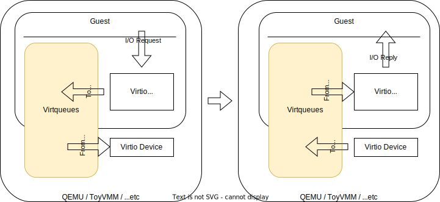

# Virtio

### What is Virtual I/O Device (Virtio)?

Virtio is a specification for virtual devices standardized by [OASIS](https://www.oasis-open.org/committees/tc_home.php?wg_abbrev=virtio). It provides a virtual device interface for efficient data transfer and communication between the host system and guest systems (virtual machines).

Based on Virtio, there are implementations like `virtio-net` (virtual network device) and `virtio-blk` (virtual block device). As their names suggest, these implementations mimic the behavior of network and block devices, allowing guest operating systems to perform I/O operations as if they were using real network and block devices.

Virtio is compatible with major virtualization technologies such as KVM and is supported by a wide range of guest operating systems, including Linux, Windows, and FreeBSD. As a result, it has become an industry-standard specification widely adopted in virtualization environments.

### Why is Virtio Necessary?

When it comes to generating I/O within a virtual machine (VM), how should the hypervisor handle it? First and foremost, the hypervisor needs to make the VM recognize the device at VM startup, which requires emulating various PCI devices. Additionally, when I/O is generated for those devices, the hypervisor must mimic the behavior of those devices. A well-known and widely used software for this kind of hardware emulation is [QEMU](https://www.qemu.org/).

The advantage of fully emulating real hardware using software is that you can use device drivers designed for physical hardware that come with the guest OS. However, this approach incurs significant overhead because it involves a VMExit each time an I/O request occurs within the VM. The hypervisor must perform emulation and then return control to the VM.

One proposed and standardized framework to reduce the overhead of virtualization in device I/O is `Virtio`. Virtio establishes a queue structure called `Virtqueue` in shared memory between the hypervisor and VM. This mechanism minimizes the number of mode transitions caused by VMExit. However, `Virtio` requires device drivers that is implemented for it, depending on the kernel build configuration. Many modern OS distributions come with Virtio device drivers installed by default.

### Components of Virtio

Virtio mainly consists of the following components:

* Virtqueue: A queue built in shared memory between the host and guest for performing data input and output.
* Virtio driver: The guest-side driver for Virtio-based devices.
* Virtio device: The host-side emulation of devices.

As depicted in the diagram, I/O requests initiated by the guest pass through Virtqueue to the host and responses are also mediated through Virtqueue back to the guest. Detailed behaviors and implementations will be discussed in the next section.

Additionally, when exposing Virtio devices to guests, it's possible to choose specific transport methods. The two common methods are "Virtio Over PCI Bus" which uses PCI (Peripheral Component Interconnect), and "Virtio Over MMIO Bus" which uses MMIO (Memory Mapped I/O). Guests have corresponding drivers such as `virtio-pci` and `virtio-mmio` for specific transports, along with Virtio drivers (`virtio-net`, `virtio-blk`) for particular device types.

In ToyVMM, we'll initially adopt `virtio-mmio` as the transport and proceed to implement Network devices for `virtio-net` and Block devices for `virtio-blk`.

### References

* [OASIS](https://www.oasis-open.org/committees/tc_home.php?wg_abbrev=virtio)
* [Virtio: An I/O virtualization framework for Linux](https://www.cs.cmu.edu/~412/lectures/Virtio_2015-10-14.pdf)
* [virtio: Towards a De-Facto Standard For Virtual I/O Devices](https://ozlabs.org/~rusty/virtio-spec/virtio-paper.pdf)
* [Introduction to VirtIO](https://blogs.oracle.com/linux/post/introduction-to-virtio)
* [Virtio on Linux](https://docs.kernel.org/driver-api/virtio/virtio.html)
