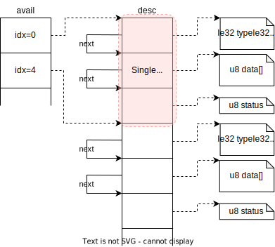

# Implement virtio-blk device

In this section, we will implement the Block device used by the guest's `virtio-blk`. The specification is similar to Virtio and is officially published by OASIS in the [Block Device](https://docs.oasis-open.org/virtio/virtio/v1.2/cs01/virtio-v1.2-cs01.html#x1-2170002) section. However, please note that this implementation may not be fully compliant with this specification.

Before proceeding with this section, make sure you have read the previous sections as the concepts introduced earlier will be used without further explanation here. Additionally, please read the [Implement virtio-net device](./03-3_virtio-net.md) from the previous section as this section may omit details that overlap with the `virtio-net` implementation.

### Mechanism of virtio-blk

In `virtio-blk`, a single Virtqueue is used to represent DISK Read/Write from the guest. Unlike `virtio-net`, there are no external factors (such as receiving data from Tap), and it is purely driven by I/O requests from the guest. Therefore, it operates with a minimum of one Virtqueue. Although the specification allows for scaling the number of Virtqueues, we have not implemented it for simplicity.

In the following sections, we will explain the implementation details based on code examples.

### Implementation Details of virtio-blk

The implementation of `virtio-blk` can be found in `block.rs`. The roles and relationships of various structures are shown in the following diagram:


As mentioned earlier, the concrete implementation depends on the specific device. However, it is abstracted by the `VirtioDevice` trait, so everything else, apart from the details of various device implementations, works the same as shown for `virtio-net`. Therefore, this diagram mostly resembles the internal details of the Block Device, with minor differences.

During initialization, queries such as `Device Type` and `Features` are responded to by the specific implementation of the `Block` device. Similar to the `Net` device, the addresses of the Virtqueue on the Guest's address space are set up and provided. Once the initialization steps are completed, the `activate` function is executed.

For the `Block` device, like the `Net` device, various file descriptors are registered with `epoll` during initialization. Handlers (`BlockEpollHandler`) are set up to be executed when `epoll` triggers, just like in the case of the `Net` device. In the `Block` device, to emulate I/O, a host-side file (to be operated as a `BlockDevice`) is opened, and read/write requests from the guest are performed on it. The file descriptors registered with `epoll` include an `eventfd` for the `Virtqueue` and another `eventfd` for stopping the system in case of unexpected situations, making a total of two file descriptors.
In comparison to the `Net` device, you can see that the Tap device has been replaced by a file, and the number of eventfds has changed. However, apart from these changes, there are no significant differences in the behavior.

For the `Block` device, a single Virtqueue is associated with the firing of an eventfd. Therefore, we will focus on this process in the following sections.

#### I/O Requests in virtio-blk

Before delving into the implementation details, let's explain the I/O requests in `virtio-blk`.

As mentioned earlier, `virtio-blk` handles I/O requests from the guest through a single Virtqueue. However, guest-originated I/O requests can be broadly categorized into two types: `Read` and `Write`, and the processing required for each of them is significantly different. The host must determine how to recognize these requests and emulate the I/O correctly.

To explain this, we need to understand how the `Descriptor Table` is used in `virtio-blk`. The data sent by the guest to Virtqueue follows the structure below:

> ```rust
> struct virtio_blk_req {
>         le32 type;
>         le32 reserved;
>         le64 sector;
>         u8 data[];
>         u8 status;
> };
> ```
> Source: [Block Device: Device Operation](https://docs.oasis-open.org/virtio/virtio/v1.2/cs01/virtio-v1.2-cs01.html#x1-2850006)

In practice, this is created as **three entries** in the `Descriptor Table`, with each entry being linked by the `next` field.

- The first `Descriptor` entry points to the addresses containing the `type`, `reserved`, and `sector` data.
- The second `Descriptor` entry points to the beginning of the data area where data is written.
- The third `Descriptor` entry points to the address where the `status` will be written by Host.

<div align="center">

</div>

The `type` field indicates the type of I/O (e.g., `read`, `write`, or other I/O requests). By examining this value, the host can determine how to behave differently.

In the case of a `read`, the second `Descriptor` entry points to the area where the host should store the data it reads from the Disk. The host can determine the sector to read from based on the `sector` value and read the necessary amount of data (`desc.len` of the second `Descriptor`).

In the case of a `write`, the second `Descriptor` entry contains the data that should be written to the Disk. The host reads the data and writes it to the sector specified by the `sector` value.

The third `Descriptor` entry is used to write status information, indicating whether the I/O was successful or failed.

In summary, the type of Disk I/O and the necessary data or buffers are provided through Virtqueue. It is the responsibility of the host to interpret this according to the specification, emulate the I/O correctly, and provide the appropriate status.

#### Implementation of Disk I/O in ToyVMM

Let's explain the guest-originated Disk I/O requests in the context of the implementation. Everything else is essentially the same as the `Tx` case of the `Net` Device, so let's start with the point where the processing is delegated to the host through `QueueNotify`.

Writing to MMIO's `QueueNotify` triggers an EventFd, which is picked up by `epoll` monitoring. Specifically, the handler for `QUEUE_AVAIL_EVENT` is executed. In practice, the `process_queue` function is called, and if its return value is `true`, the `signal_used_queue` function is called.
The `signal_used_queue` function simply sends an interrupt to the guest, so the important part to examine is the `process_queue` function.

In the `process_queue` function, the following steps are performed:

1. Initialize necessary variables:
   - `used_desc_heads[(u16, u32), 256]`: Stores the index and data length of processed `Descriptors`. This is used to populate the `used_ring` at the end of `process_queue`.
   - `used_count`: Keeps track of how many I/O requests from the guest have been processed.
2. Iterate through Virtqueue until it stops, repeating steps 2 to 4.
3. Retrieve the `Descriptor` pointed to by the `Available Ring`, parse it according to the `virtio-blk` specification, and create a `Request` structure. The `Request` structure contains parsed information such as request type, sector information, data address, data length, and status address.
4. Call the `execute` function, which performs the I/O request based on the content of the `Request` structure. For successful I/O, it returns the length of data read (for Read) or 0 (for Write and other types). This value is used to write to the `used_ring`.
5. Write the status (success or failure of I/O) to the status address and write necessary information to the `used_ring`.
6. If one or more requests have been processed, return `true` as the function's return value.

The following diagrams illustrate the process when the guest-originated I/O request is a Read:

<div align="center">

</div>

And here's the process when the guest-originated I/O request is a Write:

<div align="center">

</div>

### Verification of virtio-blk Operation

Now, let's perform a practical verification to demonstrate the functionality. Instead of using `initrd.img`, we will use an Ubuntu rootfs image similar to Firecracker, allowing us to boot the Ubuntu OS directly. With the implementation of the `virtio-blk` BlockDevice, we can recognize the Ubuntu rootfs image as `/dev/vda` in the VM. To boot from this Ubuntu image, we need to specify `root=/dev/vda` in the VM's kernel cmdline.

```
# Run ToyVMM with kernel and rootfs (no initrd.img)
$ sudo -E cargo run -- boot_kernel -k vmlinux.bin -r ubuntu-18.04.ext4
...

# You can verify that the launched VM is ubuntu-based.
root@7e47bb8f2f0a:~# uname -r
4.14.174
root@7e47bb8f2f0a:~# cat /etc/os-release
NAME="Ubuntu"
VERSION="18.04.1 LTS (Bionic Beaver)"
ID=ubuntu
ID_LIKE=debian
PRETTY_NAME="Ubuntu 18.04.1 LTS"
VERSION_ID="18.04"
HOME_URL="https://www.ubuntu.com/"
SUPPORT_URL="https://help.ubuntu.com/"
BUG_REPORT_URL="https://bugs.launchpad.net/ubuntu/"
PRIVACY_POLICY_URL="https://www.ubuntu.com/legal/terms-and-policies/privacy-policy"
VERSION_CODENAME=bionic
UBUNTU_CODENAME=bionic

# And you can also find that this VM mount /dev/vda as rootfs.

root@7e47bb8f2f0a:~# lsblk
NAME MAJ:MIN RM  SIZE RO TYPE MOUNTPOINT
vda  254:0    0  384M  0 disk /

root@7e47bb8f2f0a:~# ls -lat /
total 36
drwxr-xr-x 12 root root   360 Aug 14 13:47 run
drwxr-xr-x 11 root root  2460 Aug 14 13:46 dev
dr-xr-xr-x 12 root root     0 Aug 14 13:46 sys
drwxrwxrwt  7 root root  1024 Aug 14 13:46 tmp
dr-xr-xr-x 57 root root     0 Aug 14 13:46 proc
drwxr-xr-x  2 root root  3072 Jul 20  2021 sbin
drwxr-xr-x  2 root root  1024 Dec 16  2020 home
drwxr-xr-x 48 root root  4096 Dec 16  2020 etc
drwxr-xr-x  2 root root  1024 Dec 16  2020 lib64
drwxr-xr-x  2 root root  5120 May 28  2020 bin
drwxr-xr-x 20 root root  1024 May 13  2020 .
drwxr-xr-x 20 root root  1024 May 13  2020 ..
drwxr-xr-x  2 root root  1024 May 13  2020 mnt
drwx------  4 root root  1024 Apr  7  2020 root
drwxr-xr-x  2 root root  1024 Apr  3  2019 srv
drwxr-xr-x  6 root root  1024 Apr  3  2019 var
drwxr-xr-x 10 root root  1024 Apr  3  2019 usr
drwxr-xr-x  9 root root  1024 Apr  3  2019 lib
drwx------  2 root root 12288 Apr  3  2019 lost+found
drwxr-xr-x  2 root root  1024 Aug 21  2018 opt
```

As mentioned above, it can be seen that the VM is running the Ubuntu-based OS passed as /dev/vda, and after logging in, it is confirmed that it is an Ubuntu-based OS, and the rootfs is correctly mounted as intended. Furthermore, unlike the previous initrd.img, which had volatile rootfs, in this case, the rootfs persisted as a DISK is used for booting the VM, allowing files created within the VM to be retained across VM reboots.

```
# Create a sample file (hello.txt) in the first VM boot and reboot.

root@7e47bb8f2f0a:~# echo "HELLO UBUNTU" > ./hello.txt
root@7e47bb8f2f0a:~# cat hello.txt
HELLO UBUNTU
root@7e47bb8f2f0a:~# reboot -f
Rebooting.

# After the second boot, you can also find 'hello.txt'.  

Ubuntu 18.04.1 LTS 7e47bb8f2f0a ttyS0

7e47bb8f2f0a login: root
Password:
Last login: Mon Aug 14 13:57:27 UTC 2023 on ttyS0
Welcome to Ubuntu 18.04.1 LTS (GNU/Linux 4.14.174 x86_64)

 * Documentation:  https://help.ubuntu.com
 * Management:     https://landscape.canonical.com
 * Support:        https://ubuntu.com/advantage

This system has been minimized by removing packages and content that are
not required on a system that users do not log into.

To restore this content, you can run the 'unminimize' command.
root@7e47bb8f2f0a:~# cat hello.txt
HELLO UBUNTU
```

With the implementation of both `virtio-net` and `virtio-blk` devices, you have successfully created a minimal VM with the necessary functionality.

### Reference

* [OASIS](https://www.oasis-open.org/committees/tc_home.php?wg_abbrev=virtio)
* [Creating a Hypervisor](https://syuu1228.github.io/howto_implement_hypervisor/)
* [Self-Made VMM with virtio-blk Support](https://blog.bobuhiro11.net/2022/04-12-gokvm6.html)
* [OSDev.org - Virtio#Block_Device_Packets](https://wiki.osdev.org/Virtio#Block_Device_Packets)
