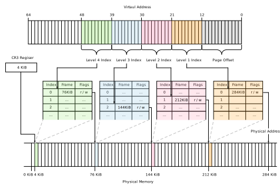

# Setup registers of vCPU

本稿では、vCPUのレジスタの設定について記載する。  
一口にレジスタと言ってもその種類は多岐に渡るため、それぞれどのレジスタをどう設定すると良いかを判断するのはかなり煩雑である。  
本稿で説明するRegisterに関わる内容はVMを起動するという側面にのみ焦点を置いた内容になっているので注意されたい。  
また、64-bit modeでGuest OSを起動したいので、64-bit modeに移行するためのいくつかの設定やその設定にまつわるPagingについても簡単に解説する。

## Setup vCPU general purpose registers

vCPUのgeneral purose registersは、KVMの`set_regs` APIを通してセットアップが可能である。  
今回は以下のようにレジスタの値を設定する。（レジスタ自体の詳細な説明は省く)  

| Register | Value                                 | Meaning                                         |
|----------|---------------------------------------|-------------------------------------------------|
| RFLAGS   | 2                                     | 0x02のbitは予約ビットで立てておかないといけない |
| RIP      | KERNEL START ADDRESS (`0x0100_0000`)  | ELFから取得したkernelのentry pointのアドレス    |
| RSP      | BOOT STACK POINTER (`0x8ff0`)         | BOOT時に利用するStack Pointerのアドレス         |
| RBP      | BOOT STACK POINTER (`0x8ff0`)         | BOOT処理実施前なのでRSPの値に合わせておく       |
| RSI      | `boot_params` ADDRESS (`0x7000`)      | `boot_param`の情報が格納されているアドレス      |

RIPはvCPU起動時の命令開始アドレスを格納する必要があり、今回はKernelのEntry Pointのアドレスを記載する。  
後述するが、`x64 Long Mode`を設定したCPUで実行するため、RIPのアドレスも仮想メモリアドレスとして扱われることになるが、Paging機構をIdentity Mappingで実装するため、`仮想メモリアドレス = 物理メモリアドレス`となり辻褄が合うことになる。  
RSP、RBPにはBootに必要なStackを格納するためのアドレスを入れておく。この辺りの値は空いている領域を使えば良い  
RSIには[64-bit Boot Protocol](https://docs.kernel.org/x86/boot.html#id1)にも記載がある通り、`boot_params`構造体が格納されているアドレスを渡しておく必要がある。
ToyVMMはFirecrackerの値を模倣して作成しているため、RSP、RBP、RSIに格納するaddress値はFirecrackerのものを模倣している。

## Setup vCPU special registers

vCPUのspecial registersは、KVMの`set_sregs` APIを通してセットアップが可能である。  
ここでは実際にセットアップをしているレジスタにのみ焦点を当てつつ、その背景についても簡単にではあるが触れながら確認していく。  
ここからの説明では、これまで話題に上げてこなかった単語なども出てくることになるだろう。これらを一つ一つ説明していてはキリがないため、知らない単語に遭遇したらご自身で確認してほしい。

#### IDT(Interrupt Descriptor Table)

[IDT(Interrupt Descriptor Table)](https://wiki.osdev.org/Interrupt_Descriptor_Table)とは、Protected modeとLong Modeにおける割り込み、例外に関する情報を保持するデータ構造である。  
もともとReal ModeではIVT（Interrupt Vector Table）というものが存在しており、これはISR(Interrupt Service Routine)がどこにあるかをCPUに対して教える役割を持っていた。  
要するに各割り込みや例外に対するハンドラを保持しており、それらが発生したとき、どのハンドラを起動すればいいか決定できるテーブルであった。  

Protected modeやLong modeになるとRead Modeとは異なるアドレス表現になるため、それに対応した同様の能力をもつ機構がIDTである。  
IDTは最大255 Entryのテーブルであり、IDTのアドレスをIDTRレジスタに設定する必要がある。割り込みが発生した際、CPUはIDTRの値からIDTを参照し、指定された割り込みハンドラを実行する。  

[64-bit Boot Protocol](https://docs.kernel.org/x86/boot.html#id1)での要求を確認すると、Interruptの設定はDisabledでなくてはならないという。
それに伴い、IDTに関する設定はToyVMM(Firecracker)の実装の中では省略されている、IDTについての説明もここまでにとどめておく。

#### Segumentation, GDT(Global Descriptor Table), LDT(Local Descriptor Table)

GDTの話を始める前に、まずはSegumentationについて軽く導入しておく。  
メモリセグメンテーションはメモリ管理方式の一つであり、プログラムやデータをセグメントと呼ばれる可変なまとまりで管理する方式である。  
セグメントはメモリ空間上で情報の属性などによって分類されたグループであり、仮想記憶やメモリ保護機能を実現する方式の一つである。  
Linuxではフラットメモリを前提としたセグメンテーションとPagingを併用しているため、以降ではそれを前提として話を進める。

[GDT(Global Descriptor Table)](https://wiki.osdev.org/Interrupt_Descriptor_Table)は、メモリセグメントを管理するためのデータ構造である。  
このデータ構造はIDTのものと非常によく似通っている。
GDTはSegment Descriptorと呼ばれる複数のEntryを持つテーブルであり、GDTのアドレスをGDTRレジスタに設定する必要がある。  
このTableのエントリは、Segment Selectorによってアクセスされ、該当するアドレス領域はどこかという情報や、その領域ではどの様な操作が許可されているかなどの情報を得ることができる。
Segument SelectorはSegumentation RegistersやIDTの各EntryのフォーマットであるGate Descriptor、Task State Segumentなどの中に現れるものである。  
詳細については本稿では説明を省略しているため、気になった場合は調べてみてほしい

[LDT(Local Descriptor Table)](https://wiki.osdev.org/Local_Descriptor_Table)は、GDTと同様にメモリにアクセスするためのセグメントを管理するデータ構造であるが、タスクやスレッド毎にLDTを保有できるという点で違いがある。  
タスク毎にGDTに相当するディスクリプタを持たせることは、自身のプログラム、タスク間ではセグメントを共有しつつ、異なるタスクとはセグメントを分離することができるため、タスク間のセキュリティを高めることに寄与する。
LDTも今回の実装では関わってこない話なので、この詳細についてもここでは省略する。

### GDT setup for 64-bit mode

[64-bit Boot Protocol](https://docs.kernel.org/x86/boot.html#id1)にも記載がある通り、64-bit modeの場合はそれぞれのSegment descriptorは4G flat segmentとしてセットアップする必要があり、Code Segument、Data Segumentはそれぞれ適切な権限を付与する必要がある。
その一方[Gloabl Descriptor Table](https://wiki.osdev.org/Global_Descriptor_Table)を確認すると、64-bit modeの場合は基本的にbase, limitが無視され、各Descriptorは全体のリニアアドレススペースをカバーするという記載があるため、Flag以外についてはどの様な値を書いていてもよさそうではある。今回は念の為、明示的にflat segumentとしてセットアップを行った。
また、`DS`、`ES`、`SS`の値はDSと同一にする必要がある旨についても記載があるため、これに習って実装する。

以降では、ToyVMM(Firecrackerと読み替えていただいても差し支えない）の実装を参考にこれらがどの様に設定されているかを確認してみる。
この設定は`configure_seguments_and_sregs`関数で実施されている。説明をしやすくするために、一部コメントを追記している

```rust
fn configure_segments_and_sregs(sregs: &mut kvm_sregs, mem: &GuestMemoryMmap) -> Result<(), RegError> {
    let gdt_table: [u64; BOOT_GDT_MAX as usize] = [
        gdt::gdt_entry(0, 0, 0),            // NULL
        gdt::gdt_entry(0xa09b, 0, 0xfffff), // CODE
        gdt::gdt_entry(0xc093, 0, 0xfffff), // DATA
        gdt::gdt_entry(0x808b, 0, 0xfffff), // TSS
    ];
    // > https://wiki.osdev.org/Global_Descriptor_Table
    //
    //              55 52     47     40 39        31               16 15                0
    // CODE: 0b0..._1010_1111_1001_1011_0000_0000_0000_0000_0000_0000_1111_1111_1111_1111
    //              <-f->     <-Access-><---------------------------> <----- limit ----->
    // - Flags  : 1010      => G(limit is in 4KiB), L(Long mode)
    // - Access : 1001_1011 => P(must 1), S(code/data type), E(executable), RW(readable/writable), A(CPU access allowed)
    //   - 0xa09b of A,9,B represents above values
    //
    // DATA: 0b0..._1100_1111_1001_0011_0000_0000_0000_0000_0000_0000_1111_1111_1111_1111
    // - Flags  : 1100      => G(limit is in 4KiB), DB(32-bit protected mode)
    // - Access : 1001_0011 => P(must 1), S(code/data type), RW(readable/writable), A(CPU access allowed)
    //
    // TSS
    // - Flags  : 1000      => G(limit is in 4KiB)
    // - Access : 1000_1011 => P(must 1), E(executable), RW(readable/writable), A(CPU access allowed)
    //    - TSS requires to support Intel VT
    let code_seg = gdt::kvm_segment_from_gdt(gdt_table[1], 1);
    let data_seg = gdt::kvm_segment_from_gdt(gdt_table[2], 2);
    let tss_seg = gdt::kvm_segment_from_gdt(gdt_table[3], 3);

    // Write seguments
    write_gdt_table(&gdt_table[..], mem)?;
    sregs.gdt.base = BOOT_GDT_OFFSET as u64;
    sregs.gdt.limit = mem::size_of_val(&gdt_table) as u16 - 1;

    write_idt_value(0, mem)?;
    sregs.idt.base = BOOT_IDT_OFFSET as u64;
    sregs.idt.limit = mem::size_of::<u64>() as u16 - 1;

    sregs.cs = code_seg;
    sregs.ds = data_seg;
    sregs.es = data_seg;
    sregs.fs = data_seg;
    sregs.gs = data_seg;
    sregs.ss = data_seg;
    sregs.tr = tss_seg;

    // 64-bit protected mode
    sregs.cr0 |= X86_CR0_PE;
    sregs.efer |= EFER_LME | EFER_LMA;
    Ok(())
}
```

上記ではセットアップするGDTとして4 Entryを持つテーブルを作成している。
最初のEntryはGDTの要求としてNullでなければならないため、そのようなエントリを作成している。
それ以外は全体のメモリ領域に対して、CODE Segment、DATA Segment、TSS Segmentの設定を行なっていることが分かるだろう。  
TSSの設定はIntel VTの要求を満たすために設定されており、本資料の範疇では実質使用しない内容である。

さて、このGDTを作成する際に各エントリを作成する関数`gdt_entry`を呼び出しているが、この内容を以下に転載する。

```rust
pub fn gdt_entry(flags: u16, base: u32, limit: u32) -> u64 {
    ((u64::from(base) & 0xff00_0000u64) << (56 - 24))
        | ((u64::from(flags) & 0x0000_f0ffu64) << 40)
        | ((u64::from(limit) & 0x000f_0000u64) << (48 - 16))
        | ((u64::from(base) & 0x00ff_ffffu64) << 16)
        | (u64::from(limit) & 0x0000_ffffu64)
}
```

この関数の引数として、全てのエントリがbaseに`0x0`、limitに`0xFFFFF` (`2^5 = 32bit = 4GB`)を指定しているためフラットなセグメンテーションになっている。第一引数であるflagsについてはEntry毎に設定を行なっており、これが翻ってGDTの`Flags`や`AccessByte`の値に対応するようになる。  
実際にそれぞれのEntryを`gdt_entry`に与えた結果返却される値と、その値を解析した内容が上記コード上のコメントになっている。
コメントを確認すると、[64-bit Boot Protocol](https://docs.kernel.org/x86/boot.html#id1)で要求されていた通り、CODE SegumentにはExecute / Read permissionと、さらに`long mode (64-bit code segment)`のフラグが、DATA SegumentにはRead / Write permissionが付与されていることが分かる。
上記の通り作成したGDTを、`write_gdt_table`関数でGuestMemory上に書き込み、その先頭アドレスを`sregs.gdt.base`に残している。

後続するIDTの設定だが、上述した通りここはdisabledとなるようだ。そのためか、特に何もメモリ上に書き込んでない。ただしGuestMemory上のどの位置を利用するかについては決めてあり、そのアドレスを`sregs.idt.base`に残している。

引き続き、そのほかのレジスタ値を設定する。
上述した通り`CS`にはCODE segumentの情報を、`DS`, `ES`, `SS`にはData Segumentの情報を、`TR`にはTSS Segumentの情報を格納しておく。  
上記のコードでは`FS`, `GS`にもDATA Segumentの情報を書いているが、これらのセグメントの値はおそらく設定しなくても良い。

最後に、CR0やEFERレジスタの設定をしているがこの説明は後述する。

### 64-bit protected mode

`Long mode`とはx86_64プロセッサ用のネイティブモードであり、従来（`x86`）に比べていくつかの追加機能がサポートされているが、ここではこれらについて詳細には記載しない  
`Long mode`はさらに`64-bit mode`と`互換モード`の2つのサブモードから構成される。

64-bitモードに切り替えるには、以下の処理が必要になる

* CR4.PAEを設定し、物理アドレス拡張機構を有効化する
* Page Tableの作成、CR3レジスタへトップレベルページテーブルのアドレスを読み込む
* CR0.PGを設定し、Pagingの有効化する
* EFER.LMEを設定し、Long Modeの有効化する

レジスタ値の設定は`kvm_sregs`構造体のうち対応するものを更新し`set_sregs`で設定するだけであり、既に説明済みであるため同様に実施すれば良い。  
それ以外に重要な作業としてPage Tableの作成がある。
特に64-bit modeに移行するためには、4-Level Page Tableを構築する必要があるため、これに焦点をしぼって以降簡単にPagingについて説明をする。

#### 4-Level Page Table for entering 64-bit mode

これまで特に言及をしてこなかったが、Linux Kernelの起動に関わる処理は、利用できるメモリアドレス空間の違いによって何段階かに名称分けされている。
起動直後、物理メモリアドレスを直接触ってセットアップを進める処理は、`x16 Real-Mode`と呼ばれ、その名の通り16bitのメモリアラインメントで処理が進んでいく。  
一方、読者もよく知っている通り、我々の馴染みがあるOSは`32bit`であったり、`64bit`である。  
これらはCPUのモード切り替えと呼ばれる機能により、`x32 Protected Mode`、`x64 Long Mode`と呼ばれるモードに切り替えられるが、これらのモードに切り替えられた途端、CPUは仮想メモリアドレスしか利用できない状態になる。  
また、特にx64 CPUアーキテクチャでは基本的に`4-level page table`によって、64bit 仮想アドレスが物理アドレスに変換されることが期待される.
つまり、`x64 Long Mode`に切り替える前に`4-level page table`を構成してCPUに伝える必要があり、この処理はBootLoaderの機能の一部として実装される。

さてもう一つ重要な点としては、今`RIP`の値にはカーネルのエントリーポイントを示す**物理アドレスの値**が格納されているが、`x64 Long Mode`で取り扱う際にこのアドレスが**仮想アドレスの値として利用される**ため、別の物理アドレスに変換されてしまうとOSが起動できなくなってしまう。  
したがって、ここではまず仮想メモリアドレスが同じ物理メモリアドレスにマッピングされる簡単なページテーブル（これは特にIdentity Mappingと呼ばれる）を作成すること上記の問題に対応する

**Note**  
ここでBootLoaderが作成するPage Tableはx64でカーネルを実行するために一時的に必要な処理であることに注意されたい。  
通常我々が仮想メモリアドレスやPage Tableと聞いた時に多くの場合に思い浮かべるのは、ユーザスペースのプロセスに対してのアドレスの話であるが、このユーザプロセスに対するPagingの仕組みはカーネル内部に実装があり、カーネルの起動とともに構成されるものであるため、今回の話とは切り離して考えるべきである。  
つまり、このBootLoaderのpage tableの変換の仕組みがIdentity Mappingであろうがなかろうが、OS起動後の各プロセスに対するPagingの仕組みには影響がないということである。

#### Page Table implementation in ToyVMM

ここではToyVMMの実装を具体的に見ていきながら、Page Tableの構成について理解を深める。  
この実装はFirecrackerの実装を模倣しているため、実質的にFirecrackerの実装と読み替えていただいて問題ない。  

まずは、簡単に4-Level Page Tableの構造について議論しておく。基本的には以下の名称でLevel毎にTableが存在しそれぞれ名称分けされている。  

* Level 4: Page Map Level 4 (PML4)
* Level 3: Page Directory Pointer Table (PDPT)
* Level 2: Page Directory Table (PDT)
* Level 1: Page Tables (PT)

また、各Tableはそれぞれ512個のEntityを格納可能であり、一つのEntityは8byte（64bit）からなるため、Table全体としては`512(entity) * 8(byte/entity) = 4096(byte)`となる。これは1つのPage（`4KB`）にちょうど収まるサイズになっている。
それぞれのLevelのEntiryは以下のような構造になっている  
（引用元: [x86 Initial Boot Sequence](https://alessandropellegrini.it/didattica/2017/aosv/1.Initial-Boot-Sequence.pdf)、[OSdev/Paging](https://wiki.osdev.org/Paging)。64bitのうちHigh bitについては今回あまり重要ではないので紙面の都合上省略している）


上記から、以下の内容を満たしながらセットアップすればよさそうである。

* CR3のなかで、PML4のアドレスとして利用されるデータは12~32+bitになるため、これを考慮してPML4のアドレスを設計する
* PML4は有効化のために0bit目は1にセットし、12~32+bitにPDPTのアドレスを設計する
* PDPTE page directoryのレイアウトを利用するために、PDPTEの7bit目は立てず、12~32+bitのレンジにPDのアドレスを設計する
* PDEでは2MB pageを許可するため7bit目を立て、21~32+bitのレンジにPhysical Addressを設計する
    * Firecrackerでは、Level1 Page Tableを利用せず(= 4KiB pageを利用せず)、2MiB Pagingで実装しているようである。ToyVMMの実装もこれに倣う（2MiBページングは基本的に多くのCPUでサポートされている上、4KiBページングによるPage Tableの肥大化を伏せるためかと思われる）

さて、上記をもとに実際の実装部分のコードを抜粋する

```rust
fn setup_page_tables(sregs: &mut kvm_sregs, mem: &GuestMemoryMmap) -> Result<(), RegError> {
    let boot_pml4_addr = GuestAddress(PML4_START);
    let boot_pdpte_addr = GuestAddress(PDPTE_START);
    let boot_pde_addr = GuestAddress(PDE_START);

    // Entry converting VA [0..512GB)
    mem.write_obj(boot_pdpte_addr.raw_value() as u64 | 0x03, boot_pml4_addr)
        .map_err(|_| RegError::WritePdpteAddress)?;
    // Entry covering VA [0..1GB)
    mem.write_obj(boot_pde_addr.raw_value() as u64 | 0x03, boot_pdpte_addr)
        .map_err(|_| RegError::WritePdpteAddress)?;
    // 512 MB entries together covering VA [0..1GB).
    // Note we are assuming CPU support 2MB pages (/proc/cpuinfo has 'pse').
    for i in 0..512 {
        mem.write_obj((i << 21) + 0x83u64, boot_pde_addr.unchecked_add(i * 8))
            .map_err(|_| RegError::WritePdeAddress)?;
    }
    sregs.cr3 = boot_pml4_addr.raw_value() as u64;
    sregs.cr4 |= X86_CR4_PAE;
    sregs.cr0 |= X86_CR0_PG;
    Ok(())

}
```

見た通り実装はかなりシンプルである。  
`PML4_START`、`PDPTE_START`、`PDE_START`にはそれぞれアドレス値がハードコードされており、それぞれ`PML4_START=0x9000`、`PDPTE_START=0xa000`、`PDE_START=0xb000`となっていて、これは上記したそれぞれのアドレス設計の要求を満たしている。  
上記を見ると分かる通り、`PML4`及び`PDPT` Table自体は1つずつであり、Entryとしても最初のものしかセットアップしていない。これはこのページテーブルで変換されるカーネルのアドレスが、`0x0100_0000`であり、これを仮想アドレスとして扱った場合、詳しくは後述するが、`PML4`、`PDPT`は必ず最初のEntryを見ることになるためこの実装で十分である。  
PML4には、PDPTの先頭アドレス情報に0x03の論理和を取ったものを書き込み、PDPTにも同様にPDの先頭アドレス情報に0x03の論理和を取ったものを書き込む。
ここで0x03で論理和を取っている理由は、`PML4E`、`PDPTE`の0, 1bit目のフラグを立てるためであり、1bit目は共にR/W許可に関するフラグ、0bitは共に当該Entryの存在性に関してのフラグに該当するため今回のケースでは必須の処理である。  
PDは512 Entry分作成するためにループし、**ループのindexの値を**21bit shiftさせたものと0x83の論理和を取ったものを、PDの先頭アドレスから8byte毎(=1 Entry size毎）に書き込んでいる。  
ここで0x83で論理和を取っている理由は、前述しているR/W許可フラグ、存在性確認のフラグに加えて、2MBのpage frameとして扱うかどうかに関わるフラグを立てるためである。このフラグを立てることによって、21bit目からの値をアドレスとして取り扱う（図の「PDE 2MB page」のレイアウトを利用することになる）。したがって、**上述したループで格納したindex値を21bitオフセット（2^21 = 2MB）させた値がそのまま変換後の物理アドレス値に対応するとになる**ため、PDEとしてはindex=0のEntryは0を21bit offsetした値(= `0x0000_0000`)、index=1のEntryは1を21bit offsetした値(= `0x0010_0000`)というように変換されることになる。

さて、以降では上記で作成したPage Tableで、EIPに格納したkernelのアドレス（`0x0100_0000`）は正しく変換されるのか実際に計算して確かめてみよう！  
前述した通り、`x64 Long Mode`へ移行すると、このカーネルのアドレスは64bit仮想アドレスとして取り扱われることになる。今、ToyVMM（およびFirecracker）ではカーネルを物理アドレスの`0x0100_0000`に読み込んでおり、その値が`eip`レジスタに格納されている。
したがって、`0x0100_0000`を仮想アドレスとして扱い、上述した変換テーブルを用いてアドレス変換を行った結果、`0x0100_0000`になることを期待したい。  

では具体的に計算してみよう。64bit仮想アドレスを4-Level Page Tableで変換する場合は以下の図の様に仮想アドレスの下位48bitを`9 + 9 + 9 + 9 + 12`bit毎に分割し、4つの9bitを先頭からそれぞれ各Page tableのEntryのindex値として利用する。この方法で特定したEntryのレイアウトを確認して、次のPage Tableの物理アドレスを確認し、同様にその物理アドレスと仮想アドレスから得たEntryのindex値を元に次のPage Tableの対象のEntryを割り出す。これを続けると最終的に目的の物理アドレスを得ることができる。Pageは少なくとも4KB毎のサイズになっているため、アドレス値としても4KB毎の値になるため、仮想アドレスの最後の12bitはそのオフセット(`2^12 = 4KB`)として利用される。



今回はPDEで2MB page frameとして取り扱うフラグを立てていることを思い出してほしい。この場合はPDEから得られる結果をそのまま物理アドレスへのマッピングとして利用する。この時使われないPTEの9bit分はオフセットとして取り扱われ、元々の12bitと合わせて合計21bit分のoffsetを加えることになる。この21bitオフセットが2MBに対応していることになる。同様にPDPTEでフラグを立てていると1GB page frameとして扱われるという仕組みになっている。

上記の話をもとに、`0x0100_0000`を変換してみる。この値はわかりやすさのためにbitで表現すると`0b0..._0000_0001_0000_0000_0000_0000_0000_0000`である。これを仮想アドレス変換の方式に倣いbitを分解すると、以下の通りになる。

| Entry index for                     | Range of Virtual Address | Value           |
|-------------------------------------|--------------------------|-----------------|
| Page Map Level4 (PML4)              | 47 ~ 39 bit              | `0b0_0000_0000` |
| Page Directory Pointer Table (PTPT) | 38 ~ 30 bit              | `0b0_0000_0000` |
| Page Directory Table (PDT)          | 29 ~ 21 bit              | `0b0_0000_1000` |
| Page Tables (PT)                    | 20 ~ 12 bit              | `0b0_0000_0000` |
| -                                   | 11 ~ 0  bit (offset)     | `0b0_0000_0000` |

これを見ると分かる通り、`PML4E`、`PDPTE`用のindex値は`0`になるため、それぞれのTableの先頭アドレスから64bit確認することになる。
実装で確認した通り、index=0の`PML4E`には`PDPT`のアドレスが書かれており、index=0の`PDPTE`にはPDTのアドレスが書かれているため、`PDT`までは順当に辿り着く。
さて、今回PDEのIndex値は上記の仮想メモリアドレスから`0b0_0000_1000`なので`PDT`の中で8番目のEntryを確認することになるが、当該Entryの2MB Page frameの領域に書かれている値は実装から`0b0...0000_1000`であることが分かる。
したがって、この値に21bit offsetを加えた値である`0b1_0000_0000_0000_0000_0000_0000 = 0x100_0000`が変換により得られる物理アドレスであり、これは入力した仮想アドレスと一致している。
したがって、変換後もカーネルのエントリーポイントを指すことになり、64-bit long modeにシフトしてもカーネルを起動から処理が開始されることになる


**Note**  
今回作成したPage Tableを再考してみると、PML4、PDPT用のEntryは1つしか作っていないので、そもそも対象となる仮想メモリアドレス範囲はMaxでも`2^31 - 1`までの範囲になる(この領域を超える場合、PML4E、PDPTEとしてindexが0以外を指す場合が存在してしまう)
加えて、PDのEntryでは2MB page frameを有効化しているため、仮想メモリアドレスの下位21bitはOffsetとして取り扱われる。
その上で、PDEのアドレス設計をindexに対応付けているため、このPage Tableは **`2^21 ~ 2^30-1`の範囲でIdentity Mapping** になっている。


## What to do next?

実はここまでの話を組み合わせるだけで、Guest VMを起動すること自体は可能である。  
しかし、この状態ではGuest VMは起動できてもそれを操作することはできないという何とも片手落ちな状態になってしまう。  
起動したGuest VMが我々の想定した通りの設定になっているかなどを確認するためにも、Guest VMを操作するようなインターフェイスを作りたいところである。  
次の章ではこれを達成するために`Serial`について議論し、ToyVMMの中に実装することでGuest VMを起動後にキーボード操作できるようにする！  

## References

- [The Linux/x86 Boot Protocol - 64-bit Boot Protocol](https://docs.kernel.org/x86/boot.html#id1)
- [Linux Insides: カーネル起動プロセス part4](https://postd.cc/linux-bootstrap-4/)
- [Global Descriptor Table (wiki)](https://wiki.osdev.org/Interrupt_Descriptor_Table)
- [Interrupt Descriptor Tabke (wiki)](https://wiki.osdev.org/Interrupt_Descriptor_Table)
- [Segmentation (wiki)](https://wiki.osdev.org/Segmentation)
- [Control register (wiki)](https://en.wikipedia.org/wiki/Control_register#CR3)
- [Long mode (wiki)](https://wiki.osdev.org/Segmentation)
- [x86 initial boot sequence](https://alessandropellegrini.it/didattica/2017/aosv/1.Initial-Boot-Sequence.pdf)
- [Virtual Memory - Intro to Paging Tables](https://back.engineering/23/08/2020/)
- [Writing an OS in Rust - Introduction to Paging](https://os.phil-opp.com/paging-introduction/)
- [Intel 64 and IA-32 Architectures Software Developer's Manual](https://www.intel.com/content/dam/support/us/en/documents/processors/pentium4/sb/25366821.pdf)
