# SMP - Symmetric MultuProcessing

本資料は全て以下のコミットナンバーをベースとしている

* ToyVMM : 2795702addc5fe3d7d42f13a82c5487985237fc8
* Firecracker : 0c3c9fc6a5a7d0815a310c5d2e7624a0fe2118ac

また、議論のはじめにSMP実装の導入にあたって参考にさせてもらった素晴らしい資料について紹介しておく。
Nobuhiro Miki氏による[KVMを使った自作VMMのSMP対応](https://blog.bobuhiro11.net/2021/11-25-gokvm3.html)は本実装を行うにあたりFirecrackerのソースコードと合わせて大変参考にさせていただいた資料である。
Nobuhiro Miki氏はGolangによるVMM実装である[gokvm](https://github.com/bobuhiro11/gokvm)の作者でもあるため、もしGolangでVMMを実装することに興味がある方は確認してみると良いだろう。
本資料でも上記の資料の内容は一部参照させていただく。

本資料ではまず、SMPの話に入る前の基礎知識として、割り込み処理、割り込みコントローラの基礎について簡単に復習する。
その後にSMPについて詳細に議論していく。

## 割り込み（Interrupt）の復習

### 割り込みとは

割り込みとは、CPUが処理をしているプログラムの実行に、その名の通り「割り込んで」別のプログラムを実行させる仕組みである。
CPUはこの割り込みを受け取ると、実行しているプログラムを一旦停止し、その割り込みに対応する処理を実行する。この処理は基本的に事前定義されており、これを割り込みハンドラと呼ぶ。CPUは割り込みハンドラの処理を終了すると、停止していたプログラムを再開する。

割り込みには「ソフトウェア割り込み」と「ハードウェア割り込み」が存在するが、ここでは特に後者に着目する。基本的に以降「割り込み」と記載した場合は「ハードウェア割り込み」を指すものと思ってほしい。

割り込みについては検索すると多くの資料がでてくるため、もし読者が割り込みについて基礎知識を習得していない場合は自身で調べてみてほしい。

### 割り込みコントローラ

CPUの割り込み端子の数はCPUの種類、実装によって異なるものの、少なくとも一つ、もしくは複数用意される。
一方で周辺機器は基本的に複数存在するため、割り込み要求もそれらのデバイス数に合わせて増えていくことになる。

例えば実装として、一つの割り込みハンドラのみを用意し、全ての周辺機器からの割り込みについてそのハンドラで処理をするという形式にすると、ハンドラの実装の中でどの周辺機器からの割り込み要求かを判別する処理が必要になる。

PC/AT互換機などでは基本的に、ハードウェアとして複数のIRQ端子を用意し、割り込み要因毎に異なるハンドラに処理を移すことができるような形をとっており、この機能を持った回路のことを割り込みコントローラと呼ぶ。

#### PIC (Programmable Interrupt Controller)

割り込みコントローラの代表的な例として、ここでは[Intel 8259](https://ja.wikipedia.org/wiki/Intel_8259)を題材として取り上げる。
Intel 8259はProgrammable Interrupt  Controller（PIC）の一種であり、マルチプレクサの機能、CPUに割り込みをかけるために、複数の周辺機器からの割り込み処理を一つの割り込み出力に束ねる機能を持っている。この割り込みコントローラはIntel 8080時代から使用されているコントローラである。

Intel 8259は単体で8つのデバイスからの割り込み要求入力（IRQ0~7）に加え、一本の割り込み出力（INTR）、割り込みACK（INTA）、割り込みレベルや割り込みベクタオフセット用の通信ライン（D0-D7）を備えている。
更に、8259には3つのレジスタがあり、、、と霧がなくなるため、ひとまずはこのあたりで話を止めておく。
8259は大変有名なPICであり、調べるとたくさんの資料が出てくるので、詳細は各自調べてほしい。

以下の図は、よく取られるPICを2つカスケード接続してCPUに接続する構成である。
この構成では最大15個のデバイスから割り込みを受け付けることができる。

> 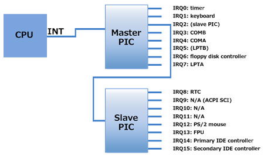
>
> Reference: [Linux/x86_64の割り込み処理 第一回 割り込みコントローラ](https://www.valinux.co.jp/technologylibrary/document/linux/interrupts0001/)

上記の図はあくまで単一CPUに対しての構成例であった。
さて、ではこれをベースにマルチプロセッサシステムを考えた場合に割り込みはどう考えればよいだろうか？

対処が必要な点としては、CPUが複数になる一方で周辺機器の数はかわらないということで、CPUが単一の場合は全ての割り込みをそのPCUに渡せば良いだけだったため話が単純だったが、複数CPUになると「どの割り込みをどのCPUで処理させるのか？」という新たな問題が浮上してくることになり、これに対応できるような仕組みが必要になってきた。
これが次に紹介し、また本資料の主題でもあるSMPとも深く関係のあるAPICである。

#### APIC (Advanced Programmable Interrupt Controller)

APICはIntelが開発したx86アーキテクチャにおける割り込みコントローラであり、マルチプロセッサシステムに対応するものになっている。

まず特徴的なのはAPICに２つ種類があることである。
単一のCPUにそれぞれ存在しているLocal APIC（LAPIC）とデバイスの割り込みを受け付けるI/O APICである。
LAPICとI/O APICはAPIC Busと呼ばれる線でつながっており、APIC間で割り込みの送受信を行えるようになっている。
PICでは単一CPUに対してデバイスの割り込みラインが直接つながっていたことがマルチプロセッサ化対応の上での問題だったため、PICの機能を分割しI/Oを受けるPICとCPUに対して割り込みをいれるPICを分けたような形、と考えると割と順当な変化と言えよう。

> 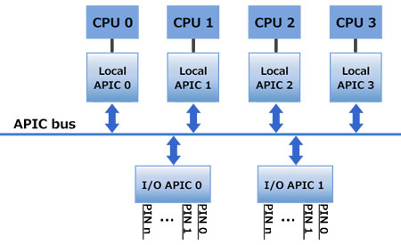
>
> Reference: [Linux/x86_64の割り込み処理 第一回 割り込みコントローラ](https://www.valinux.co.jp/technologylibrary/document/linux/interrupts0001/)

LAPICは、自身のCPUに対して届いた割り込みを受信し、自身のCPUに対して実際に割り込みをかける役割、及び他CPUに割り込みを送出したりする（IPI: InterProcessor Interrupt）役割を持っている。
I/O APICは当然ながらデバイスからの割り込みを受けて特定のLAPICにベクタなどを指定して送出する役割を持っている。I/O APICは増設することも可能になっている。

さて、ここまで簡単に割り込みの復習をしてきたが、つまるところマルチプロセッサ構成の場合はこのLAPIC・I/O APICなどの構成に関する理解が重要になってくるわけである。

## SMP (Symmetric MultiProcessing)

本題に入って、ToyVMMのマルチプロセッサ対応について話していく。

まずはマルチプロセッサ対応の話をする上で避けることのできないAPICに関わる話題として割り込みモードの話をし、その後に実際のマルチプロセッサ対応の根幹部分であるMP Configurationの話に移って行くことにする。

### Intel MultiProcessor Specification v1.4

今回の資料はマルチプロセッサシステムの仕様書である[Intel MultiProcessor Specification v1.4](https://pdos.csail.mit.edu/6.828/2008/readings/ia32/MPspec.pdf)に従った内容になっている。
以降の内容は上記の資料から必要最低限の情報をピックアップしたような形になっているため、より詳細を知りたい場合はこのSpecを参照されたい。

### PIC Mode, Virtual Wire Mode and Symmetric I/O Mode

MP specificationではAPICに対して以下の割り込みモードを定義している

* PIC Mode : 全てのAPICコンポーネントをバイパスし、システムをシングルプロセッサモードで動作させる。
* Virtual Wire Mode : APICをVirtual Wireとして利用するが、それ以外はPIC Modeと同様に動作させる。
* Symmetric I/O Mode : 複数プロセッサによるシステム動作を有効にする。

PIC ModeとVirtual Wire ModeはPC/AT 互換性を保つための割り込みモードであり、これらのいずれかについてシステムは実装している必要がある。
これらのモードでは、APICを標準のPICである8259A相当のPICと組み合わせて使用することにより、uniprocessor PC/ATと完全なDOS互換性が提供される。

一方、Symmetric I/O ModeはPIC Mode、もしくはVirtual Wire Modeに追加で実装されるものである。MP Operating Systemはいずれかのモード(PIC Mode or Virtual Wire Mode)で起動し、その後マルチプロセッサモードに移行するとSymmetric I/O Modeに切り替わる。

#### PIC Mode

PIC ModeではBSP(Bootstrap Processor）に到達する割り込み信号がMaster PIC（図中にある8259A-EQUIVALENT PICS）から来るか、Local APICからくるかを制御するIMCR（Interrupt Mode Configuuration Register）が存在しており、必要に応じて適切にAPICコンポーネントをバイパスできるような仕組みになっている。
図中の点線のラインをみると、Master PICからの割り込みラインがBSPに繋がるような構成になっており、これをIMCRでうまく制御するため、実質的に旧来の割り込み形式と同じ構成で動かすことができるわけである。
従って、PC/ATと同じハードウェア割り込みコンフィギュレーションを採用でき、互換性があるような形を保てている。


> 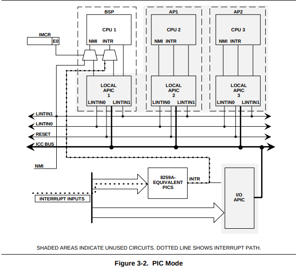
>
> Reference: Intel MultiProcessor Specification v1.4 - Figure 3-2. PIC Mode

Symmetric I/O Modeに遷移する前に、BIOSもしくはOSがIMCRの設定を変更しPIC Modeから切り替える必要がある。
今回はどちらかというと次に説明するVirtual Wire Modeの話が重要なので、PIC Modeにおける具体的なIMCRへの書き込み等に関する話についてはここでは省略する。気になる場合はSpecを参照してもらいたい。

#### Virtual Wire Mode

Virtual Wire ModeはPIC Modeとは異なり、下図のようにPICの割り込みラインがBSPのLocal APICのLINTIN0（Local Interrupt 0）を介してBSPへと配送される。
おそらく、直接的な配線ではなくLocal APICを通した仮想的な配線がなされるように設定をすることから、"Virtual Wire" Modeという名前がついているのだろうと思われる。

Virtual Wire Modeを実現するために、Local APICの設定をする必要がある。
すなわち、LINTIN0のピンはExtINT（External Interrupt）としてプログラムされ、8259-EQUIVALENT PICが外部割り込みコントローラとして機能することを指定する必要がある。
この場合は図からもわかるとおり、Virtual Wire Modeにおける割り込みは8259-EQUIVALENT PICからBSPに創出されるため、このMode中にはI/O APICは利用されない。

> 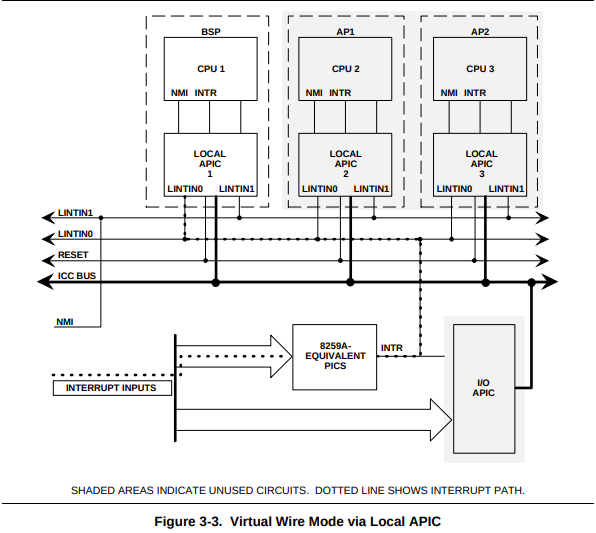
>
> Reference: Intel MultiProcessor Specification v1.4 - Figure 3-3. Virtual Wire Mode via Local APIC

一方で、下図に示すようにI/O APICをプログラムしてVirtual Wire Modeを実現する方式も存在するようである。
この場合、割り込み信号はI/O APICとLocal APICの両方を通過してBSPに配送されるような形になる。

> 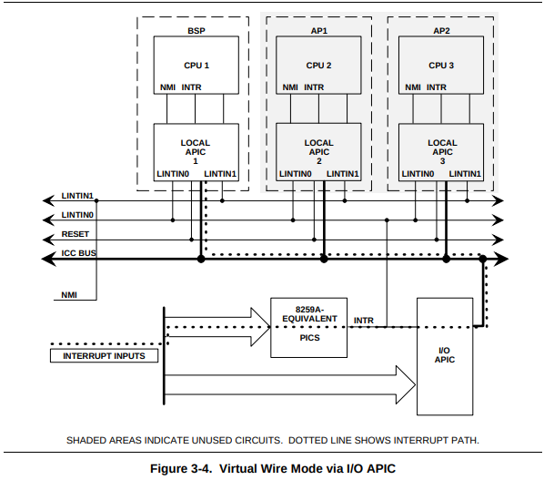
>
> Reference: Intel MultiProcessor Specification v1.4 - Figure 3-3. Virtual Wire Mode via I/O APIC

#### Symmetric I/O Mode

複数プロセッサでの動作を有効にするために、PIC ModeもしくはVirtual Wire Modeを経て、Symmetric I/O Modeに遷移する。
当然ながらこのモードでは少なくとも一つ以上のI/O APICが必要になり、I/O割り込みはI/O APICによって生成される。8259割り込みラインはマスクされるか、混合モードでI/O APICと一緒に動作することになる。

> 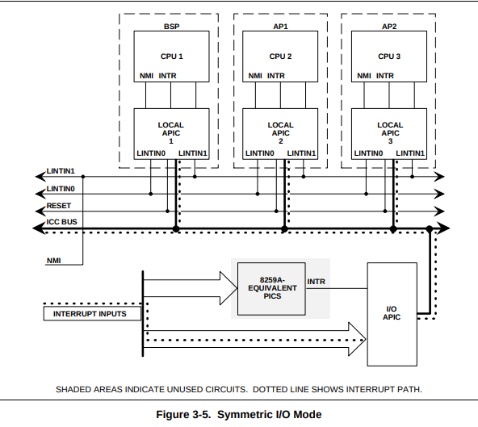
>
> Reference: Intel MultiProcessor Specification v1.4 - Figure 3-5. Symmetric I/O Mode

APIC I/Oユニットはgeneral-purpose interrupt inputを持っており、異なる動作モードで個別にプログラムできるようになっている。
I/O APIC interrupt lineの割り当てはシステムの実装に固有になっており、当然カスタムも可能である。
デフォルトの実装についてはSpecの5章、カスタムの方法についてはSpecの4章を参考にされたい。ここでは一旦省略とするが後ほどのMP Configurationの話のなかで、カスタムする話が一部出てくることになる。

#### Virtual Wire Mode setup in ToyVMM.

これまでの話をToyVMMの実装に絡めて考えてみる。

基本的に、PIC ModeやVirtual Wire Mode周りについてはBIOSが処理を行う領域であるため、ToyVMMとしてはこれらを適切に実装する必要がある。
SpecのAppendix. Aにはありがたいことに「System BIOS Programming Guidelines」という記載が存在しており、これを一部参考にさせてもらった。
ここではその内容のうち「A.3 Programming the APIC for Virtual Wire Mode」を参考に、ToyVMMに対してVirtual Wire Modeで割り込みモードを動作するように設定を入れていくことにした。

Virtual Wire Modeではまず、BSPのLocal APICの設定を行って"virtual wire"として動作させ、8259A-EQUIVALENT PICからのCPU割り込みをBSPまでバイパスするように設定する必要がある。

これには、以下の設定を実施する必要があるらしい。

* BSPのLocal APICのLINT0をEdge-Triggered ExitINT delivery modeに設定
* BSPのLocal APICのLINT1をLevel-Triggered NMI delivery modeに設定

各Local APICのLINTはどこに存在していて、どのように書き込みなどを実行すればよいかといった詳細については、Specの「Example A-1. Programming Local APIC for Virtual Wire Mode」にも記載があるが、より詳細の理解を伴うために、「[Intel 64 and IA-32 Architectures Software Developer's Manual Combined Volumes: 1, 2A, 2B, 2C, 2D, 3A, 3B, 3C, 3D, and 4](https://www.intel.com/content/www/us/en/developer/articles/technical/intel-sdm.html)」も参照した。

このIntel SDMの資料の「11.4 LOCAL APIC」と「11.5 HANDLING LOCAL INTERRUPTS」にLocal APIC、及びLocal Interruptに関するより詳細な仕様の記載がある。
流石に上記の資料は斜め読みしかしていないが、必要な情報としては概ね以下の２つ図にまとまっていた。

> 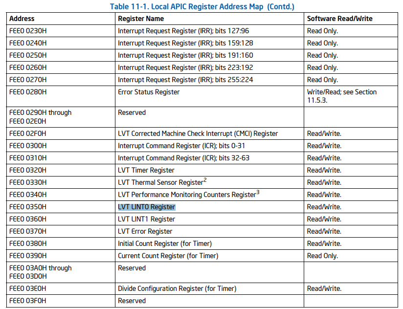
>
> Reference: Intel SDM - Table 11-1. Local APIC Register Address Map
>
> 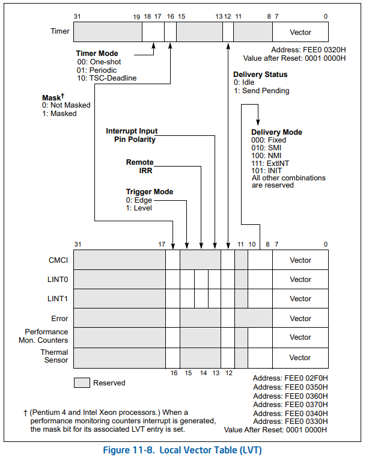
>
> Reference: Intel SDM - Local Vector Table (LVT)

Table 11-1を見てわかるとおり、Local APICのLINT0は0xFEE00350、LINT1は0xFEE00360に配置されているため、ここをベースとしてderivery modeの変更を加えることになる。
更に、Figure 11-8を見るとそれぞれのLINTアドレスをベースに8bitオフセットした位置から3bitでDelivery Modeが表現されることがわかる。NMIを設定する場合は0b100、ExtINTを設定する場合は0b111を書き込むと良さそうだ。

また、Edge/Level Triggerを設定する場合は、それぞれのLINTのアドレスの15bit目を変更することで制御できるようだ。
しかし、どうもBIOSのサンプルコードもFirecrackerのコードもこの部分に関しては特にいじっていないように見える。
今回は一旦Firecrackerを参考にLINT0, LINT1のDelivery Modeを変更するのみとした。

ToyVMMでの実装を以下に示す。これはFirecrackerの実装をそのまま引用させてもらっている。
以下のコードでは、LINT0、LINT1のアドレスオフセットを0x350、0x360として処理しているように見えるが、これは`vcpu.get_lapic`で取得してきた値（これは0xFEE00000が開始アドレスで、そこからLocal APIC分だけ読み出している値）に対して処理をしているからである。

```rust
// Defines poached from apicdef.h kernel header
const APIC_LVT0: usize = 0x350;
const APIC_LVT1: usize = 0x360;
const APIC_MODE_NMI: u32 = 0x4; // 0x4 = 0b100
const APIC_MODE_EXTINT: u32 = 0x7; // 0x7 = 0b111

fn get_klapic_reg(klapic: &kvm_lapic_state, reg_offset: usize) -> u32 {
    let range = reg_offset..reg_offset + 4;
    let reg = klapic.regs.get(range).expect("get_klapic_reg range");
    byte_order::read_le_i32(reg) as u32
}

fn set_klapic_reg(klapic: &mut kvm_lapic_state, reg_offset: usize, value: u32) {
    let range = reg_offset..reg_offset + 4;
    let reg = klapic.regs.get_mut(range).expect("set_klapic_reg range");
    byte_order::write_le_i32(reg, value as i32)
}

fn set_apic_delivery_mode(reg: u32, mode: u32) -> u32 {
    // !0x700 = 0b1000_1111_1111
    // (AND)    0bRRRR_RRRR_RRRR (reg)
    // --------------------------
    //          0bR000_RRRR_RRRR
    // (OR)     0b0MMM_0000_0000 (mode)
    // --------------------------
    //        = 0bRMMM_RRRR_RRRR (Write mode bits to 8~11 bit)
    ((reg) & !0x700) | ((mode) << 8)
}

// Configure LAPICs. LAPIC0 set for external interrupts. LAPIC1 is set for NMI
pub fn set_lint(vcpu: &VcpuFd) -> Result<(), InterruptError> {
    let mut klapic = vcpu.get_lapic().map_err(InterruptError::GetLapic)?;
    let lvt_lint0 = get_klapic_reg(&klapic, APIC_LVT0);
    set_klapic_reg(
        &mut klapic,
        APIC_LVT0,
        set_apic_delivery_mode(lvt_lint0, APIC_MODE_EXTINT),
    );
    let lvt_lint1 = get_klapic_reg(&klapic, APIC_LVT1);
    set_klapic_reg(
        &mut klapic,
        APIC_LVT1,
        set_apic_delivery_mode(lvt_lint1, APIC_MODE_NMI),
    );
    vcpu.set_lapic(&klapic).map_err(InterruptError::SetLapic)
}
```

ここまでの議論でBSPのLAPICの設定としてVirtual Wire Modeの設定を実施する話をした。
以降では、SMPの根幹であるMP Configuration Tableについての議論を行う。

#### MP Floating Pointer Table

ここからは具体的にMP Configurationの話に移っていく。

まず第一に、MP準拠システムでは「MP Floating Pointer Structure」の実装が必要になる。
システムがMPの仕様に準拠しているかどうかを判断するために、OSはこのMP Floating Pointer Structure構造体を以下の順序で検索する

1. 拡張BIOSデータ領域（EBDA）の最初の1キロバイト
2. EBDAセグメントが未定義の場合、システム・ベース・メモリの最後の1キロバイト内
3. In the BIOS ROM address space between 0F0000h and 0FFFFFh.

この構造が存在する場合、OSはそのシステムをはMP準拠のシステムであると解釈する。
この構造体は後述する「MP Configuration Table」への物理アドレスのポインタを格納していることを期待する。
MP Configuration Tableへのポインタがない場合はシステムのデフォルト設定が利用されるような挙動になるらしいが、その話はここでは省略する。

> 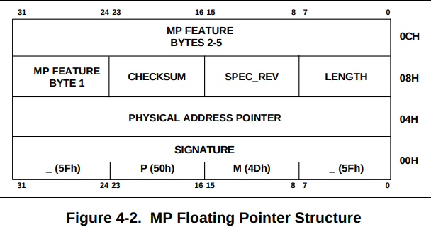
>
> Reference: Intel MultiProcessor Specification v1.4 - Figure 4-2. MP Floating Pointer Structure

以下に、MP Floating Pointer Structureの一部のフィールドについて記載する。
全てのフィールドについての詳細はSpecを参照されたい。

| Field                    | Offset<br>(in bytes:bits) | Length<br>(in bits) | Description |
|--------------------------|--------|--------|-----------------------------------------|
| Signature                | 0      | 32     | 検索キーとなる `_MP_` というASCII文字列 |
| Physical Address Pointer | 4      | 32     | MP Configuration Tableの先頭アドレス    |
| Length                   | 8      | 8      | Paragraph(16byte)単位の本テーブル長     |
| Spec Rev                 | 9      | 8      | サポートされるMP Specのバージョン       |
| Checksum                 | 10     | 8      | 完全なポインタ構造体のチェックサム      |

ToyVMMでの実装の観点から考えると、ゲストアドレスのEBDAの領域にこの構造を構築すれば良いことになる。
特にLinux Kernelでは、MP Floating Pointer Tableは`mpf_intel`という名称の構造体で定義されているため、これを利用してゲストOSのメモリにMP Floating Pointer Tableをセットアップすれば良い。

```rust
{
    let mut mpf_intel = mpspec::mpf_intel {
        signature: SMP_MAGIC_IDENT, // _MP_
        physptr: (base_mp.raw_value() + size) as u32, // phys addr for MP Configuration Table
        length: 1,
        specification: 4,
        ..mpspec::mpf_intel::default()
    };
    mpf_intel.checksum = mpf_intel_compute_checksum(&mpf_intel);
    // write mpf_intel to guest memory
    ...
}
```

#### MP Configuration Table

MP Configuration Tableは上述した、MP Floating Pointer TableのPhysical Address Pointerの値の先に格納されているデータ構造である。
MP Configuration TableをここではHeaderとEntriesの2種類に分けて議論する。

MP Configuration Table Headerはベースアドレスの最初に構築されるヘッダー部になる。  
上記のHeaderに続いて、MP Configuration Table Entryが続くが、このEntryには種類があり、その種類によってエントリの内容はもちろん、エントリ長も変わってくることになる。またエントリの数も任意の数になる。  
MP Configuration Table EntriesはBase sectionとExtended sectionに別れていると仕様書に記載があるが、今回の実装ではBase sectionの話しか出てこないので後者は省略する。

#### MP Configuration Table Header

MP Configuration Table Headerは以下のフォーマットになっている

> 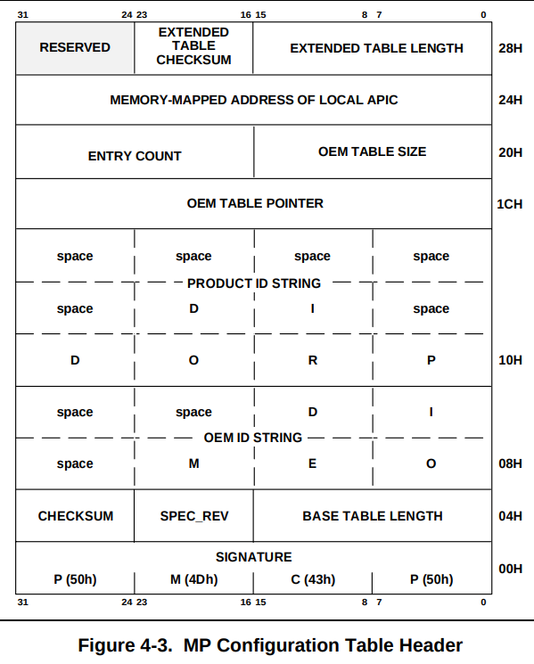
>
> Reference: Intel MultiProcessor Specification v1.4 - Figure 4-3. MP Configuration Table Header

以下に、MP Configuration Table Headerの一部のフィールドについて記載する。

| Field                    | Offset<br>(in bytes:bits) | Length<br>(in bits) | Description |
|--------------------------|--------|--------|-----------------------------------------------------|
| Signature                | 0      | 32     | テーブルの存在を示す `PCMP` というASCII文字列       |
| Base Table Length        | 4      | 16     | Configuration tableのバイト長                  |
| Spec Rev                 | 6      | 8      | MP Specのバージョン                                 |
| Checksum                 | 7      | 8      | Base configuration table全体のchecksum              |
| OEM ID                   | 8      | 64     | システムハードウェアの製造会社を示す文字列          |
| PRODUCT ID               | 16     | 96     | プロダクトファミリを示す文字列                      |
| Address of Local APIC    | 36     | 32     | 各CPUがLAPICにアクセスする際のベースアドレス        |

Linux Kernelではこのheaderは`mpc_table`という構造体に対応しているようである。  
Base Table Lengthに格納する値は、その後に続くConfiguration Tableのバイト長さになるが、これは前述したとおりエントリの種類と数が可変のため注意が必要である。ToyVMMの実装としてはこれらのエントリを作成したあとに、エントリ長の情報を埋めたこのHeaderをメモリ上に書き込む実装にしている。  
また、Specの「3.1 System Memory Configuration」の節にLocal APICのデフォルトのベースアドレスは`0xFEE0_0000`と記載があるためこれに従って設定する。

```rust
{
    let mut mpc_table = mpspec::mpc_table {
        signature: MPC_SIGNATURE, // PCMP
        length: table_end.unchecked_offset_from(table_base) as u16,
        spec: MPC_SPEC, // 4
        oem: MPC_OEM, // TOYVMM
        productid: MPC_PRODUCT_ID, // 0
        lapic: APIC_DEFAULT_PHYS_BASE, // 0xfee0_0000
        ..Default::default()
    };
    checksum = checksum.wrapping_add(compute_checksum(&mpc_table));
    mpc_table.checksum = (!checksum).wrapping_add(1) as i8;
    // write mpc_table to guest memory
    ...
}
```

#### Base MP Configuration Table Entries

上記のHeaderに続いて、MP Configuration Table Entryが続くが、このEntryには種類があり、その種類によってエントリの内容はもちろん、エントリ長も変わってくることになる。またエントリの数も任意の数になる。  

具体的に、MP Configuration Table Entryには以下の種別が存在する

| Entry Description          | Entry Type Code | Length | Commnets                              |
|----------------------------|-----------------|--------|---------------------------------------|
| Processor                  | 0               | 20     | One entry per processor               |
| Bus                        | 1               | 8      | One entry per bus                     |
| I/O APIC                   | 2               | 8      | One entry per I/O APIC                |
| I/O Interrupt Assignment   | 3               | 8      | One entry per bus interrupt source    |
| Local Interrupt Assignment | 4               | 8      | One entry per system interrupt source |

以降では、それぞれのEntryについての詳細を以下に記載していく。

**Processor Entry**

Processor entryのフォーマットは以下のような形になっている

> 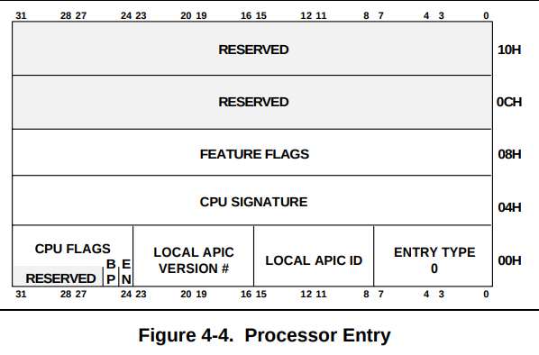
>
> Reference: Intel MultiProcessor Specification v1.4 - Figure 4-4. Processor Entry

以下に、Processor Entryのフィールドについて記載する

| Field                  | Offset<br>(in bytes:bits) | Length<br>(in bits) | Description |
|------------------------|--------|--------|-------------|
| ENTRY TYPE             | 0      | 8      | Processorエントリを示す0を入れる |
| LOCAL APIC ID          | 1      | 8      | そのプロセッサのLocal APIC ID    |
| LOCAL APIC Version     | 2      | 8      | APIC version register(Bits: 0-7) |
| CPU Flags:EN           | 3:0    | 1      | 0の場合はプロセッサを使わない    |
| CPU Flags:BP           | 3:1    | 1      | Bootstrapプロセッサとして設定    |
| CPU Signature STEPPING | 4:0    | 4      | SpecのTable 4-5を参照されたい    |
| CPU Signature MODEL    | 4:4    | 4      | SpecのTable 4-5を参照されたい    |
| CPU Signature FAMILY   | 5:0    | 4      | SpecのTable 4-5を参照されたい    |
| FEATURE FLAGS          | 8      | 32     | CPUの機能定義フラグ<br>SpecのTable 4-6を参照されたい |

Descriptionに記載している通り、CPUの詳細な情報についてはSpecの4-5, 4-6を参照されたい。
Linux KernelではこのEntryは`mpc_cpu`という構造体に対応しているようである。

ToyVMMのマルチプロセッサ対応にあたって、この`mpc_cpu`のエントリはCPUの個数分作ることになる。
Local APIC IDにはそのCPUの番号と同じ番号を割り当てることとした。
最初のCPUのセットアップ時のみCPU Flags:BPを立て、そのCPUをBootstrap Processor(BSP)として登録する。
CPU SigunatureとしてはSpecのTable4-5ではFeature processor向けになっているReservedな値を設定しておくことにする。
また、CPU Feature FlagとしてはFPU（On-chip Floating Point Unit）とAPIC（On-chip APIC）を有効にしておく。

```rust
{
    let size = mem::size_of::<mpspec::mpc_cpu>() as u64;
    for cpu_id in 0..num_cpus {
        let mpc_cpu = mpspec::mpc_cpu {
            type_: mpspec::MP_PROCESSOR as u8, // MP_PROCESSOR = 0
            apicid: cpu_id,
            apicver: APIC_VERSION, // 0x14=0b0001_0100
            cpuflag: mpspec::CPU_ENABLED as u8 // CPU_ENABLED = 1
                | if cpu_id == 0 {
                    mpspec::CPU_BOOTPROCESSOR as u8 // CPU_BOOTPROCESSOR = 2
                } else {
                    0
                },
            cpufeature: CPU_STEPPING, // 0b0110_0000_0000
            featureflag: CPU_FEATURE_APIC | CPU_FEATURE_FPU, // 0b0010_0000_0001
            ..Default::default()
        };
        // write mpc_cpu to guest memory
        ...
    }
}
```

**Bus Entry**

Bus entryのフォーマットは以下のような形になっている

> 
>
> Reference: Intel MultiProcessor Specification v1.4 - Figure 4-5. Bus Entry

以下に、Bus Entryのフィールドについて記載する

| Field                  | Offset<br>(in bytes:bits) | Length<br>(in bits) | Description |
|------------------------|--------|--------|----------------------------------|
| ENTRY TYPE             | 0      | 8      | Busエントリを示す1を入れる       |
| Bus ID                 | 1      | 8      | Bus ID (Bus毎にユニークな値)     |
| Bus Type String        | 2      | 48     | Busの種類を示す文字列(Table 4-8) |

Descriptionに記載している通り、Busの種類についてはSpecの4-8を参照されたい。
Linux KernelではこのEntryは`mpc_bus`という構造体に対応しているようである。
今回、BusはISAの種類のバスを1本のみ準備することした。

```rust
{
    let size = mem::size_of::<mpspec::mpc_bus>() as u64;
    let mpc_bus = mpspec::mpc_bus {
        type_: mpspec::MP_BUS as u8,
        busid: 0,
        bustype: BUS_TYPE_ISA,
    };
    // write mpc_bus to guest memory
    ...
}
```

**I/O APIC Entry**

I/O APIC entryのフォーマットは以下のような形になっている

> 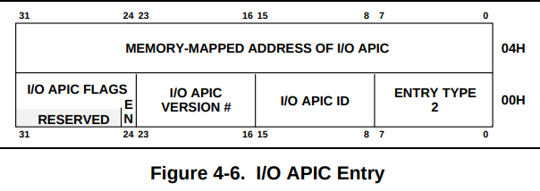
>
> Reference: Intel MultiProcessor Specification v1.4 - Figure 4-6. I/O APIC Entry

以下に、I/O APIC Entryのフィールドについて記載する

| Field                  | Offset<br>(in bytes:bits) | Length<br>(in bits) | Description |
|------------------------|--------|--------|-----------------------------------------|
| ENTRY TYPE             | 0      | 8      | I/O APIC エントリを示す2を入れる        |
| I/O APIC ID            | 1      | 8      | このI/O APICのID                        |
| I/O APIC Version #     | 2      | 8      | I/O APICのバージョンレジスタのBit (0-7) |
| I/O APIC FLAGS: EN     | 3:0    | 1      | 0の場合、このI/O APICは利用されない     |
| I/O APIC Address       | 4      | 32     | このI/O APICのベースアドレス            |

Linux KernelではこのEntryは`mpc_ioapic`という構造体に対応しているようである。
I/O APIC IDとしては、CPU Entryを作成するときにLAPICに割り振ったIDと被らないように、ID = Num of CPU + 1 とした。
Specの「3.1 System Memory Configuration」の節にI/O APICのデフォルトのベースアドレスは`0xFEC0_0000`と記載があるためこれに従って設定する。

```rust
{
    let size = mem::size_of::<mpspec::mpc_ioapic>() as u64;
    let mpc_ioapic = mpspec::mpc_ioapic {
        type_: mpspec::MP_IOAPIC as u8,
        apicid: ioapicid,
        apicver: APIC_VERSION, // 0x14=0b0001_0100
        flags: mpspec::MPC_APIC_USABLE as u8, // MPC_APIC_USABLE = 1
        apicaddr: IO_APIC_DEFAULT_PHYS_BASE, // 0xfec0_0000
    };
    // write mpc_ioapic to guest memory
    ...
}
```

**I/O Interrupt Assignment Entry**

このエントリは、各I/O APICの割り込み入力に接続されている割り込みソースを示す。
接続されているI/O APICの割り込み入力毎に1つのエントリが存在している。

> 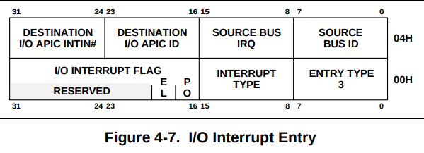
>
> Reference: Intel MultiProcessor Specification v1.4 - Figure 4-7. I/O Interrupt Entry

以下に、I/O Interrupt Assignment Entryのフィールドについて記載する

| Field                  | Offset<br>(in bytes:bits) | Length<br>(in bits) | Description |
|------------------------|--------|--------|---------------------------------------------|
| ENTRY TYPE             | 0      | 8      | I/O interrupt エントリを示す3を入れる       |
| Interrupt Type         | 1      | 8      | 以下のInterrupt Type ValueのTableを参照     |
| I/O Interrupt Flag: PO | 2:0    | 2      | Polarity of APIC I/O input signals(詳細はSpecを参照)|
| I/O Interrupt Flag: EL | 2:2    | 2      | Trigger of APIC I/O input signals(詳細はSpecを参照) |
| Source Bus ID          | 4      | 32     | 割り込み信号が来るバスのID                  |
| Source Bus IRQ         | 4      | 32     | Source busからの割り込み信号の識別子        |
| Dest I/O APIC ID       | 4      | 32     | 信号が接続されているI/O APICを識別する      |
| Dest I/O APIC INTIN#   | 4      | 32     | 信号が接続されているINTIN #n ピンを識別する |

また、Interrupt Typeに指定する、Interrupt Type Valueは以下のテーブルである。

| Interrupt Type | Description | Comments                                                                      |
|----------------|-------------|-------------------------------------------------------------------------------|
| 0              | INT         | 信号はベクタ割り込みである。<br>ベクタはAPICのredirection tableから供給される |
| 1              | NMI         | 信号はNon Maskable割り込みである                                              |
| 2              | SMI         | 信号はSystem Management割り込みである                                         |
| 3              | ExtINT      | 信号はベクタ割り込みである。<br>ベクタはexternal PICから供給される            |

Linux KernelではこのEntryは`mpc_intsrc`という構造体に対応しているようである。
ここではIRQ 0-23の全てを、そのままのIRQ番号で対応付けるよな設定をI/O APICに対して実施している。
BusとしてはBus Entryで設定したバス番号0（ISAバスとして設定しているもの）を指定し、I/O APICの番号もI/O APIC Entryで設定したものを指定している。

```rust
for i in 0..=u8::try_from(IRQ_MAX).map_err(|_| MptableError::TooManyIrqs)? { // IRQ_MAX = 23
    let size = mem::size_of::<mpspec::mpc_intsrc>() as u64;
    let mpc_intsrc = mpspec::mpc_intsrc {
        type_: mpspec::MP_INTSRC as u8,
        irqtype: mpspec::mp_irq_source_types_mp_INT as u8, // Interrupt Type = 0
        irqflag: mpspec::MP_IRQPOL_DEFAULT as u16, // irqflag = 0
        srcbus: 0,
        srcbusirq: i,
        dstapic: ioapicid,
        dstirq: i,
    };
    // write mpc_intsrc to guest memory
    ...
}
```

**Local Interrupt Assignment Entry**

このエントリは、各Local APICのローカル割り込み入力に接続されている割り込みソースを示す。

> 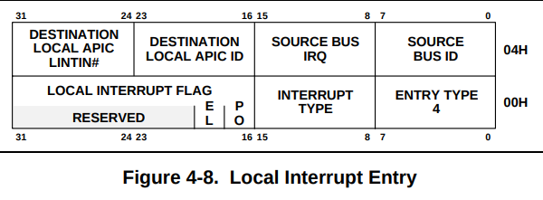
>
> Reference: Intel MultiProcessor Specification v1.4 - Figure 4-8. Local Interrupt Entry

以下に、Local Interrupt Assignment Entryのフィールドについて記載する

| Field                  | Offset<br>(in bytes:bits) | Length | Description                               |
| Field                  | Offset<br>(in bytes:bits) | Length<br>(in bits) | Description |
|------------------------|--------|--------|--------------------------------------------------------------|
| ENTRY TYPE             | 0      | 8      | Local interrupt エントリを示す4を入れる                      |
| Interrupt Type         | 1      | 8      | 前述したInterrupt Type ValueのTableを参照                    |
| I/O Interrupt Flag: PO | 2:0    | 2      | Polarity of APIC I/O local input signals（詳細はSpecを参照)  |
| I/O Interrupt Flag: EL | 2:2    | 2      | Trigger of APIC I/O local input signals                      |
| Source Bus ID          | 4      | 32     | 割り込み信号が来るバスのID                                   |
| Source Bus IRQ         | 4      | 32     | Source busからの割り込み信号の識別子                         |
| Dest Local APIC ID     | 4      | 32     | 信号が接続されているlocal APICを識別する。<br>0xFFの場合シグナルは全てのlocal APICsに接続される |
| Dest Local APIC INTIN# | 4      | 32     | 信号が接続されているINTIN #n ピンを識別する                  |

Linux KernelではこのEntryは`mpc_lintsrc`という構造体に対応しているようである。
FirecrackerやCrosVMではここのエントリを以下のように設定していたが、正直この設定については意図が掴みきれていないため今の自分の知識では説明できない。
もし詳細がわかったら追記することとするが、逆に詳しい人はIssueなどで教えてほしい。
実際のところ、このエントリ部分を消してもに問題なくOSは起動するし、複数プロセッサは利用できる。ただ、割り込みに関する設定なので確認が不十分である節は否めない。
ToyVMMではFirecrecker、CrosVMに習ってここは同じ実装を入れておくことにした。

```rust
{
    let size = mem::size_of::<mpspec::mpc_lintsrc>() as u64;
    let mpc_lintsrc = mpspec::mpc_lintsrc {
        type_: mpspec::MP_LINTSRC as u8,
        irqtype: mpspec::mp_irq_source_types_mp_ExtINT as u8,
        irqflag: mpspec::MP_IRQPOL_DEFAULT as u16,
        srcbusid: 0,
        srcbusirq: 0,
        destapic: 0,
        destapiclint: 0,
    };
    // write mpc_intsrc to guest memory
    ...
}
{
    let size = mem::size_of::<mpspec::mpc_lintsrc>() as u64;
    let mpc_lintsrc = mpspec::mpc_lintsrc {
        type_: mpspec::MP_LINTSRC as u8,
        irqtype: mpspec::mp_irq_source_types_mp_NMI as u8,
        irqflag: mpspec::MP_IRQPOL_DEFAULT as u16,
        srcbusid: 0,
        srcbusirq: 0,
        destapic: 0xFF,
        destapiclint: 1,
    };
    // write mpc_intsrc to guest memory
    ...
}
```

### ToyVMM Implementation

ToyVMMにおけるMPTableの実装は `src/vmm/src/arch/x86_64/mptable.rs` に存在している。
このコードを読み解くのは難しくはない。`setup_mptable`という関数の中でSpecificationにしたがってゲストメモリ上にMPTableの構造を作成していっているだけである。
更に、それぞれのエントリの内容についてはすでに上記で見てきたとおりであり、それを適切なアドレス位置に書き込んでいるだけなのでここでは特に説明することはないだろう。

加えて、各CPU毎にセットアップを実施したり、各CPU毎に`KVM_RUN`を実行するThreadを生成する必要があるがこれも軽微な修正なので特にここでは言及しない。

実際に上記の実装を終え、ToyVMMの起動時に渡す設定ファイルのCPUの数を増やすと、増やし多分のCPUを利用できるようになった。


```
$ cat examples/vm_config.json
{
        "boot-source": {
                "kernel_path": "./vmlinux.bin",
                "boot_args": "console=ttyS0 reboot=k panic=1"
        },
        "drives": [
                {
                        "path_on_host": "./ubuntu-18.04.ext4",
                        "is_root_device": true
                }
        ],
        "machine-config": {
                "vcpu_count": 2,
                "mem_size_mib": 2048,
                "track_dirty_page": false
        }
}

# VM起動
$ sudo ./build/release/toyvmm vm run --config examples/vm_config.json

# dmesgを抜粋するとMPTableを読み込んで複数CPUがセットアップできているのを確認できる。
[    0.000000] Intel MultiProcessor Specification v1.4
[    0.000000] MPTABLE: OEM ID: TOYVMM
[    0.000000] MPTABLE: Product ID: 000000000000
[    0.000000] MPTABLE: APIC at: 0xFEE00000
[    0.000000] Processor #0 (Bootup-CPU)
[    0.000000] Processor #1
[    0.000000] IOAPIC[0]: apic_id 3, version 17, address 0xfec00000, GSI 0-23
[    0.000000] Processors: 2
[    0.000000] smpboot: Allowing 2 CPUs, 0 hotplug CPUs

# VM起動後、内部で複数CPUが確認できる
root@7e47bb8f2f0a:~# cat /proc/cpuinfo | grep processor
processor       : 0
processor       : 1
```

## References

* [KVMを使った自作VMMのSMP対応](https://blog.bobuhiro11.net/2021/11-25-gokvm3.html)
* [Intel MultiProcessor Specification v1.4](https://pdos.csail.mit.edu/6.828/2008/readings/ia32/MPspec.pdf)
* [Intel 64 and IA-32 Architectures Software Developer's Manual Combined Volumes: 1, 2A, 2B, 2C, 2D, 3A, 3B, 3C, 3D, and 4](https://www.intel.com/content/www/us/en/developer/articles/technical/intel-sdm.html)
* [Local APICについて](https://mmi.hatenablog.com/entry/2017/03/27/202656)
* [I/O APICについて](https://mmi.hatenablog.com/entry/2017/04/09/132708)
* [Linux / x86_64の割り込み処理 第1回 割り込みコントローラ](https://www.valinux.co.jp/technologylibrary/document/linux/interrupts0001/)
* [Kernel Interrupt: A Major Overhaul](https://events19.linuxfoundation.org/wp-content/uploads/2017/11/A-Major-Overhaul-of-the-APIC-Initialization-and-Vector-Allocation-in-Linux-Kernel-OSS-Dou-Liyang.pdf)
* [割り込み(コンピュータ)](https://ja.wikipedia.org/wiki/%E5%89%B2%E3%82%8A%E8%BE%BC%E3%81%BF_(%E3%82%B3%E3%83%B3%E3%83%94%E3%83%A5%E3%83%BC%E3%82%BF))
