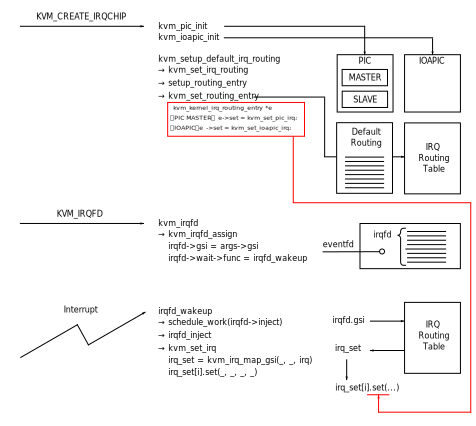

# Serial Console implementation

## About Serial UART and ttyS0

UART（Universal Asynchronous Receiver/Transmitter）はコンピュータやマイコンと周辺機器を繋ぐ非同期式シリアル通信規格である。
UARTによってシリアル・パラレル信号の相互変換を行えるため、入力されるパラレルデータをシリアルデータへ変換し通信回線越しに相手に送信することができる。
これを実装するために設計された集積回路として8250 UARTと呼ばれるデバイスが製造され、その後さまざまなファミリが登場してきた。

さて、今回Guest OS（Linux）を起動させようとしているわけであるが、デバッグ等の用途としてシリアルコンソールが存在すると便利なケースが多い。  
シリアルコンソールはGuestの全てのコンソール出力をシリアルポートに送付するため、シリアルターミナルが適切に設定されていればリモートターミナルとしてシステムの起動状況を確認したり、シリアルポート経由でシステムにログオンしたりすることができる。  
今回は、ToyVMM上で起動したGuest VMの状態確認やGuestの操作をするためにこの方式を利用することにする。

コンソールメッセージをシリアルポートに出力させるために、カーネルの起動時パラメータとして`console=ttyS0`を設定する必要がある。  
現在のToyVMMの実装ではこの値をデフォルト値として与えている。

問題はこれを受け取るシリアルターミナル側である。
シリアルポートに該当するIO Portのアドレスは決まっているため、ToyVMMのレイヤからは当該アドレス付近に対して`KVM_EXIT_IO`の命令を受けることになる。
つまりGuest OS側から発行されるシリアルコンソールへの出力情報、またそれ以外にも必要なセットアップ要求などを適切に処理する必要があり、これはUARTデバイスをエミュレートすることで成立させる必要がある。
その上で、デバイスをエミュレートした結果として、標準出力に対してコンソール出力を出力したり、逆に我々の標準入力をGuest VM側に反映させることができれば、ToyVMMからVMを起動した際に、その起動情報の確認やGuestの操作を手元のターミナルから実施することが可能になる。

以上をまとめると、大まかに下記のような概念図のものを作成することになる。


以降では順を追って説明していく。

## Serial UART

Serial UARTについては、以下のLammet Biesの資料とWikibooksに大変詳細な情報が記載されているため基本的にはこれを確認すれば良い。

* [Serial UART information (Lammet Bies)](https://www.lammertbies.nl/comm/info/serial-uart)
* [Serial Programming / 8250 UART Programming (Wikibooks)](https://en.wikibooks.org/wiki/Serial_Programming/8250_UART_Programming)

以下の図は、[Lammetの資料に記載のある図](https://www.lammertbies.nl/comm/info/serial-uart)を引用しつつそれぞれのRegisterの各bitに関して簡単に説明を加えた図である。本資料の執筆において個人的に作成した図であるが、読者の理解の手助けになることを期待して添付しておく。
ただし、それぞれのregisterやbitの意味については本資料では説明はしないため、上記の資料を参考に確認してもらいたい。


基本的には上記のregisters/bitsを操作することで必要な処理を行うのがUARTの仕組みになっている。  
今回はこれをSoftwareでエミュレートする必要があるが、この実装に関しては [rust-vmm/vm-superio](https://github.com/rust-vmm/vm-superio)を利用することで代替とする。  
以降でこの [rust-vmm/vm-superio](https://github.com/rust-vmm/vm-superio) の実装と上記のSpecificationとを比較しながら簡単にではあるが確認していこうと思う。


## rust-vmm/vm-superioによるSerial DeviceのSoftware実装

### 初期値設定／RWの実装

ここからは[rust-vmm/vm-superio](https://github.com/rust-vmm/vm-superio)を利用したserial deviceの実装を、上記のSpecificationと比較しながら確認していく。
是非、上記からコードを取得して自分で確認してみてほしい。
なお、以下の内容は `vm-superio-0.6.0` に準拠しているので、最新のコードでは変更されているかもしれないため留意されたい。

まず、いくつかの値の初期値について以下の通りに整理する。  
[rust-vmm/vm-superio](https://github.com/rust-vmm/vm-superio)はもともとVMMでの利用を前提にしているため、いくつかのレジスタの値を初期設定していたり、書き換え想定をしていなかったりする。  

| Variable                 | DEFAULT VALUE | Meaning                    | REGISTER   |
|--------------------------|---------------|----------------------------|------------|
| baud_divisor_low         | 0x0c          | baud rate 9600 bps         |            |
| baud_divisor_high        | 0x00          | baud rate 9600 bps         |            |
| interrupt_enable         | 0x00          | No interrupts enabled      | IER        |
| interrupt_identification | 0b0000_0001   | No pending interrupt       | IIR        |
| line_control             | 0b0000_0011   | 8 bit word length          | LCR        |
| line_status              | 0b0110_0000   | (1)                        | LSR        |
| modem_control            | 0b0000_1000   | (2)                        | MCR        |
| modem_status             | 0b1011_0000   | (3)                        | MSR        |
| scratch                  | 0b0000_0000   |                            | SCR        |
| in_buffer                | Vec::new()    | vector values (buffer)     | -          |

1. THR empty関係のbitを立てている。このbitを立てているといつでもデータを受信可能であることを表現していることになるが、これは仮想デバイスとしての利用が前提の設定になっている。
2. 多くのUARTはAuxiliary Output 2の値を1に設定し、interruptを有効にするたデフォルトで有効にしている
3. Connectedの状態、かつハードウェアデータフローの初期化

さて、次にwriteのリクエストが来た場合の処理内容について簡単に記載する。
`KVM_EXIT_IO`の結果として、IOが発生したaddressと、書き込むべきデータが渡される。
ToyVMM側ではこれらの値から適切なデバイス（今回はSerial UART device）とそのベースアドレスからのOffsetを計算し、`vm-superio`で定義されている`write`関数を呼び出す。
以下の内容は、`Serial::write`の処理を簡単に表に起こしたものである。基本的には素直にレジスタ値の書き換えになるが一部ちょっとロジックが入る。

| Variable         | OFFSET(u8) | Additional Conditions   | write                              |
|------------------|------------|-------------------------|------------------------------------|
| DLAB_LOW_OFFSET  | 0          | is_dlab_set = true      | `self.baud_divisor_low`を書き換え  |
| DLAB_HIGH_OFFSET | 1          | is_dlab_set = true      | `self.baud_divisor_high`を書き換え |
| DATA_OFFSET      | 0          | - (is_dlab_set = false) | (1)                                |
| IER_OFFSET       | 1          | - (is_dlab_set = false) | (2)                                |
| LCR_OFFSET       | 3          | -                       | `self.line_control`を書き換え      |
| MCR_OFFSET       | 4          | -                       | `self.modem_control`を書き換え     |
| SCR_OFFSET       | 7          | -                       | `self.scratch`を書き換え           |

1. 現在のSerialの状態として、LOOP_BACK_MODE（MCR bit 4）が有効になっている場合とそうでない場合で場合分け
    - 有効の場合、送信レジスタに書かれたものをそのまま受信レジスタに書き込まれる(loopbackする）ようにシミュレート（今回は重要ではない）
    - 有効でない場合、書き込むべきデータをそのまま出力に書き出し、既存の設定状態に依存して割り込みを入れる。
      - 上記の表をみてわかる通り、外部からのwriteによるIIRの変更はサポートしておらず、デフォルト値が`0b0000_0001`で設定されている。
      - もし、IER_OFFSETに対してIERのTHR empty bitのフラグが立っている場合は、IIRのTHR emptyに対応するフラグを立てて割り込みをトリガする。
2. IERのbitのうち0-3bit以外はMaskした結果（Interruptに関連するbitのみそのままにして）で `self.interrupt_enable`を書き換え

次に、readのリクエストが来た場合の処理内容について簡単に記載する  
同様に `Serial::read`の処理を表に起こしたものが下記である。readの場合はwriteと異なり基本的には返り値としてデータを返すロジックになっている

| Variable         | OFFSET(u8) | Additional Conditions   | write                              |
|------------------|------------|-------------------------|------------------------------------|
| DLAB_LOW_OFFSET  | 0          | is_dlab_set = true      | `self.baud_divisor_low`を読み込み  |
| DLAB_HIGH_OFFSET | 1          | is_dlab_set = true      | `self.baud_divisor_high`を読み込み |
| DATA_OFFSET      | 0          | - (is_dlab_set = false) | (1)                                |
| IER_OFFSET       | 1          | - (is_dlab_set = false) | `self.inerrupt_enable`を読み込み   |
| IIR_OFFSET       | 2          | -                       | (2)                                |
| LCR_OFFSET       | 3          | -                       | `self.line_control`を読み込み      |
| MCR_OFFSET       | 4          | -                       | `self.modem_control`を読み込み     |
| LSR_OFFSET       | 5          | -                       | `self.line_status`を読み込み       |
| MSR_OFFSET       | 6          | -                       | (3)                                |
| SCR_OFFSET       | 7          | -                       | `self.scratch`を読み込み           |

1. Serial構造体が持つbufferのデータを読み出したりするが、現実装ではこのbufferはloopback modeでのwriteでしかデータが積まれない実装になっているため、今回の内容では省略。OSの起動シーケンスでもこの領域に関する`read`は発行されていなかった。
2. `self.interrupt_identification` | `0b1100_0000(FIFO enabled)`の結果を返却しデフォルト値に戻す
3. 現在の状態がloopback modeかどうかで場合分けを行う
    - loopbackの場合は適切に調整する（今回は重要ではないので省略）
    - loopbackで無い場合は素直に`self.modem_status`の値を返却する

## ToyVMMでのrust-vmm/vm-superioの利用

ToyVMMでは上記の[rust-vmm/vm-superio](https://github.com/rust-vmm/vm-superio)を利用し`KVM_EXIT_IO`の内容をハンドルする。
加えて考えなければならないのは以下の2点である。

* Guestからシリアルポートに当てたコンソール出力を標準出力に書き出すことで、起動シーケンスやGuest内部の状態を確認できるようにする。
* 標準入力の内容をGuest VMに引き渡す

以降、それぞれ順番に確認していく。　

### シリアルポート当てのコンソール出力を標準出力に書き出す

起動シーケンスやGuest VMの内部状態を確認するために、シリアルポート宛のコンソール出力を標準出力に書き出すようにしてみよう。  
「シリアルポート当てのコンソール出力」はまさに、`KVM_EXIT_IO`で`Serial向けのIO Portアドレス`に対しての`KVM_EXIT_IO_OUT`のケースに該当する。
以下のコード部が該当処理になる。

```rust
...
loop {
  match vcpu.run() {
      Ok(run) => match run {
          ...
          VcpuExit::IoOut(addr, data) => {
              io_bus.write(addr as u64, data);
          }
      ...  
      }
    }
}
...
```

さて、ここでは`KVM_EXIT_IO_OUT`で受け取ったアドレスと書き込むべきデータを伴って、`io_bus.write`を呼び出すのみになっている。
この`io_bus`は以下のような形で設定を行ったものである。  

```rust
let mut io_bus = IoBus::new();
let com_evt_1_3 = EventFdTrigger::new(EventFd::new(libc::EFD_NONBLOCK).unwrap());
let stdio_serial = Arc::new(Mutex::new(SerialDevice {
    serial: serial::Serial::with_events(
        com_evt_1_3.try_clone().unwrap(),
        SerialEventsWrapper {
            buffer_read_event_fd: None,
        },
        Box::new(std::io::stdout()),
    ),
}));
io_bus.insert(stdio_serial.clone(), 0x3f8, 0x8).unwrap();
vm.fd().register_irqfd(&com_evt_1_3, 4).unwrap();
```

上記のセットアップについては少し説明が必要なため以降に順を追って話していくが、大まかに押さえておくと以下のようなことをおこなっている。  

* I/O Busを表現している`IoBus`構造体、割り込みを表現する`eventfd`を初期化する。
* Serial Deviceの初期化をおこなう。その際にGuestへ割り込みを発生させるための`eventfd`と標準出力のためのFD（`std::io::stdout`）を渡している。
* 初期化した`IoBus`に上記のSerial Deviceを登録している。この時、`0x3f8`をベースアドレス、`0x8`をレンジとして登録している。
  * これにより、`0x3f8`を基底として`0x8`のレンジはこのSerial Deviceが利用するアドレス領域ということを表現している。

#### I/O Busの取り回し

`KVM_EXIT_IO`で渡されるアドレス値は、アドレス空間全体におけるアドレスの値になる。  
一方で、[rust-vmm/vm-superio](https://github.com/rust-vmm/vm-superio)の`read/write`の実装は、Serial Deviceのベースアドレスからのオフセット値をとって処理を実施するような実装になっているため、このギャップを埋めるための処理が必要になる。  
単純にオフセットを計算するだけでも良いが、Firecrackerではその後の拡張性（Serialデバイス以外のIO Portを利用するデバイス）も考慮してか、I/O Busを表現する構造体である`Bus`という構造体が存在する。
これは`BusRange`（バスにおけるデバイスのベースアドレスと利用するアドレスレンジを表現している構造体）とともにデバイスを登録できるようなものになっている。  
さらに、あるアドレスへのIOが発生しときに、そのアドレスを確認し、対応するアドレスレンジに登録されているデバイスを取り出して、そのデバイスに対して、ベースアドレスからのオフセット値でIOを実行するような仕組みが提供されている。
例えば`write`関数は以下のような実装になっており、`get_device`でアドレス情報から対応する登録済みデバイスと、そのデバイスのベースアドレスからのオフセットを取得し、それを利用してデバイスに実装されている`write`関数を呼び出している。

```rust
pub fn write(&self, addr: u64, data: &[u8]) -> bool {
    if let Some((offset, dev)) = self.get_device(addr) { : u64 : &Mutex<dyn BusDevice>
        // OK to unwrap as lock() failing is a serious error condition and should panic.
        dev.lock() Result<MutexGuard<dyn BusDevice>, …>
            .expect("Failed to acquire device lock") MutexGuard<dyn BusDevice> msg:
            .write(offset, data);
        true
    } else {
        false
    }
}
```

具体的にSerialデバイスの話を例に挙げて考えてみる。
前述した通りGuest VMからのserialに対する`KVM_EXIT_IO_OUT`は`0x3f8`をベースとして8 byteのアドレスレンジで発生する。
ToyVMMのIoBusでも同様のアドレスベース、レンジ情報でSerial Deviceの登録をしているため、例えば`KVM_EXIT_IO_OUT`として`0x3fb`へ`0b1001_0011`を書き込むという命令をトラップした場合、登録したSerial Deviceに対して、ベースアドレス(`0x3f8`)からのオフセット(`0x3`)の位置、つまり`LCR`に`0b1001_0011`を書く、という命令に解釈される。

#### eventfd/irqfdによるGuest VMへの割り込み通知

ここからは少しKVMと割り込みに関する話をしたい。
いくつかLinuxのソースコードを引用することになるが以降では`v4.18`のコードから引用する。

:warning: 以降の話は基本的にソースコードを元に記載しているが、詳細な状態遷移を逐一確認して記載したものではないため多少間違っている可能性があります。もし間違いを発見した場合はコメントをいただけると幸いです。

[rust-vmm/vm-superio](https://github.com/rust-vmm/vm-superio)では、Serialの初期化時に第一引数に[`EventFd`](https://docs.rs/vmm-sys-util/0.6.1/vmm_sys_util/eventfd/struct.EventFd.html)を要求する。  
これはLinuxにおける[eventfd](https://man7.org/linux/man-pages/man2/eventfd.2.html)のWrapperになっているものである。
eventfdの詳細は[man](https://man7.org/linux/man-pages/man2/eventfd.2.html)を確認してほしいが、簡単にいうとプロセス間やプロセスとカーネルの間などでのイベントの通知を実現することができる仕組みである。

次にirqfdである。irqfdはeventfdをベースとしたVMに対して割り込みを入れることのできるfile descriptorである。
イメージとしてはeventfdの一端をKVMが保持し、もう片方からの通知をGuest VMへの割り込みとして解釈するというものである。
このirqfdによる割り込みは、Guest VMの外の世界からGuest VMへの割り込み、つまり通常のシステムで言うところの周辺デバイスからの割り込みをエミュレートするものである。逆方向の割り込みは`ioeventfd`の仕組みを利用するがここでは一旦省略する。

実際にソースコードを見ながら、このirqfdがどのようにGuestへの割り込みにつながっていくかを確認してみよう。  
KVMに対して`KVM_IRQFD`を伴ってioctlを実施すると、渡されたデータを元に`kvm_irqfd`、`kvm_irqfd_assign`の流れでKVMの処理が実行され、この`kvm_irqfd_assign`関数で`kvm_kernel_irqfd`構造体のインスタンスが作成される。  
この時、ioctl時に渡した追加情報を元に設定を行うが、特に`kvm_kernel_irqfd`構造体は`gsi`というフィールドを持っており、これがioctlで渡した引数の値によって設定される。  
この`gsi`は、`irqfd`に対応するGuestの割り込みテーブルのインデックスに該当するものになるため、ioctlを呼ぶ際にはeventfdに加えて、Guestのどの割り込みテーブルのエントリに対して割り込みを入れるかということも指定する。
ToyVMMではこの設定を行なっているのが以下の一行である。  

```rust
vm.fd().register_irqfd(&com_evt_1_3, 4).unwrap();
```

これは`kvm_ioctl::VmFd`構造体のメソッドとして定義されている

```rust
pub fn register_irqfd(&self, fd: &EventFd, gsi: u32) -> Result<()> {
    let irqfd = kvm_irqfd {
        fd: fd.as_raw_fd() as u32,
        gsi,
        ..Default::default()
    };
    // Safe because we know that our file is a VM fd, we know the kernel will only read      the
    // correct amount of memory from our pointer, and we verify the return result.
    let ret = unsafe { ioctl_with_ref(self, KVM_IRQFD(), &irqfd) }; : i32 fd: req: arg:
    if ret == 0 {
        Ok(())
    } else {
        Err(errno::Error::last())
    }
}
```

つまり上記では、これまで話してきたSerial deviceに利用しているeventfd（`com_evt_1_3`）をGSI=4（Guest VM上のCOM1ポートへの割り込みテーブルインデックス）を伴って設定しているため、この`com_evt_1_3`に対して実行した`write`は、COM1からの割り込みとしてGuest VMに渡り（つまり、Guestから見るとCOM1の先のserial deviceから割り込みが発生したことになり）、Guest VMのCOM1の割り込みハンドラを起動することになる。

さて、今Guest側の割り込みテーブル（GSI: Global System Interrupt）の話が出たが、これらはいつ、どのようにセットアップされるかいついて以降で説明していくこととする。  
端的に言えばこれらは`KVM_CREATE_IRQCHIP`を伴ってKVMにioctlを発行することで設定される。これを実施すると割り込みコントローラである`PIC`と`IOAPIC`の２種類が作成される（内部的には`kvm_pic_init`でPICの初期化とread/write opsの登録などを行い、`kvm->arch.vpic`に設定。`kvm_ioapic_init`でIOAPICの初期化とread/write opsの登録などを行い、`kvm->arch.vioapic`に設定している）  
この`PIC`や`IOAPIC`などのハードウェアは高速化の目的でKVMに実装があるため、独自にエミュレートする必要がない。もちろんqemuなどに任せることができるが、ここでは利用しないため省略する。
さらにその後、`kvm_setup_default_irq_routing`関数の中でデフォルトのIRQ Routingの設定がなされている。
この処理によって、どのGSIに対する割り込みによってどのハンドラが起動するか、という部分がセットアップされる。  

さて、もう少し`kvm_setup_default_irq_routing`の中身を見てみよう。この関数の中ではさらに`kvm_set_irq_routing`関数を呼びだしており、本質的な処理はそこに記載がある。
ここでは`kvm_irq_routing_table`を作成し、これに対してGSIからIRQへの対応を表現している`kvm_kernel_irq_routing_entry`を設定していく形になる。
この`kvm_kernel_irq_routing_entry`はデフォルトのエントリ（`default_routing`）が存在しており、これをループしながら登録していくような形の実装が存在する。
この`default_routing`は以下のような定義になっている。関係するマクロの実装も記しておく。

```C
#define SELECT_PIC(irq) \
	((irq) < 8 ? KVM_IRQCHIP_PIC_MASTER : KVM_IRQCHIP_PIC_SLAVE)

#define IOAPIC_ROUTING_ENTRY(irq) \
	{ .gsi = irq, .type = KVM_IRQ_ROUTING_IRQCHIP,	\
	  .u.irqchip = { .irqchip = KVM_IRQCHIP_IOAPIC, .pin = (irq) } }

#define ROUTING_ENTRY1(irq) IOAPIC_ROUTING_ENTRY(irq)

#define PIC_ROUTING_ENTRY(irq) \
	{ .gsi = irq, .type = KVM_IRQ_ROUTING_IRQCHIP,	\
	  .u.irqchip = { .irqchip = SELECT_PIC(irq), .pin = (irq) % 8 } }

#define ROUTING_ENTRY2(irq) \
	IOAPIC_ROUTING_ENTRY(irq), PIC_ROUTING_ENTRY(irq)

static const struct kvm_irq_routing_entry default_routing[] = {
	ROUTING_ENTRY2(0), ROUTING_ENTRY2(1),
	ROUTING_ENTRY2(2), ROUTING_ENTRY2(3),
	ROUTING_ENTRY2(4), ROUTING_ENTRY2(5),
	ROUTING_ENTRY2(6), ROUTING_ENTRY2(7),
	ROUTING_ENTRY2(8), ROUTING_ENTRY2(9),
	ROUTING_ENTRY2(10), ROUTING_ENTRY2(11),
	ROUTING_ENTRY2(12), ROUTING_ENTRY2(13),
	ROUTING_ENTRY2(14), ROUTING_ENTRY2(15),
	ROUTING_ENTRY1(16), ROUTING_ENTRY1(17),
	ROUTING_ENTRY1(18), ROUTING_ENTRY1(19),
	ROUTING_ENTRY1(20), ROUTING_ENTRY1(21),
	ROUTING_ENTRY1(22), ROUTING_ENTRY1(23),
};
```

見ての通り、0-15までのIRQ番号は`ROUTING_ENTRY2`に、16-23までのをIRQ番号は`ROUTING_ENTRY1`に引き渡しており、`ROUTING_ENTRY2`は`IOAPIC_ROUTING_ENTRY`と`PIC_ROUTING_ENTRY`を、`ROUTING_ENTRY1`は`IOAPIC_ROUTING_ENTRY`のみを呼び出して、必要な情報を埋めた構造体を作っている。

この構造体の情報を使いながら後続する`kvm_set_routing_entry`関数で以下の通りそれぞれの`.u.irqchip.irqchip`の値(`KVM_IRQCHIP_PIC_SLAVE`、`KVM_IRQCHIP_PIC_MASTER`、`KVM_IRQCHIP_IOAPIC`)ごとにコールバック（`kvm_set_pic_irq`、`kvm_set_ioapic_irq`）や必要な設定をおこなっている。このコールバックは割り込み発生時に呼ばれる関数に該当し、後ほど触れるため少し覚えておいてほしい。

```C
int kvm_set_routing_entry(struct kvm *kvm,
			  struct kvm_kernel_irq_routing_entry *e,
			  const struct kvm_irq_routing_entry *ue)
{
	/* We can't check irqchip_in_kernel() here as some callers are
	 * currently inititalizing the irqchip. Other callers should therefore
	 * check kvm_arch_can_set_irq_routing() before calling this function.
	 */
	switch (ue->type) {
	case KVM_IRQ_ROUTING_IRQCHIP:
		if (irqchip_split(kvm))
			return -EINVAL;
		e->irqchip.pin = ue->u.irqchip.pin;
		switch (ue->u.irqchip.irqchip) {
		case KVM_IRQCHIP_PIC_SLAVE:
			e->irqchip.pin += PIC_NUM_PINS / 2;
			/* fall through */
		case KVM_IRQCHIP_PIC_MASTER:
			if (ue->u.irqchip.pin >= PIC_NUM_PINS / 2)
				return -EINVAL;
			e->set = kvm_set_pic_irq;
			break;
		case KVM_IRQCHIP_IOAPIC:
			if (ue->u.irqchip.pin >= KVM_IOAPIC_NUM_PINS)
				return -EINVAL;
			e->set = kvm_set_ioapic_irq;
			break;
		default:
			return -EINVAL;
		}
		e->irqchip.irqchip = ue->u.irqchip.irqchip;
		break;
...
```

さて、ここまで見てきたところで再度`irqfd`の話に立ち戻ろう。
先ほどは説明していなかったが、実は`kvm_irqfd_assign`関数の中では、`init_waitqueue_func_entry(&irqfd->wait, irqfd_wakeup)`という処理が呼び出され、`&irqfd->wait->func`に`irqfd_wakeup`を登録している。
割り込みが発生した際にこの関数が呼び出され、この中で`schedule_work(&irqfd->inject)`が呼ばれる。
この`inject`フィールドも`kvm_irqfd_assign`関数の中で初期化されており、結果として`irqfd_inject`関数が呼び出されることになり、さらにこの関数の中で`kvm_set_irq`関数が呼び出される。  
`kvm_set_irq`の処理の中では、割り込みがきたIRQ番号を持つエントリをリストアップし、その`set`コールバックを呼び出していく。これはつまり上記で説明した`kvm_set_pic_irq`や`kvm_set_ioapic_irq`などの関数が呼ばれることを意味する。
以上の流れが割り込みとGSI、IRQ間Routingの実際の処理の部分である。



ここからの話は割り込み処理に対してもう少し深掘りした内容になるが、ToyVMMを理解する上で必ずしも必要ではない内容なので、[ToyVMM serial console](#toyvmm-serial-console)まで読み飛ばしてもらっても構わない。  

折角なので、割り込みハンドラである`kvm_set_pic_irq`の処理についてもう少し見てみることにしよう。やや話が脱線してきたが、せっかくなのでキリのいいところまで深掘りして確認してみる。  
`kvm_set_pic_irq`は、`KVM_CREATE_IRQCHIP`で初期化した`kvm->arch.vpic`を利用して、`kvm_pic_set_irq`を呼び出しているのみである。

```C
static int kvm_set_pic_irq(struct kvm_kernel_irq_routing_entry *e,
			   struct kvm *kvm, int irq_source_id, int level,
			   bool line_status)
{
	struct kvm_pic *pic = kvm->arch.vpic;
	return kvm_pic_set_irq(pic, e->irqchip.pin, irq_source_id, level);
}
```

さて、`kvm_pic_set_irq`の実装を見にいくと以下のようになっている。

```C
int kvm_pic_set_irq(struct kvm_pic *s, int irq, int irq_source_id, int level)
{
	int ret, irq_level;

	BUG_ON(irq < 0 || irq >= PIC_NUM_PINS);

	pic_lock(s);
	irq_level = __kvm_irq_line_state(&s->irq_states[irq],
					 irq_source_id, level);
	ret = pic_set_irq1(&s->pics[irq >> 3], irq & 7, irq_level);
	pic_update_irq(s);
	trace_kvm_pic_set_irq(irq >> 3, irq & 7, s->pics[irq >> 3].elcr,
			      s->pics[irq >> 3].imr, ret == 0);
	pic_unlock(s);

	return ret;
}
```

`pic_set_irq1`関数でIRQ Levelの設定を行い、`pic_update_irq`関数で`kvm->arch.vpic`に格納されている`kvm_pic`構造体の中を以下のように書き換えている。  

```C
/*
 * callback when PIC0 irq status changed
 */
static void pic_irq_request(struct kvm *kvm, int level)
{
	struct kvm_pic *s = kvm->arch.vpic;

	if (!s->output)
		s->wakeup_needed = true;
	s->output = level;
}
```

さらにこの上で`pic_unlock`関数を呼び出しているが、この関数の中身が地味に重要である。
`wakeup_needed`がtrueの場合、vCPUに対して`kvm_vcpu_kick`を実行している。

```C
static void pic_unlock(struct kvm_pic *s)
	__releases(&s->lock)
{
	bool wakeup = s->wakeup_needed;
	struct kvm_vcpu *vcpu;
	int i;

	s->wakeup_needed = false;

	spin_unlock(&s->lock);

	if (wakeup) {
		kvm_for_each_vcpu(i, vcpu, s->kvm) {
			if (kvm_apic_accept_pic_intr(vcpu)) {
				kvm_make_request(KVM_REQ_EVENT, vcpu);
				kvm_vcpu_kick(vcpu);
				return;
			}
		}
	}
}

/*
 * Kick a sleeping VCPU, or a guest VCPU in guest mode, into host kernel mode.
 */
void kvm_vcpu_kick(struct kvm_vcpu *vcpu)
{
	int me;
	int cpu = vcpu->cpu;

	if (kvm_vcpu_wake_up(vcpu))
		return;

	me = get_cpu();
	if (cpu != me && (unsigned)cpu < nr_cpu_ids && cpu_online(cpu))
		if (kvm_arch_vcpu_should_kick(vcpu))
			smp_send_reschedule(cpu);
	put_cpu();
}
```
`smp_send_reschedule`を呼び出した結果として、`native_smp_send_reschedule`関数が呼ばれる。

```C
/*
 * this function sends a 'reschedule' IPI to another CPU.
 * it goes straight through and wastes no time serializing
 * anything. Worst case is that we lose a reschedule ...
 */
static void native_smp_send_reschedule(int cpu)
{
	if (unlikely(cpu_is_offline(cpu))) {
		WARN_ON(1);
		return;
	}
	apic->send_IPI(cpu, RESCHEDULE_VECTOR);
}
```

コメントにもある通り、この関数を呼び出すと別のCPUに対してIPI（Inter Process Interrupt）を発行し再スケジュールを促す。
vCPUに対して割り込みを送り、仮想マシンから強制的に`VMExit`する。そしてvCPUにスケジュールする際に割り込みが挿入されることになる。

さて、では実際に割り込みが挿入される処理も簡単に確認して割り込みの話を一旦終えることにしよう。
`KVM_RUN`が実行されると、以下のような処理が実行されていくようである（あくまで割り込みの挿入のみに着目しているため、そのほか膨大な処理は省略している）

```
kvm_arch_vcpu_ioctl_run
 -> vcpu_run
 -> vcpu_enter_guest
 -> inject_pending_event
 -> kvm_cpu_has_injectable_intr
```

`kvm_cpu_has_injectable_intr`の中で`kvm_cpu_has_extint`関数が呼ばれる。この処理は今回の場合はおそらく`pic_irq_request`で設定した`s->output`の値でreturnするため、この関数は全体として`return 1`を返す。  
そのため、`inject_pending_event`関数の以下の処理に差し掛かる。  

```C
	} else if (kvm_cpu_has_injectable_intr(vcpu)) {
		/*
		 * Because interrupts can be injected asynchronously, we are
		 * calling check_nested_events again here to avoid a race condition.
		 * See https://lkml.org/lkml/2014/7/2/60 for discussion about this
		 * proposal and current concerns.  Perhaps we should be setting
		 * KVM_REQ_EVENT only on certain events and not unconditionally?
		 */
		if (is_guest_mode(vcpu) && kvm_x86_ops->check_nested_events) {
			r = kvm_x86_ops->check_nested_events(vcpu, req_int_win);
			if (r != 0)
				return r;
		}
		if (kvm_x86_ops->interrupt_allowed(vcpu)) {
			kvm_queue_interrupt(vcpu, kvm_cpu_get_interrupt(vcpu),
					    false);
			kvm_x86_ops->set_irq(vcpu);
		}
	}
```

結果的に`kvm_x86_ops->set_irq(vcpu)`が呼ばれる。これはコールバック関数として`vmx_inject_irq`が実行されることになる。
この処理で、`VMCS`（`Virtual Machine Control Structure`）に`VMX_ENTRY_INTR_INFO_FIELD`を設定することで割り込みを挿入している。
`VMCS`についての説明を行なっていないが、この話を始めるとハイパーバイザーの実装についての話が必要になってくるのでここでは省略する。
将来的に、補足情報としてドキュメントに追記するかもしれない。

長くなったが以上がPICを例にとった割り込み処理の流れである。  

#### ToyVMM serial console

さて、この辺りで割り込みに関する探索を一旦切り上げて、ToyVMMの実装の話に戻ろう。
これまでの話を踏まえながら、ToyVMM側ではどのような処理を実行しており、それが裏ではどのような処理として実行されているかを整理する。
ToyVMMの中で、先に紹介した`register_irqfd`を実施する前に実は以下のような処理を行なっていた。  

```rust
vm.setup_irqchip().unwrap();
```

この関数は薄いwrapperになっており、内部的には`create_irq_chip`の呼び出しと`create_pit2`の呼び出しを行う処理になっている。  

```rust
#[cfg(target_arch = "x86_64")]
pub fn setup_irqchip(&self) -> Result<()> {
    self.fd.create_irq_chip().map_err(Error::VmSetup)?;
    let pit_config = kvm_pit_config {
        flags: KVM_PIT_SPEAKER_DUMMY,
        ..Default::default()
    };
    self.fd.create_pit2(pit_config).map_err(Error::VmSetup)
}
```

ここで重要なのは、`create_irq_chip`関数である。これは内部的には`KVM_CREATE_IRQCHIP`のAPIを叩いており、これによって先に話した通り、割り込みコントローラの初期化、IRQ Routingの初期化などを実施する。
上記セットアップ済みのGuest VMに対して、先に説明した`register_irqfd(&com_evt_1_3, 4)`を実行することで`KVM_IRQFD` APIを叩き、先に説明した`kvm_irqfd_assign`などの処理が実施されるため、割り込みハンドラの設定などが行われる。
これで、ToyVMMからKVM APIを利用した割り込み関係のセットアップは完了である。

さて、改めて`com_evt_1_3`のからの割り込みについて確認してみよう。割り込みの一端は上記で見た通り`register_irqfd`によって`GSI=4`とともにKVM側に受け渡しているため、もう一端から発行されたwriteをGuest VMへのCOM1ポートへのinterruptとして取り扱うことになる。一方、問題の`com_evt_1_3`のもう一端はSerial Deviceに渡してあるためSerial Device側で実行されるeventfdへのwrite（`Serial::write`による書き込み処理後や、後述する`Serial::enqueue_raw_byte`による呼び出しで発生する）が具体的な割り込みのトリガである。
つまり、通常のサーバとSerial Deviceが行うやりとりと同じような形で、Guest VMとSoftware実装のSerial Deviceがやりとりをするような構成を構築できる。

また、Serial Consoleを表現するために、今回はSerial Deviceのoutputに該当する書き込み先はstdoutに設定している。そのため、`KVM_EXIT_IO_OUT`をハンドルした際の`THR`への書き込みがstdoutへの書き込みへと渡っていき、結果として標準出力にコンソールメッセージが出力され、目的のSerial Consoleとしての機能が実現される。

#### 標準入力でGuest VMを操作する。

最後に標準入力の内容をGuest VMに反映させてGuest VMを操作できるようにしたい。
[rust-vmm/vm-superio](https://github.com/rust-vmm/vm-superio)が提供する`Serial`構造体には、[`enqueue_raw_bytes`](https://docs.rs/vm-superio/0.1.1/vm_superio/serial/struct.Serial.html#method.enqueue_raw_bytes)というヘルパー関数が存在し、これを利用するとあまり細かいレジスタ操作や割り込みを考えずにGuest VMに対してデータを送信することができる（関数の実装がこれらの処理をうまく実施してくれる）
あとはこれを標準入力から受け取った入力をプログラムで読み取って、このメソッドにそのまま引き渡してあげるようにすると目的の操作が達成できる。

標準入力をraw modeへと切り替えて、メインスレッドでpollingしながら標準入力を受け取ったら`enqueue_raw_bytes`でGuest VMに対してその入力内容を送信する。
Guest VMはvCPUごとに別スレッドを起動して処理させているため、メインスレッドで標準入力をpollingすることによるGuest VMの処理への影響はない。

```rust
let stdin_handle = io::stdin();
let stdin_lock = stdin_handle.lock();
stdin_lock
    .set_raw_mode()
    .expect("failed to set terminal raw mode");
let ctx: PollContext<Token> = PollContext::new().unwrap();
ctx.add(&exit_evt, Token::Exit).unwrap();
ctx.add(&stdin_lock, Token::Stdin).unwrap();
'poll: loop {
    let pollevents: PollEvents<Token> = ctx.wait().unwrap();
    let tokens: Vec<Token> = pollevents.iter_readable().map(|e| e.token()).collect();
    for &token in tokens.iter() {
        match token {
            Token::Exit => {
                println!("vcpu requested shutdown");
                break 'poll;
            }
            Token::Stdin => {
                let mut out = [0u8; 64];
                tx.send(true).unwrap();
                match stdin_lock.read_raw(&mut out[..]) {
                    Ok(0) => {
                        println!("eof!");
                    }
                    Ok(count) => {
                        stdio_serial
                            .lock()
                            .unwrap()
                            .serial
                            .enqueue_raw_bytes(&out[..count])
                            .expect("failed to enqueue bytes");
                    }
                    Err(e) => {
                        println!("error while reading stdin: {:?}", e);
                    }
                }
            }
            _ => {}
        }
    }
}
```

ナイーブな実装でありあまり特別なことは行っていないので特に説明すべきことはない。  
単純だが以上で目的の動作が達成できる。

## Check UART request in booting linux kernel.

これまでSerial UARTのソフトウェア実装の内容とToyVMM内部での利用方法について記載した。  
これは実際にうまく動作するが、やはりLinux Kernel起動時のUARTのやりとりを確認してみたいところである。
幸い、VMMの仕組み上、`KVM_EXIT_IO`をハンドルする必要があるため、このハンドリング処理にデバッグコードを仕込むことでシリアルポートに送付された全てのリクエストを盗み見ることができる。  
ただし全ての内容を確認するのは現実的ではないので、一部だけ簡単に確認してみようと思う。  

デバッグするために差し込んだコードの説明はここでは行わない。適切な処理箇所にデバッグコードを入れるだけのため非常に単純である。  
以降では、シリアルポートへのリクエストに対して、分かりやすいように以下のような3種類の書式に従って注釈をつけている。

```bash
[書式1 - Read]
r($register) = $data
  - Description

・ r           = Read operation
・ $register   = デバイスのアドレス(0x3f8)を利用して計算したoffsetに対応するレジスタ
・ $data       = $registerから読み出したデータ
・ Description = 説明文

[書式2 - Write]
w($register = $data)
  - Description

・ w           = Write operation
・ $register   = デバイスのアドレス(0x3f8)を利用して計算したoffsetに対応するレジスタ
・ $data       = $registerの値に書き込むデータ
・ Description = 説明文


[書式3 - Write (character)]
w(THR = $data = 0xYY) -> 'CHAR'

・ w(THR ...)  = Write operation to THR
・ $data       = $registerの値に書き込むbinaryデータ
・ 0xYY        = $dataをhexに変換したもの
・ 'CHAR'      = 0xYYをASCIIコード表に基づきcharacterに変換したもの
```

さて、以下は少し長いがOS起動時の`0x3f8 (COM1)`のレジスタに対してのリクエストを上記の書式に従ってわかりやすく書き表したものである。

```bash
# 最初はbaud lateなどの初期設定を行なっている
w(IER = 0)
w(LCR = 10010011)
  - DLAB         = 1   (DLAB: DLL and DLM accessible)
  - Break signal = 0   (Break signal disabled)
  - Parity       = 010 (No parity)
  - Stop bits    = 0   (1 stop bit)
  - Data bits    = 11  (8 data bit)
w(DLL = 00001100)
w(DLM = 0)
  - DLL = 0x0C, DLM = 0x00 (Speed = 9600 bps)
w(LCR = 00010011)
  - DLAB         = 0   (DLAB : RBR, THR, and IER accessible)
  - Break signal = 0   (Break signal disabled)
  - Parity       = 010 (No parity)
  - Stop bits    = 0   (1 stop bit)
  - Data bits    = 11  (8 data bit)
w(FCR = 0)
w(MCR = 00000001)
  - Reserved            = 00
  - Autoflow control    = 0
  - Loopback mode       = 0
  - Auxiliary output 2  = 0
  - Auxiliary output 1  = 0
  - Request to send     = 0
  - Data terminal ready = 1
r(IER) = 0
w(IER = 0)

# この辺りから実際にコンソール出力をシリアルで受け取り、write（今回の場合はstdoutへのwrite）をしている様子である

# r(LSR)の内容をみて、次の文字を書いていいか判別していると思われる
r(LSR) = 01100000
  - Errornous data in FIFO         = 0
  - THR is empty, and line is idle = 1
  - THR is empty                   = 1
  - Break signal received          = 0
  - Framing error                  = 0
  - Parity error                   = 0
  - Overrun error                  = 0
  - Data available                 = 0
    - 5, 6 bitはcharacter transmitterに関わるもので、UARTが次のcharacterを受付可能かの識別に利用する
    - 5, 6 bitが立っていれば、新たなcharacterを受け付けることができる
      - Bit 6 = '1' means that all characters have been transmitted
      - Bit 5 = '1' means that UARTs is capable of receiving more characters

# 上記で、次の文字のwriteを受け付けているので、outputしたい文字を書く。
w(THR = 01011011 = 0x5b) -> '['

# 以降、これの繰り返しを行っている
r(LSR) = 01100000
w(THR = 00100000 = 0x20) -> ' '
# 上記の処理があと3回続く
r(LSR) = 01100000
w(THR  = 00110000 = 0x30) -> '0'
r(LSR) = 01100000
w(THR  = 00101110 = 0x2e) -> '.'
r(LSR) = 01100000
w(THR  = 00110000 = 0x30) -> '0'
# 上記の処理があと5回続く
r(LSR) = 01100000
w(THR  = 01011101 = 0x5d) -> ']'
r(LSR) = 01100000
w(THR  = 00100000 = 0x20) -> ' '
r(LSR) = 01100000
w(THR  = 01001100 = 0x4c) -> 'L'
r(LSR) = 01100000
w(THR  = 01101001 = 0x69) -> 'i'
r(LSR) = 01100000
w(THR  = 01101110 = 0x6e) -> 'n'
r(LSR) = 01100000
w(THR  = 01110101 = 0x75) -> 'u'
r(LSR) = 01100000
w(THR  = 01111000 = 0x78) -> 'x'
r(LSR) = 01100000
w(THR  = 00100000 = 0x20) -> ' '
r(LSR) = 01100000
w(THR  = 01110110 = 0x76) -> 'v'
r(LSR) = 01100000
w(THR  = 01100101 = 0x65) -> 'e'
r(LSR) = 01100000
w(THR  = 01110010 = 0x72) -> 'r'
r(LSR) = 01100000
w(THR  = 01110011 = 0x73) -> 's'
r(LSR) = 01100000
w(THR  = 01101001 = 0x69) -> 'i'
r(LSR) = 01100000
w(THR  = 01101111 = 0x6f) -> 'o'
r(LSR) = 01100000
w(THR  = 01101110 = 0x6e) -> 'n'
r(LSR) = 01100000
w(THR  = 00100000 = 0x20) -> ' '
r(LSR) = 01100000
w(THR  = 00110100 = 0x34) -> '4'
r(LSR) = 01100000
w(THR  = 00101110 = 0x2e)-> '.'
r(LSR) = 01100000
w(THR  = 00110001 = 0x31) -> '1'
r(LSR) = 01100000
w(THR  = 00110100 = 0x34) -> '4'
r(LSR) = 01100000
w(THR  = 00101110 = 0x2e) -> '.'
r(LSR) = 01100000
w(THR  = 00110001 = 0x31) -> '1'
r(LSR) = 01100000
w(THR  = 00110111 = 0x37) -> '7'
r(LSR) = 01100000
w(THR  = 00110100 = 0x34) -> '4'
r(LSR) = 01100000
w(THR  = 00100000 = 0x20) -> ' '
r(LSR) = 01100000
w(THR  = 00101000 = 0x28) -> '('
r(LSR) = 01100000
w(THR  = 01000000 = 0x40) -> '@'
w(LSR) = 01100000
r(THR  = 00110101 = 0x35) -> '5'
r(LSR) = 01100000
w(THR  = 00110111 = 0x37) -> '7'
r(LSR) = 01100000
w(THR  = 01100101 = 0x65) -> 'e'
r(LSR) = 01100000
w(THR  = 01100100 = 0x64) -> 'd'
r(LSR) = 01100000
w(THR  = 01100101 = 0x65) -> 'e'
r(LSR) = 01100000
w(THR  = 01100010 = 0x62) -> 'b'
r(LSR) = 01100000
w(THR  = 01100010 = 0x62) -> 'b'
r(LSR) = 01100000
w(THR  = 00111001 = 0x39) -> '9'
r(LSR) = 01100000
w(THR  = 00111001 = 0x39) -> '9'
r(LSR) = 01100000
w(THR  = 01100100 = 0x64) -> 'd'
r(LSR) = 01100000
w(THR  = 01100010 = 0x62) -> 'b'
r(LSR) = 01100000
w(THR  = 00110111 = 0x37) -> '7'
r(LSR) = 01100000
w(THR  = 00101001 = 0x29) -> ')'

# 上記の出力を並べると以下のようになる。  
[    0.000000] Linux version 4.14.174 (@57edebb99db7)

# これはOSブート時に出力される一行目の内容と一致していることがわかる
```

当然ながらLinux起動時のUART requestはまだまだ続き、かつ上記に示すような単純な出力以外の処理も行われるが、ここではこれ以上の確認は行わないので気になる方は各々確認してほしい。

## Reference

* [Serial UART information](https://www.lammertbies.nl/comm/info/serial-uart)
* [Wikibooks : Serial Programming / 8250 UART Programming](https://en.wikibooks.org/wiki/Serial_Programming/8250_UART_Programming)
* [rust-vmm/vm-superio](https://github.com/rust-vmm/vm-superio)
* [Interrupt request(PC architecture)](https://en.wikipedia.org/wiki/Interrupt_request_(PC_architecture))
* [Linux Serial Console](https://www.kernel.org/doc/html/v4.15/admin-guide/serial-console.html)
* [KVM IRQFD Implementation](https://xzpeter.org/htmls/2017_12_07_kvm_irqfd/kvm_irqfd_implementation.html)
* [KVMのなかみ（KVM internals）](https://rkx1209.hatenablog.com/entry/2016/01/01/101456)
* [ハイパーバイザーの作り方~ちゃんと理解する仮想化技術~ 第2回 intel VT-xの概要とメモリ仮想化](https://syuu1228.github.io/howto_implement_hypervisor/part2.html)
* [External Interrupts in the x86 system. Part1. Interrupt controller evolution](https://habr.com/en/post/446312/)
