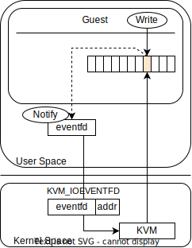

# Implement virtio in ToyVMM

本節では、ToyVMMにおけるVirtioの具体的な実装について記載する。  
以下の3項目が本説における主要なトピックである

* Virtqueueの実装
* irqfd, ioeventfdによるゲスト・ホスト間の軽量な通知の実装
* MMIO Transportの実装

[前節](./03-1_virtio.md)でも述べた通りToyVMMではTransportとしてひとまずMMIOを利用する。  
具体的な説明に入る前に、以下に今回実装したVirtioの実装の全体像を図示する。  

<div align="center">

</div>

この図を適宜見返しつつ、以降の説明とコードを読み進めることで理解が深まるはずである。

### 実装方針

実装においては、VirtioDevice自体は抽象概念 (`Trait`) として実装し、これを満たす構造体として具体的に`Net`や`Block`といったデバイスを作成していく。
また、Transportについても`PCI`と`MMIO`で選択肢があるためこれも抽象概念とし、それぞれの実体（今回は`MMIO`）に合わせて実装する形にする。  

<div align="center">

</div>

最後にVirtqueueの実装が必要になるが、これは実装するVirtioデバイスによって個数や利用方法は異なるが、その構造自体は変化しないことを前提に素直に実装する。詳細は後述する。


### Virtqueueの実装

#### Virtqueue Deep-Dive

Virtqueueの実装に入る前、一般的なVirtQueueの構造についてより詳細に把握しておく。
Virtqueueは以下のように、`Descriptor Table`、`Available Ring`、`Used Ring`の3つの要素で構成される。
それぞれの役割は以下のようなものである。

* `Descriptor Table` : ホストとゲストの間で共有したいデータの位置やサイズなどの情報を格納しているエントリ（`Descriptor`）を保持しているテーブル
* `Available Ring` : ゲストからホストに対して通知したい情報を格納したDescriptorについて管理している構造
* `Used Ring` : ホストからゲストに対して通知したい情報を格納したDescriptorについて管理している構造

<div align="center">

</div>

以降、それぞれの要素について詳細に確認していきつつ、どのように協調動作するかを把握していく。
まず、`Descriptor Table`は具体的には以下のようなデータ構造（図中には`Descriptor`と記載したエントリ）を集めたものになっている。

> ```C
> struct virtq_desc { 
>         /* Address (guest-physical). */ 
>         le64 addr; 
>         /* Length. */ 
>         le32 len; 
>  
> /* This marks a buffer as continuing via the next field. */ 
> #define VIRTQ_DESC_F_NEXT   1 
> /* This marks a buffer as device write-only (otherwise device read-only). */ 
> #define VIRTQ_DESC_F_WRITE     2 
> /* This means the buffer contains a list of buffer descriptors. */ 
> #define VIRTQ_DESC_F_INDIRECT   4 
>         /* The flags as indicated above. */ 
>         le16 flags; 
>         /* Next field if flags & NEXT */ 
>         le16 next; 
> };
> ```
> Source: [2.7.5 The Virtqueue Descriptor Table](https://docs.oasis-open.org/virtio/virtio/v1.2/cs01/virtio-v1.2-cs01.html#x1-430005)

`Descriptor`は転送するデータについてと、次のデータのありかについて表現されている構造になっている。
* `addr`が実際のデータのアドレス（ゲストの物理アドレス）であり、そのデータ長の情報は`len`から取得できる。
* `flags`は、次のdescriptorがあるかどうかや、write onlyかどうかなどの情報を提供するフラグである。
* `next`は次のdescriptor番号を示しており、この値を元にDescriptor Tableを順番に処理していけるようになっている。

基本的には、1つのデータを送信するために一つのDescriptorが利用されるが、データのアドレスがゲスト上の物理アドレスであり、連続している範囲に限られることに注意されたい。もし仮想アドレス上で連続する領域を確保していてたとしても、物理アドレス上で連続していない場合は、物理ページ毎にDescriptorが1つ必要になり複数のDescriptorを連続して送信することになる。


次に`Avaialble Ring` である。`Available Ring`は以下のようなデータ構造になっている。

> ```C
> struct virtq_avail { 
> #define VIRTQ_AVAIL_F_NO_INTERRUPT      1 
>         le16 flags; 
>         le16 idx; 
>         le16 ring[ /* Queue Size */ ]; 
>         le16 used_event; /* Only if VIRTIO_F_EVENT_IDX */ 
> }
> ```
> Source: [2.7.6 The Virtqueue Available Ring](https://docs.oasis-open.org/virtio/virtio/v1.2/cs01/virtio-v1.2-cs01.html#x1-490006)

`Avaiable Ring`は「ゲストからホストへ」通知したいDescriptorを指定するために利用する。
* `flags`は割り込みの一時的な抑制などに利用されるフラグ
* `idx`は`ring`で一番新しいエントリのインデックス
* `ring`はRingの本体。Descriptorの番号を保持している
* `used_event`も割り込みの抑制に利用されるデータであるが、こちらは後述する`Used Ring`のエントリがこの値で指定したindexに書き込まれるまで通知が不要であることをデバイスに通知するできるというもの

ゲストは実際のデータのありかについてはDescriptorに書き込み、Descriptorのindex情報をこの`Available Ring`（実際にはそのフィールドである`ring`）に書き込む。
一つ重要な事実として、**ホストは最後に処理した`ring`のエントリ番号を記憶しておく必要がある**。
ゲストから与えられ得る情報はあくまで、現在のringの状態、及びringの最新index情報（`idx`フィールド）であるため、ホストは最後に処理したエントリの番号と最新のindex情報を比較し、差分がある(=新しいエントリがある)場合に、ringを参照してDescriptorのindexを取得し、Descriptorから対応するデータを取得する。そして取得したデータをもとにどのような処理をするかは、実際のDeviceの実装に依存する。

最後に`Used Ring`である。`Userd Ring`は以下のようなデータ構造になっている。

> ```C
> struct virtq_used { 
> #define VIRTQ_USED_F_NO_NOTIFY  1 
>         le16 flags; 
>         le16 idx; 
>         struct virtq_used_elem ring[ /* Queue Size */]; 
>         le16 avail_event; /* Only if VIRTIO_F_EVENT_IDX */ 
> }; 
>  
> /* le32 is used here for ids for padding reasons. */ 
> struct virtq_used_elem { 
>         /* Index of start of used descriptor chain. */ 
>         le32 id; 
>         /* 
>          * The number of bytes written into the device writable portion of 
>          * the buffer described by the descriptor chain. 
>          */ 
>         le32 len; 
> };
> ```
> Source: [2.7.8 The Virtqueue Used Ring](https://docs.oasis-open.org/virtio/virtio/v1.2/cs01/virtio-v1.2-cs01.html#x1-540008)

`Used Ring`は`Avaialble Ring`の逆、つまり「ホストからゲストへ」通知したいDescriptorを指定するために利用する。

* `flags`は割り込みの一時的な抑制などに利用されるフラグ
* `idx`は`ring`で一番新しいエントリのインデックス
* `ring`はRingの本体。Descriptorの番号を保持している
* `used_event`も割り込みの抑制に利用されるデータであるが、こちらは後述する`Used Ring`のエントリがこの値で指定したindexに書き込まれるまで通知が不要であることをデバイスに通知するできるというもの

ホストからゲストに通知を返す場合も、リプライに対応するデータをゲストに返却すべく、Descriptorを利用してデータの在処をゲストに伝える。
そして、`Used Ring`の`ring`にDescriptorのindexを格納し、idxの値は`ring`の最新のindexを指すように更新した上でゲストに処理を戻す。

ただし、`Avaiable Ring`とは少し異なり`ring`の要素が構造（`virtq_used_elem`）を伴っている

* `id`はDescriptorチェーンの先頭エントリ (virtq_avail.idxと同じ)
* `len`は`id`で指すDescriptorチェーンに対して、ホスト側で行われたI/Oの総量などを格納する。

これまで説明してきた内容を一枚の図にまとめると以下のようになる。

<div align="center">

</div>

以上が、Virtqueueの実装に必要な知識である

#### Virtqueue implementation on ToyVMM

ToyVMMでは`queue.rs`にVirtqueueの実装を行っている。  

`Descriptor Table`、`Available Ring`、`Used Ring`のGuest Memory上の具体的なアドレスなどは、Guest VM起動時のGuest側のDevice Driverとのやりとりによって設定されることになる。
この一連のやり取りについては後ほど実際にゲストからのIO要求を覗き見ながら確認するが、ここではこの事実だけ把握されたい。

ToyVMM側はそれぞれの先頭アドレスの位置とVirtioの仕様を元にアドレスアクセスを行っていく必要がある。
基本的にはDescriptorのエントリ単位で処理を行うことが想定される（このエントリの先に具体的なデータのアドレスが格納されている）
このデータ処理に伴って`Available Ring`や`Used Ring`を更新する形になる。

さて具体的にコードを参照しながら解説を勧めていく。
`Queue`という構造体がToyVMMにおける`Virtqueue`を表現する構造体である。定義としては以下のようになっている。

```Rust
#[derive(Clone)]
/// A virtio queue's parameters
pub struct Queue {
    /// The maximal size in elements offered by the device
    max_size: u16,

    /// The queue size in elements the driver selected
    pub size: u16,

    /// Indicates if the queue is finished with configuration
    pub ready: bool,

    /// Guest physical address of descriptor table
    pub desc_table: GuestAddress,

    /// Guest physical address of the available ring
    pub avail_ring: GuestAddress,

    /// Guest physical address of the used ring
    pub used_ring: GuestAddress,

    next_avail: Wrapping<u16>,
    next_used: Wrapping<u16>,
}
```

Virtqueuesに必要な、`Descriptor Table`, `Available Ring`, `Used Ring`の定義が確認できるだろう。それぞれゲストメモリ上のアドレス値を指し示しており、このはゲストのDevice Driverとのやり取りで初期化される部分である。
前述したとおりToyVMMからみるとそれぞれのデータはあくまでゲストの物理メモリでしかなく、これに対してVirtioの仕様に基づいたアドレスアクセスを伴っていく。

では具体的なアドレスアクセスについて見ていく。
ToyVMMでは`Avail Ring`の状態から`Descriptor`を取得する一連の流れを"VirtqueueのIteration"として隠蔽しており、Virtqueueを利用した実際のデバイスの実装においては以下のようなコードを記載する形になっている。

```rust
// queue : 'Queue' struct
// desc_chain: 'DescriptorChain' struct
for desc_chain in queue.iter(mem) {
  // 'desc_chain' contrains the 'addr', 'len', 'flags' and 'next' values of the descriptor
  // behind the iteration, the data related to 'queue.avail_ring' is adjusted.
}
```

iterationの裏で何が起きているかを説明していこう。
まず、`Queue`構造体は以下のようなiter関数を実装しており`AvailIter`構造体を作成している。`AvailIter`の作成にあたり、`GuestMemory`と`avail_ring`の先頭アドレスから`Available Ringの`最新の`idx`を取得している。

```Rust
/// A consuming iterator over all available descriptor chain heads offered by the driver
pub fn iter<'a, 'b>(&'b mut self, mem: &'a GuestMemoryMmap) -> AvailIter<'a, 'b> {
    ... // validation codes
    let queue_size = self.actual_size();
    let avail_ring = self.avail_ring;

    // Access the 'idx' fields of available ring
    // skip 2byte (= u16 / 'flags' member) from avail_ring address
    // and get 2byte (= u16 / 'idx' member that represents the newest index of avail_ring) from that address.
    let index_addr = mem.checked_offset(avail_ring, 2).unwrap();
    let last_index: u16 = mem.read_obj(index_addr).unwrap();

    AvailIter {
        mem,
        desc_table: self.desc_table,
        avail_ring: self.avail_ring,
        next_index: self.next_avail,
        last_index: Wrapping(last_index),
        queue_size,
        next_avail: &mut self.next_avail,
    }
}
```

上記の通り`iter`関数を呼び出すことで`AvailIter`が返却されるが、イテレーション処理ではこの`AvailIter`が実装している`next`関数が呼び出される。
`next`関数は`Option<T>`を返却するように実装し、値がある場合はその値がイテレーション時の要素になり、`None`を返すとイテレーション終了になる。
さて、では`AvailIter`の`next`関数の実装をみてみる。

```rust
impl<'a, 'b> Iterator for AvailIter<'a, 'b> {
  type Item = DescriptorChain<'a>;

  fn next(&mut self) -> Option<Self::Item> {
    if self.next_index == self.last_index {
      return None;
    }

    // Access the avail_ring element indicated by self.next_index
    // skip 4byte (=u16 x 2 / 'flags' member and 'idx' member from avail_ring)
    // Because of the Ring, calculate modulo (= self.next_index % self.queue_size)
    // and the result of modulo calculation, convert to 2bytes order
    // (because the unit of avail_ring's element is 2byte)
    let offset = (4 + (self.next_index.0 % self.queue_size) * 2) as usize;
    // Calculate the next desc_index address from avail_ring address.
    let avail_addr = match self.mem.checked_offset(self.avail_ring, offset) {
      Some(a) => a,
      None => return None,
    };
    // Get the next desc_index value from avail_ring.
    let desc_index: u16 = self.mem.read_obj(avail_addr).unwrap();

    self.next_index += Wrapping(1);

    let ret = DescriptorChain::checked_new(self.mem, self.desc_table, self.queue_size, desc_index);
    if ret.is_some() {
      *self.next_avail += Wrapping(1);
    }
    ret
  }
}
```

`self.last_index`が`iter`関数で取得した「現在の`avail_ring`における最新要素のindex（= ここまで処理したい、という値）」であり、`self.next_index`が「これまで処理してきたindexの値」になる。
この`next`の中で`self.next_index`の値をインクリメントしていくため、Iterationをしていく中でいずれ`self.next_index`と`self.last_index`の値が一致する（= 必要なところまで処理しきる）ところまで進みNoneが帰ることで繰り返しが終了する、というのが大枠である。

さらにこの関数のなかで、`self.next_index`が指す`avail_ring`上の要素（= descriptorのindexを指している）を取り出し、それを利用して`DescriptorChain::checked_new`を呼び出し、その値を返却している。

この`checked_new`関数では関数に渡した上記のindex値から具体的にその要素のアドレスを割り出してアドレスアクセスを行い、`desciptor`が指しているデータのアドレス(`addr`)やデータ長(`len`)、フラグ(`flags`)、次のdesciptorの番号(`next`)を取り出したうえで、`DescriptorChain`構造体を構成する。

```Rust
fn checked_new(
    mem: &GuestMemoryMmap,
    desc_table: GuestAddress,
    queue_size: u16,
    index: u16,
) -> Option<DescriptorChain> {
    if index >= queue_size {
        return None;
    }

    // The size of each element of descriptor table is 16 bytes
    // - le64 addr  = 8byte
    // - le32 len   = 4byte
    // - le16 flags = 2byte
    // - le16 next  = 2byte
    // So, the calculation of the offset of the address
    // indicated by desc_index is 'index * 16'
    let desc_head = match mem.checked_offset(desc_table, (index as usize) * 16) {
        Some(a) => a,
        None => return None,
    };
    // These reads can't fail unless Guest memory is hopelessly broken
    let addr = GuestAddress(mem.read_obj(desc_head).unwrap());
    mem.checked_offset(desc_head, 16)?;
    let len = mem.read_obj(desc_head.unchecked_add(8)).unwrap();
    let flags: u16 = mem.read_obj(desc_head.unchecked_add(12)).unwrap();
    let next: u16 = mem.read_obj(desc_head.unchecked_add(14)).unwrap();
    let chain = DescriptorChain {
        mem,
        desc_table,
        queue_size,
        ttl: queue_size,
        index,
        addr,
        len,
        flags,
        next,
    };
    if chain.is_valid() {
        Some(chain)
    } else {
        None
    }
}
```

`next`関数の帰り値として上記で作成した`DesciptorChain`を返却しているので、ループ内部ではDescriptorの情報にアクセスする際はIteration処理で取得できる`DescriptorChain`構造体の該当するメンバにアクセスするだけで良い形になっている。

なお、ここでは説明を省略するが、Iteration処理の中で`next`が指すDescriptorの取得が必要になるケースが想定される。
これに対応するために`DescriptorChain`構造体は`next_descriptor`関数を実装しており、この関数を呼び出すだけで良い。

ここまであまり触れてこなかったが、`Used Ring`についてもHost側で更新する必要がある。
ただしこちらについては難しい処理はほとんど不要で、以下のような関数を定義しておき必要に応じて呼び出しているだけの実装で基本的に事足りている。

```rust
/// Puts an available descriptor head into the used ring for use by the guest
pub fn add_used(&mut self, mem: &GuestMemoryMmap, desc_index: u16, len: u32) {
    if desc_index >= self.actual_size() {
        // TODO error
        return;
    }
    let used_ring = self.used_ring;
    let next_used = (self.next_used.0 % self.actual_size()) as u64;

    // virtq_used structure has 4 byte entry before `ring` fields, so skip 4 byte.
    // And each ring entry has 8 bytes, so skip 8 * index.
    let used_elem = used_ring.unchecked_add(4 + next_used * 8);
    // write the descriptor index to virtq_used_elem.id
    mem.write_obj(desc_index, used_elem).unwrap();
    // write the data length to the virtq_used_elem.len
    mem.write_obj(len, used_elem.unchecked_add(4)).unwrap();

    // increment the used index that is the last processed in host side.
    self.next_used += Wrapping(1);

    // This fence ensures all descriptor writes are visible before the index update is.
    fence(Ordering::Release);
    mem.write_obj(self.next_used.0, used_ring.unchecked_add(2))
        .unwrap();
```

次節で説明するvirtio-net device、及びその次に説明するvirtio-blk deviceの実装において、上記で示したqueueのiterationを利用して具体的なIOの実装を行っているのでこの前提を覚えておいてほしい。

### irqfd, ioeventfdによるゲスト・ホスト間の軽量な通知の実装

Virtqueueの実装についてここまで話してきたが、ここではもう一つVirtqueueに関係する重要な話をしよう。
それはVirtqueueを利用したホストとゲスト間のやり取りに必要になる「通知」の機能である。
VirtioではVirtqueueにデータを詰めたのち、ゲストからホスト、またはホストからゲストに通知を行う仕組みが必要になる。
この通知はどのように実現されているのか、という話を抑えておく必要がある。

端的にいえば、GuestとHostの間での通知は`ioeventfd`と`irqfd`の仕組みを利用することで実現している。
これはともに`KVM API`によって提供される仕組みである。

まずGuestからHostに対する通知であるが、これは`ioeventfd`を利用して実装する。
`ioeventfd`はGuest VMで発生したPIO/MMIOによるメモリへの書き込みをeventfdの通知に変化する仕組みである。
KVM APIとしては`KVM_IOEVENTFD`を利用し、引数に通知を受けるeventfdやMMIOのアドレスを渡すことで、この引数のMMIOアドレスへの書き込みが、同じく引数のeventfdへの通知に変換される。
これによってKVM APIを呼び出したソフトウェア（= ToyVMM）側で、eventfdからゲストからの通知を受け取ることができる。
この仕組みはイベント通知の効率を向上させるための仕組みであり、従来のポーリングや割り込みハンドラによる方式に比べ軽量な実装になっている。

<div align="center">

</div>

次にHostからGuestに対する通知だが、これは`irqfd`の仕組みを利用する。
`irqfd`はこれまでの実装でも既に利用しているが、`KVM_IRQFD`を利用し、引数に通知に利用するeventfdと対応して発火させたいGuestのirq番号を渡すことで、ToyVMM側でのeventfdへのwriteが、Guestのirqへのハードウェア割り込みに変換される。

<div align="center">

</div>

上記のようなKVM APIをベースとする通知機能を利用し、ゲストとホストの間での通知を実現している。具体的な使い方は次の「MMIO Transportの実装」の説明で触れることとする。

### MMIO Transportの実装

ここからはMMIO Transportの実装について説明していく。
[Virtio Over MMIO](https://docs.oasis-open.org/virtio/virtio/v1.2/cs01/virtio-v1.2-cs01.html#x1-1650002)が公式の仕様なので必要に応じてこちらを参照されたい。

MMIO TransportはPCIサポートのない仮想環境などで簡単に利用できる方式である。Firecrackerでは基本的にMMIO Transportのみサポートしているようである。MMIO Transportは特定のメモリ領域へのRead/Writeを通してデバイス操作を行う方式である。  

MMIO TransportはPCIのような汎用のDevice discovery仕組みを利用できない。
そのため、MMIOにおけるDevice discoveryは[MMIO Device Discovery](https://docs.oasis-open.org/virtio/virtio/v1.2/cs01/virtio-v1.2-cs01.html#x1-1660001)で説明のある通り、ゲストOSに対してそのメモリマップされたデバイスの位置と割り込み位置について提供する必要がある。
具体的にはDevice Treeに記載する方式が公式では書かれているが、それ以外に[カーネル起動時のコマンドライン引数に埋め込む方法](https://docs.kernel.org/admin-guide/kernel-parameters.html)が存在している。Guest VM起動時にこのコマンドライン引数はToyVMMから動的に調整できるため今回は後者の方式をとることとした。

この方式では以下のような書式に従って記述することでMMIO deviceのdiscoveryを行うようにGuest VMに情報を提供することができる。  

```bash
(format)
virtio_mmio.device=<size>@<baseaddr>:<irq>

(example)
virtio_mmio.device=4K@0xd0000000:5
```

この場合、Guest VMは0xd0000000のアドレスを起点として、決まったオフセット（Register位置）にRead/Writeを実施することでデバイスの初期化や設定を実施する。
[MMIO Device Register Layout](https://docs.oasis-open.org/virtio/virtio/v1.2/cs01/virtio-v1.2-cs01.html#x1-1670002)に記載してあるのがその全てである。

ToyVMMの観点からみると、それぞれのRegisterに対してRead/Writeが発生した際に、上記のSpecに従った処理が実施されることを保証しなければならず、これを実装するというのがMMIO Transportの実装の中核である。
基本的には上記のMMIOの領域に対するIOは`KVM_EXIT_MMIO`として処理が渡ってくるので、これをうまくハンドルすれば良く、デバイスの初期化などは基本的にこの流れで処理する。

一方で、これまで議論してきたVirtqueueを通したI/Oのための通知については、ioeventfd, irqfdを使って取り回すことにしたい。
MMIO Transportではベースアドレスからのoffsetが0x050の位置にWriteすることが、デバイスに対して「処理すべきデータがバッファに存在する」ということを通知する処理に該当する。
つまり、このアドレスと、Eventfdを`KVM_IOEVENTFD`によって紐づけ、更に実装したいVirtio Deviceの処理をこのEventfdをハンドルする形で記述すれば、eGuestで発生したNotify（MMIOへの書き込み）が、直接Eventfdへの割り込みとして通知され、それに従いデバイスを処理するコードがかける。

さらに、コマンドライン経由でゲストに渡す情報としてIRQの情報を提示しているため、ゲストは指定されたIRQに対して割り込みが入った場合に、対応するデバイスのハンドラを起動するようにセットアップを進めることになる。  
逆にGuest VMに対して見せたVirtioデバイスに割り込みをかけたい時（Guest VMに処理を移譲したい場合）には、このIRQに対して割り込みをかけることができれば良いということになる。
つまり、Eventfdを作成して上記のIRQ番号とともに`KVM_IRQFD`で登録し、以降はToyVMM側でこのEventfdに対してwriteすることで割り込みがかけられる。

以上の話をまとめたのが以下の図でありToyVMMはこの実装を行っている。

<div align="center">

</div>

#### MMIO Transport - MMIO Device Register Layoutに対応する実装

MMIO Transportの実装は`mmio.rs`に存在している。
`MmioTransport`は[Serial Console implementation](./02-5_serial_console_implementation.md)で触れたI/O Busを表現する構造体と同様に、`BusDevice` Traitを実装しており、これは`Bus`構造体に登録される。`KVM_EXIT_MMIO`に対応する`VcpuExit::MmioRead`、`VcpuExit::MmioWrite`といったMMIO領域へのI/Oを、従来の`VcpuExit::IoIn`、`VcpuExit::IoOut`と同じように処理できるようにしている。
従って`MmioTransport`が`BusDevice`を満たすために実装している`read`、`write`関数に具体的なレジスタアクセスに対する処理、つまりデバイスのエミュレーション処理が記載してある。当然ながらこれは[MMIO Device Register Layout](https://docs.oasis-open.org/virtio/virtio/v1.2/cs01/virtio-v1.2-cs01.html#x1-1670002)の仕様に従って処理するような実装がなされている。参考程度に`read`の実装の一部を以下に掲載する

```Rust
impl BusDevice for MmioTransport {
    // OASIS: MMIO Device Register Layout
    #[allow(clippy::bool_to_int_with_if)]
    fn read(&mut self, offset: u64, data: &mut [u8]) {
        match offset {
            0x00..=0xff if data.len() == 4 => {
                let v = match offset {
                    0x0 => MMIO_MAGIC_VALUE,
                    0x04 => MMIO_VERSION,
                    0x08 => self.device.device_type(),
                    0x0c => VENDOR_ID,
                    0x10 => {
                        self.device.features(self.features_select)
                            | if self.features_select == 1 { 0x1 } else { 0x0 }
                    }
                    0x34 => self.with_queue(0, |q| q.get_max_size() as u32),
                    0x44 => self.with_queue(0, |q| q.ready as u32),
                    0x60 => self.interrupt_status.load(Ordering::SeqCst) as u32,
                    0x70 => self.driver_status,
                    0xfc => self.config_generation,
                    _ => {
                        println!("unknown virtio mmio register read: 0x{:x}", offset);
                        return;
                    }
                };
                LittleEndian::write_u32(data, v);
            }
            0x100..=0xfff => self.device.read_config(offset - 0x100, data),
            _ => {
                // WARN!
                println!(
                    "invalid virtio mmio read: 0x{:x}:0x{:x}",
                    offset,
                    data.len()
                );
            }
        }
    }
```

`read`, `write`をそれぞれ詳細に説明すると膨大な量になるためここでは説明を割愛するが、見たとおり素直な実装になっているため、仕様を見ながらソースコードを確認すれば容易に理解できるだろう。

この部分の処理はGuest VMの起動時に生じるVirtio deviceに対するDevice Driverからの初期化シーケンスで実施される初期化や設定などで呼び出されることになるため、ここにデバッグコードを仕込むことで、ゲストから発生するデバイス初期化シーケンスを観察することができる。
以降では、実際にGuest VMが起動するタイミングで実施されるやり取りを観察しつつ、OASISの仕様と照らし合わせることで理解の助けとする。

#### Guest VMの起動シーケンスでのMMIO Device初期化処理の観察

Guest OSにはVirtioのデバイスドライバ（ゲスト側のドライバ）が存在しており、これが仕様通りにVirtioデバイスの初期化をすることを期待する。
今回のMMIOベースの実装では起動時のカーネルコマンドラインで指定したvirtioデバイスのMMIOレンジの情報をもとに、Guest VMがR/Wをかけるはずであり、Hypervisor側としてはVMExitが発生して適切にトラップする必要があるコード部に該当するため、デバッグコードを仕込むことは容易である。
実際にデバッグコードを仕込んで、ゲストOSの起動シーケンス中にMMIOの領域に対して発生したR/Wを観測してみる。

具体的な処理の流れをみる前に、仕様上での初期化処理について整理しておく。
以降の議論では`virtio-net`がネットワークデバイスの初期化しようとする処理を題材としている。
デバイスの初期化の仕様は、MMIO Transportにおけるデバイスの初期化（[MMIO-specific Initialization And Device Operation](https://docs.oasis-open.org/virtio/virtio/v1.2/cs01/virtio-v1.2-cs01.html#x1-1700003)）、汎用的なデバイスの初期化（[General Initialization And Device Operation](https://docs.oasis-open.org/virtio/virtio/v1.2/cs01/virtio-v1.2-cs01.html#x1-1060003)）、デバイス特有の初期化に分かれる。
これらを合わせると仕様上は概ね以下のような流れになる。

1. Magic Numberの読み出し。Device ID、Device Type、Vendor ID等の読み出し
2. Deviceのリセット
3. ACKNOWLEDGEステータスビットを設定
4. Device feature bitsを読み出し、OSとドライバが解釈できるfeature bitsをデバイスに設定。
5. FEATURES_OKステータスビットを設定
6. デバイス固有の設定を実施する（Virtqueueの検出や設定の書き込みなど）
7. DRIVER_OKステータスビットを設定し、この時点でデバイスはLiveの状態になる。

さて、上記を念頭においてでは実際のGuest VM起動時の処理について確認してみよう。
以下では、デバッグコードを仕込んだ上でゲストOSを起動した際に、デバッグコードにより出力された情報に対して、私が説明のためにコメントを付け加えたものである。

```bash
# offset 0x00 からmagic numberを読み出し
# Little Endianなので元の値は 116,114,105,118
# 116(10) = 74(16)
# 114(10) = 72(16)
# 105(10) = 69(16)
# 118(10) = 76(16)
# 従って、0x74726976 (magic number)
MmioRead: addr = 0xd0000000, data = [118, 105, 114, 116]
# offset 0x04 から device id(0x02)を読み出し
MmioRead: addr = 0xd0000004, data = [2, 0, 0, 0]
# offset 0x08 から device typeを(net = 0x01)読み出し
MmioRead: addr = 0xd0000008, data = [1, 0, 0, 0]
# offset 0x0c から vendor id (virtio vendor id = 0x00) を読み出し
MmioRead: addr = 0xd000000c, data = [0, 0, 0, 0]

# この辺りはDevice Initializationのフェーズ(3.1.1 Driver Requirements: Device Initialization)
# offset 0x70(= Status) に0を書き込み -> デバイスステータスをリセット
MmioWrite: addr = 0xd0000070, data = [0, 0, 0, 0]
# offset 0x70 から読み込み。今デバイスはリセットされている
MmioRead: addr = 0xd0000070, data = [0, 0, 0, 0]
# offset 0x70 に0x01 = ACKNOWLEDGE をセット。
MmioWrite: addr = 0xd0000070, data = [1, 0, 0, 0]
# offset 0x70 から読み込み。確認か?
MmioRead: addr = 0xd0000070, data = [1, 0, 0, 0]
# offset 0x70(= Status)に0x02 = Device(2)を'加算した値'(1 + 2 = 3)を書き込み
MmioWrite: addr = 0xd0000070, data = [3, 0, 0, 0]

# Device/DriverのFeature bitsに関する処理。
# Deviceは自身が持つ機能セット(feature bits)を提供し、デバイスの初期化時にドライバはこれを読んだ上で、受け入れる機能サブセットをデバイスに指示する。
# 
# まずは、Guest OS上のvirtio device driverがfeature bitsを読みだす処理
# offset 0x14(=DeviceFeatureSel) に0x01をSet(次の処理に関わる)
MmioWrite: addr = 0xd0000014, data = [1, 0, 0, 0]
# offset 0x10(=DeviceFeatures)にたいしてRead.
# 読みだすのはDeviceFeatures bitだが、(DeviceFeatureSel * 32) + 31 bitsを返却する
# 今DeviceFeatureSel=1なので、DeviceFeatures bitsのうち、64~32 bitsを返却する。
# virtio-netだと、DeviceFeatureSel=0x0000_0001_0000_4c83 (64bit)なので、
# 先頭0x0000_0001がLittle Endiandで取り出される。
MmioRead: addr = 0xd0000010, data = [1, 0, 0, 0]
# offset 0x14(=DeviceFeatureSel)に0x00をSet(次の処理に関わる)
MmioWrite: addr = 0xd0000014, data = [0, 0, 0, 0]
# offset 0x10(=DeviceFeatures)にたいしてRead.
# 今DeviceFeatureSel=0なので、DeviceFeatures bitsのうち、31~0 bitsを返却する。
# virtio-netだと、DeviceFeatureSel=0x0000_0001_0000_4c83 (64bit)なので、
# 0x0000_4c83がLittle Endiandで取り出される。以下、値の確認
# Little Endianを戻す: 0,0,76,131
# 76(10) = 4c
# 131(10) = 83
# 0x00004c83 -> avail_features(0x100004c83)のうち、VIRTIO_F_VERSION_1で立てているbit(0x100000000)を無視したbit
# つまり、
# * virtio_net_sys::VIRTIO_NET_F_GUEST_CSUM
# * virtio_net_sys::VIRTIO_NET_F_CSUM
# * virtio_net_sys::VIRTIO_NET_F_GUEST_TSO4
# * virtio_net_sys::VIRTIO_NET_F_GUEST_UFO
# * virtio_net_sys::VIRTIO_NET_F_HOST_TSO4
# * virtio_net_sys::VIRTIO_NET_F_HOST_UFO
# のfeature bitの情報を返却している
MmioRead: addr = 0xd0000010, data = [131, 76, 0, 0]
# feature bitsの読み出しはここまでで、ここからは受け入れる機能サブセットをデバイスに指示する処理
# 処理としては読み出し時と似たような感じで、DriverFeatureSel bitに0x00/0x01を書き込んだ上で、DriverFeatureに設定したいfeature bitsを書き込んでいく
# まず、offset 0x24(DriverFeatureSel/activate guest feature) に対して、0x01をSet(= acked_featuresに0x01を設定)
MmioWrite: addr = 0xd0000024, data = [1, 0, 0, 0]
# offset 0x20(DriverFeatures)に対して0x01(= 0x0000_0001, 先に読み出した値の片方)をSet（DriverFeatureSelに0x01が設定されているので、
# 32bit shiftが起きて、0x0000_0001_0000_0000 が実際は設定される）
MmioWrite: addr = 0xd0000020, data = [1, 0, 0, 0]
# offset 0x24(DeviceFeatureSel/activate guest feature)に対して、0x00をSet(= acked_featuresに0x00を設定)
MmioWrite: addr = 0xd0000024, data = [0, 0, 0, 0]
# offset 0x20(DeviceFeatures)に対して、0x0000_4c83（先に読み出した値の片方）をSet（DriverFeatureSelに0x00が設定されているので、そのまま加算する形で書き込む）
MmioWrite: addr = 0xd0000020, data = [131, 76, 0, 0]
# ここまでで、Feature bitsの処理が完了する。

# offset 0x70(= Status)を読み込み -> 直近で0x03が指定されているので、0x03が返却されるのはよい。
MmioRead: addr = 0xd0000070, data = [3, 0, 0, 0]
# offset 0x70(= Status)に0x08 = FEATURES_OK(8)を'加算した値'(3 + 8 = 11)を書き込み
MmioWrite: addr = 0xd0000070, data = [11, 0, 0, 0]
# offset 0x70(= Status)から読み込み。当然11が返る
MmioRead: addr = 0xd0000070, data = [11, 0, 0, 0]

# device-specific setupはここからになる(4.2.3.2 Virtqueue Configuration)
# offset 0x30(=QueueSel)に 0x00 をSet(self.queue_select)
MmioWrite: addr = 0xd0000030, data = [0, 0, 0, 0]
# offset 0x44(QueueReady)を読み込んで、まだreadyではないので0x0が返却され、これは期待通り。
MmioRead: addr = 0xd0000044, data = [0, 0, 0, 0]
# offset 0x34(QueueNumMax)を読み込んで、queueのサイズを確認。
MmioRead: addr = 0xd0000034, data = [0, 1, 0, 0]
# offset 0x38(QueueNum)に先ほど読み込んだQueueNumをセット(q.size)
MmioWrite: addr = 0xd0000038, data = [0, 1, 0, 0]

# Virtual queue's 'descriptor' area 64bit long physical address
# offset 0x80(QueueDescLow = lo(q.desc_table) / lower 32bits of the address)に、
# QueueSelレジスタで選択したqueue（0）のdiscriptor領域の位置をSet -> 122,209,64,0 -> 0x7ad14000
MmioWrite: addr = 0xd0000080, data = [0, 64, 209, 122]
# 同上。但し0x84(QueueDescHigh = hi(q.desc_table) / higher 32 bits of the address)の残りの部分をSet.
MmioWrite: addr = 0xd0000084, data = [0, 0, 0, 0]
# 二つ合わせると、0x0000_0000_7ad1_4000 (q.desc_table) が先頭アドレス

# Virtual queue's 'driver' area 64bit log physical address
# offset 0x90(QueueDeviceLow = lo(q.avail_ring) / lower 32bits of the address)に、
# QueueSelレジスタで選択したqueue(0)のdriver領域(avail_ring)の位置をSet -> 122,209,80,0 -> 0x7ad15000
MmioWrite: addr = 0xd0000090, data = [0, 80, 209, 122]
# 同上。但し0x94(QueueDeviceHigh = hi(q.avail_ring) / higher 32 bits of the address)の残りの部分をSet.
MmioWrite: addr = 0xd0000094, data = [0, 0, 0, 0]
# 二つ合わせると、0x0000_0000_7ad1_5000 (q.avail_ring)
# q.desc_tableのアドレスレンジ: q.avail_ring - q.desc_table = 0x1000 = 512(10)

# Virtual queue's 'device' area 64bit long physical address
# offset 0xa0(QueueDeviceLow = lo(q.used_ring) / lower 32bits of the address)に、
# QueueSelレジスタで選択したqueue(0)のdevice領域 (q.used_ring) の位置をSet -> 122,209,96.0 -> 0x7ad16000
MmioWrite: addr = 0xd00000a0, data = [0, 96, 209, 122]
# 同上。但し0xa4（QueueDeviceHigh = hi(q.used_ring) / higher 32bits of the address）の残り部分をSet.
MmioWrite: addr = 0xd00000a4, data = [0, 0, 0, 0]
# 二つ合わせると、0x0000_0000_7ad1_6000 (q.used_ring)
# q.avail_ringのアドレスレンジ: q.used_ring - q.avail_ring = 0x1000 = 512(10)

# offset 0x44 (QueueReady = q.ready) に対して0x1を書き込んでReadyにしている
MmioWrite: addr = 0xd0000044, data = [1, 0, 0, 0]

# 上記と同じ流れをもう片方のqueue(1)でも実施している
MmioWrite: addr = 0xd0000030, data = [1, 0, 0, 0]
MmioRead: addr = 0xd0000044, data = [0, 0, 0, 0]
MmioRead: addr = 0xd0000034, data = [0, 1, 0, 0]
MmioWrite: addr = 0xd0000038, data = [0, 1, 0, 0]
MmioWrite: addr = 0xd0000080, data = [0, 128, 196, 122]
MmioWrite: addr = 0xd0000084, data = [0, 0, 0, 0] # q.desc_table = 0x0000_0000_7ad1_8000
MmioWrite: addr = 0xd0000090, data = [0, 144, 196, 122]
MmioWrite: addr = 0xd0000094, data = [0, 0, 0, 0] # q.avail_ring = 0x0000_0000_7ad1_9000
MmioWrite: addr = 0xd00000a0, data = [0, 160, 196, 122]
MmioWrite: addr = 0xd00000a4, data = [0, 0, 0, 0] # q.used_ring = 0x0000_0000_7ad1_a000
MmioWrite: addr = 0xd0000044, data = [1, 0, 0, 0]
# ここまでで、device-specificなセットアップ（virtio-net向けの2つのqueueのセットアップ）が完了

# offset 0x70(= Status)を読み込み -> 0x11が書いてあるのでそれが返却される
MmioRead: addr = 0xd0000070, data = [11, 0, 0, 0]
# offset 0x70(= Status)に0x04 = DRIVER_OK(4)を'加算した値'(11 + 4 = 15)を書き込み
MmioWrite: addr = 0xd0000070, data = [15, 0, 0, 0]
# offset 0x70(= Status) を読み込んで値確認かな?
MmioRead: addr = 0xd0000070, data = [15, 0, 0, 0]
# ここまでで、Device Initializationのフェーズ(3.1.1 Driver Requirements: Device Initialization)は完了する
```

冷静に一つ一つ解釈していくと、仕様通りの挙動になっていることがわかる。
デバイス固有の設定読み出しや書き込みについては、`MmioTransport`初期化時に紐付けている`VirtioDevice`の実装から取り出している。逆にいうと`VirtioDevice` Traitはこのような処理に対し必要な情報の提供を行うための実装を要求しているわけである。
また、初期化の流れでoffset=0x70へのMMIO Writeが何度か登場するが、これは初期化シーケンスが進む毎に更新されるステータスの書き込みに該当する。このステータス更新が完了する（`ACKNOWLEDGE`-> `DRIVER`-> `FEATURES_OK`-> `DRIVER_OK`の遷移）ことをToyVMM側で確認できると、`DRIVER_OK`のステータス更新後に`activate`関数を呼び出し、具体的なDeviceのアクティベーション処理（epollやそのhandlerの設定など）を実施する。このアクティベーション処理も実際には各Deviceの実装に委ねられている。


### Summary

本節ではToyVMMにおける`Virtio`の仕組みについて詳細に解説してきた。
以降の節では、本節で述べていない実際のデバイスの実装について、具体的にNetwork Device、及びBlock Deviceの実装を紹介する。
更には、このVirtioの仕組みに則って実装したコードで実際に特定のI/Oが実行できることも合わせて確認していく。

### Reference

* [OASIS](https://www.oasis-open.org/committees/tc_home.php?wg_abbrev=virtio)
* [ハイパーバイザの作り方](https://syuu1228.github.io/howto_implement_hypervisor/)
* [The Definitive KVM (Kernel-based Virtual Machine) API Documentation](https://docs.kernel.org/virt/kvm/api.html)
* [QEMU](https://github.com/qemu/qemu/)
* [Introduction to VirtIO](https://blogs.oracle.com/linux/post/introduction-to-virtio)
* [Virtqueues and virtio ring: How the data travels](https://www.redhat.com/ja/blog/virtqueues-and-virtio-ring-how-data-travels)
