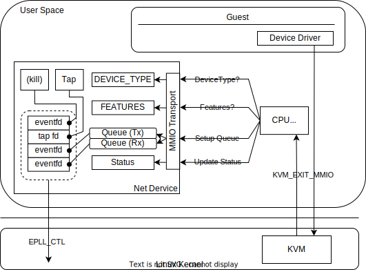

# Implement virtio-net device

本節では具体的なVirtio Deviceの実装としてNetwork Deviceの実装を行っていくことにする。
仕様はVirtioと同様OASISの公式で公開されている[Network Device](https://docs.oasis-open.org/virtio/virtio/v1.2/cs01/virtio-v1.2-cs01.html#x1-2170001)に記載があるが、本実装はこの仕様に完全に一致している訳ではないので注意されたい。
本節はこれまでに出てきた概念は特に説明なしに利用するため、これまでの節を読んでいない場合は本節の内容を読み進める前に必ず確認されたい。

### virtio-netの仕組み

virtio-net`では本来3種類のVirtqueueを利用する。それぞれ、送信キュー、受信キュー、コントロールキューと呼ばれる。
送信キューはゲストからホストに対してのデータ送信、受信キューはホストからゲストへのデータ送信に利用される。
コントロールキューはゲストからホストに対してNICの設定などを行うためのキューであり、NICのプロミスキャスモードの設定、ブロードキャスト受信やマルチキャスト受信の有効・無効化設定などを行うことに利用できる。
今回は説明と実装を最低限に留めるため、コントロールキューについてはひとまず実装を省略しているので注意されたい。
また、Virtqueuesの数は仕様上スケールさせることが認められているが、実装の単純化のためそれも行っていない。

以降では、より詳細な仕組みについて実装ベースで説明していく。

### Network Deviceの実装詳細

`virtio-net`の実装は`net.rs`に存在している。
以降では、初期化処理段階、初期化後の段階に分けて図示、解説を行っていく。

以下の図は、主に初期化処理にフォーカスしたNetwork Deviceの詳細図である。

<div align="center">

</div>

`Net`構造体は`VirtioDevice` Traitを実装しており、`MmioTransport`に紐づけられるような仕組みになっている。
前節で述べた通り、MMIO Transportの初期化処理におけるデバイス特有の処理に関してはこの`Net`構造体の実装に依存する。

例えば、初期化時に`Device Type`の問い合わせが発生するが、これに対して`Net`デバイスの場合は`0x01`を返すことが[仕様によって決まっており](https://docs.oasis-open.org/virtio/virtio/v1.2/cs01/virtio-v1.2-cs01.html#x1-2160005)、`Net`構造体では以下のような実装を行っている。

```Rust
impl VirtioDevice for Net {
    fn device_type(&self) -> u32 {
        // types::NETWORK_CARD:u32 = 0x01
        types::NETWORK_CARD
    }
    ...
}
```

同様に、`Device Feature`の問い合わせについてもそのデバイスに特有の値を返すように実装する形になっている。
また初期化処理の中で、Guest OS側でVirtqueueの`Descriptor Table`、`Available Ring`、`Used Ring`の初期化が行われ、それぞれのアドレスについて通知されるためそれをQueue毎に格納しておき、実際の処理の中でアドレスを参照できるようにしておく。  
初期化のステップが完了してStatusが特定の値に更新されると、ToyVMM側ではDeviceに実装した`activate`関数を実行し必要な処理を完了させる。
`Net`デバイスの場合はこの`activate`の中で、各種`file descriptor`を`epoll`で登録し、`epoll`に対してトリガがかかった際に実行するハンドラ(`NetEpollHandler`)のセットアップを実施している。  
`Net`デバイスはI/Oのエミュレーションするにあたりホスト側にTapデバイスを作成し、Virtqueue経由でゲストから受け取ったデータをTapデバイスに書き出すことで`Tx`を、Tapデバイスに対して着信したデータをVirtqueueに書き込んでゲストに通知することで`Rx`を実現する。  
`epoll`に登録する`file descriptor`は合計4つで、`tap`デバイスの`fd`、Tx用Virtqueueの通知に利用する`eventfd`、Rx用Virtqueueの通知に利用する`eventfd`、及び予期しない状況に陥った場合に停止させるための`eventfd`である。

次に、初期化後の状況にフォーカスしたNetwork Deviceの詳細図を以下に示す。

<div align="center">

</div>

`epoll`に登録した`file descriptor`のいずれかにトリガがかかった時、`NetEpollHandler`をディスパッチしてハンドラ処理を実行する。
`NetEpollHandler`ではどの`file descriptor`が発火したかのEVENTに応じて実施する処理が変化する。この処理の詳細については後述する。
いずれにせよ`NetEpollHandler`に実装されている処理の中でVirtqueueを参照しI/Oエミュレーションを実行している。

また、一つ重要な事実として、`KVM_EXIT_MMIO`をベースとしたDeviceの初期化処理はvCPUを処理するスレッドの中で呼び出される処理であり、ToyVMMにおいてはメインスレッドとは別のスレッドで実施されている。
一方でI/Oを実行するスレッドはvCPUを処理するスレッドとは別（現時点ではこちらをメインスレッドで処理）にしたいため、初期化した`NetEpollHandler`をメインスレッドに送るためにChannelを利用している。  
こうすることで、Guest VMの起動やCPUエミュレーション処理を別スレッドで進めつつデバイスのI/Oが処理できるようになる。

上述したとおり、Host-Guest間での通信は基本的にVirtqueueに紐づいたEventfdやTapデバイスのfdの発火を起点として`NetEpollHandler`が担当することになる。
以降では、Tx/Rxそれぞれのケースでどのように処理が実行されていくかについてより詳細に説明をしていく。

#### Tx (Guest -> Host)

まずはGuest -> Host方向の通信(Tx)について実装を見ながら詳細を説明する。
改めて、Txの場合は`Descriptor Table`、`Available Ring`、`Used Ring`はそれぞれ以下のように機能する

* `Descriptor Table` : Guestが送信しようとしているデータを指すようなDescriptorが格納されている
* `Available Ring` : 送信データを指すDescriptorのindexを格納しており、これをHostが読み取って必要なDescriptorを辿って処理する
* `Used Ring` : Host側で処理が完了したDescriptorのindexを格納し、Guestはこれを読み取って処理済みDescriptorを回収する

さてTxのケースの具体的な処理について実装をもとに説明してみる。
Txは、Guest（Guestのデバイスドライバ）がパケットを準備し、`QueueNotify`に対してWriteが走ることでToyVMMに制御が映る。

具体的に、Guestではまず以下のような処理が行われることが期待される。

1. 先頭Descriptorのaddrにデータのアドレス、lenにデータ長を代入
2. Available Ringのidxが指すAvailable Ringの空きエントリに、1のDescriptor indexを代入
3. Available Ringのidxの値をインクリメント
4. 未処理データがあることをホストに通知するために、MMIOの`QueueNotify`へ書き込み

ここからは処理がホスト側（ToyVMM）に移ってくる。
MMIOの`QueueNotify`への書き込みはによって発火したEventFdは`epoll`の監視によって拾い上げられ`NetEpollHandle`のハンドラ処理、具体的には`TX_QUEUE_EVENT`に対応する処理が実行される。

<div align="center">

</div>

実装的には`process_tx`関数が呼ばれることになる。

`process_tx`では以下のような形で処理が進んでいく。ぜひコードを確認しながら以降の解説を見てみてほしい。

1. 必要な変数等の初期化
  * `frame[0u8; 65562]` : Guest側で用意されたデータをコピーするバッファ。
  * `used_desc_heads[0u16; 256]` : 処理済みの`Descriptor`のindexを格納し、最後に`used_ring`へ値をセットするためのデータ。
  * `used_count` : Guest側のデータをどこまで読み出したか保存しておくカウンタ
2. TX用のVirtqueueをiterationして、停止するまで3~5の処理を繰り返す。(VirtqueueのIterationについては前節の説明を参照されたい)
3. `Descriptor`が指すデータ情報(`addr`の先のデータ)を読み出してバッファに積み込み、もし`next`が指す`Descriptor`があればそれをたどってデータを読みだす。 
4. 読み出したデータをtapに書き込む
5. 処理した`Descriptor`（`Available Ring`が指しているDescriptor）のindexを`used_desc_heads`に保存する。
6. 3~5のiterationで`used_desc_heads`に格納した処理済み`Descriptor`の情報`used_ring`に書き込む。
7. irqに紐づく`eventfd`に対してwriteすることでGuestに対して割り込みをかけ処理をGuestに移譲する。

<div align="center">

</div>

以降の処理はGuest側（device driver）に移譲され、以下のように処理されることが期待される。

1. `Used Ring`のidxを確認し、既に処理したindex位置との差分がある場合は、その差分を埋めるように`Used Ring`の要素(`Descriptor index`)を確認しする。  
2. `Desciptor index`が指す`Descriptor`はホストで処理されたものになるため、空き`Descriptor`チェーンに戻し記録していたDescriptor番号を更新する。
3. 1~2の処理を`Used Ring`のidxの値と記録しているindex位置の値に差分がなくなるまで繰り返す。

以上でTxの処理が完了する。

#### Rx (Host -> Guest)

次にHost -> Guest方向の通信(Rx)について実装を見ながら詳細を説明する。
Rxの場合は`Descriptor Table`、`Available Ring`、`Used Ring`はそれぞれ以下のように機能する。

* `Descriptor Table` : Tapから受け取ったデータをGuestが参照できるよう、受信データを指すようなDescriptorが格納されている。
* `Available Ring` : Guest側で処理が完了した空きDescriptorの受け渡しに利用される。
* `Used Ring` : 受信データを指すDescriptorのindexを格納しており、これをGuestが読み取って必要なDescriptorをたどって処理する。

Txの場合と比較して、ちょうど`Available Ring`と`Used Ring`の役割が逆転していることがわかるだろう。

Rxの場合はTxとは異なり二種類のイベントをトリガとする。
１つ目はTapデバイスからの受信パケット、もう一つはGuestからのRx用Virtqueueの処理完了通知である。
Rxはこの二種類のイベントトリガをうまく取り回す必要がありTxの場合に比べて煩雑になる。

以降ではまず基本的なRxの処理フローを説明した上で、考慮しなければいけない協調動作についても少し触れることにする。

##### Rxの処理の基本的なフロー

ホストはTapで受信したデータをRx用のVirtqueueに詰めてゲストに知らせることになる。
そのためにはまずRx用のVirtqueueについて、どの位置にデータを詰めればいいかなどの基本的なセットアップがなされていないといけない。
（ToyVMMからみた時、あくまでVirtqueueの各要素はゲストのメモリアドレスでしかなく、Virtqueueの仕様に基づいたメモリアクセスによって必要な処理を行っていたことを思い出してほしい）

翻って、Rxの場合Guestでは以下のような処理が行われることが期待される。

1. Descriptorチェイン等の初期化後、空きDescriptorチェーンの先頭番号をAvailable Ringのidxが指す空きエントリに代入
2. Available Ringのidxの値をインクリメント。
3. ホストに通知するために、MMIOの`QueueNotify`へ書き込み

ホスト側では、Rx Virtqueueの通知をゲストから受け取ると「Rx用のデータを詰めるための領域へのアドレスアクセスの準備が整った」と解釈することができる。

<div align="center">

</div>

さて、ここでTapデバイスにパケットが届いたとする。Tap用の`file descriptor`のトリガを検知することで、`NetEpollHandler`がディスパッチされ`RX_TAP_EVENT`のイベント処理を実施する。
この処理は基本的には`process_rx`関数を呼び出す。ある条件に従ってはその限りではないが、この条件については後ほど記載する。

`process_rx`では以下のような形で処理が進んでいく。ぜひコードを確認しながら以降の解説を見てみてほしい。

1. `process_rx`ではTapに届いた可能な限りのframeを処理するため、Tapにreadをかけデータが取得できなくなるまで2以降の処理をループする
2. Tapに対するreadが成功した場合は、読み出すことができたデータサイズを`self.rx_count`に格納しておき、単一frameを処理する関数である　`rx_single_frame`を呼び出す。
3. `rx_single_frame`ではまず`Available Ring`から先頭エントリを取得し、そのエントリが指す空き`Descriptor`チェーンの先頭を取り出す。
4. 受信した単一フレームが`Descriptor`が指す単一のエントリ（`desc.addr`, `desc.len`）に格納できるかこの時点では未知であるため、サイズを計算しながらデータを格納していく。
  * Tapが受信した単一フレームが`Descriptor`が指す単一エントリに格納できない場合は、`Descriptor`の`next`の値からチェーンをたどっていきながら可能な限り格納していく。
  * 準備できているすべてのチェーンを使用しても格納できない状況も想定される。これについては後述する。
5. Rx用Virtqueueの`Used Ring`の値を更新する。この時、Rxデータを格納したDescriptorのindex情報と、格納した合計データ量の情報を格納する。
6. irqに紐づく`eventfd`に対してwriteすることでGuestに対して割り込みをかけ処理をGuestに移譲する。

以下の図は、実際にTapから受信したデータを`Avaialble Ring`を使いながら`Descriptor`のチェーンに書きこんでいるイメージ図である。

<div align="center">

</div>

Tapからの受信データを書き終えてたら、`Used Ring`の更新を行いゲストの仮想デバイス（vNIC）に対して割り込みを入れる。

<div align="center">

</div>

ゲスト側では、`Used Ring`のindexを確認し、新しいエントリが指している`Descriptor`を参照することでRxデータを取得・処理していく。
また、その他必要な処理を行った上で、`Availble Ring`を更新して改めてデータが受け付けられる状態になったことをホストに通知する。


##### Rx用Virtqueueの準備が整っていない状況でTapのトリガが入った場合

Tapがパケットを受信した際にVirtqueueの準備ができていないケースが想定される。
この場合、Tapからデータを取り出したとしても格納する先の情報を得ることができないため処理を進めることができない。

これに対応するために、Virtqueueの準備が完了するまでTapデバイスの処理を遅らせる機構を備える必要があり、ToyVMMのコード上では`deferred_rx`というフラグでこれを制御している。

このフラグが立っている場合はToyVMMのRxに関連する処理は以下の戦略に従う

* `RX_QUEUE_EVENT`が発火した場合、つまりゲストからRx Virtqueueの受信準備が整ったという通知がくると、即座にTapデバイスからデータを取得し処理を進める。もしこれで処理が完了したらフラグを折る。
* `TAP_RX_EVENT`が発火した場合、ひとまず処理が進められるかRx Virtqueueの状況を確認しに行く。処理が進められる場合は処理を進め、処理が完了した場合フラグを折る。処理が進められない場合や、Virtqueueに詰められるデータ量が受信データ量に対して小さい場合などはフラグは折らず改めてVirtqueueの受信処理が整うのを待機する。

##### Tapによる受信が準備できているRx用Virtqueueで収まらない場合

もう一つのケースとして、上記でも軽く記載しているが、Tapで受信したデータ量が準備済みのVirtqueueに乗り切らないケースが想定される。
このケースも基本的には戦略は同じであり、`deferred_rx`のフラグ処理によって次のVirtqueueの準備が整うまで処理を一時中断し、準備が整ったら処理を再開するよう実装している。

### virtio-netの動作確認

実装した`Virtio`の機構、及びNetwork Deviceによってホストとゲストの間で通信ができるか試してみる。
以下はGuest内部で`ip addr`コマンドを実行した結果である。`eth0`が仮想NICとして認識されている。

```
localhost:~# ip addr
1: lo: <LOOPBACK,UP,LOWER_UP> mtu 65536 qdisc noqueue state UNKNOWN group default qlen 1000
    link/loopback 00:00:00:00:00:00 brd 00:00:00:00:00:00
    inet 127.0.0.1/8 scope host lo
       valid_lft forever preferred_lft forever
    inet6 ::1/128 scope host
       valid_lft forever preferred_lft forever
2: eth0: <BROADCAST,MULTICAST,UP,LOWER_UP> mtu 1500 qdisc pfifo_fast state UP group default qlen 1000
    link/ether 02:32:22:01:57:33 brd ff:ff:ff:ff:ff:ff
    inet6 fe80::32:22ff:fe01:5733/64 scope link
       valid_lft forever preferred_lft forever
```

ホスト側も確認してみる。
ToyVMMではTapデバイスをホスト側に作成しているので、IPアドレス（`192.168.0.10/24`）を付与する

```bash
140: vmtap0: <BROADCAST,UP,LOWER_UP> mtu 1500 qdisc fq_codel state UNKNOWN group default qlen 1000
    link/ether c6:69:6d:65:05:cf brd ff:ff:ff:ff:ff:ff
    inet 192.168.0.10/24 brd 192.168.0.255 scope global vmtap0
       valid_lft forever preferred_lft forever
```

合わせてGuest側にIPアドレスを付与する。ここではHostと同じサブネットレンジのアドレスを適当に付与している。

```
localhost:~# ip addr add 192.168.0.11/24 dev eth0
```

準備が整ったので、Guestの中からHostのTapインターフェイスのIPに向けてpingを実行してみると以下の通り返答がある。

```
localhost:~# ping -c 5 192.168.0.10
PING 192.168.0.10 (192.168.0.10): 56 data bytes
64 bytes from 192.168.0.10: seq=0 ttl=64 time=0.394 ms
64 bytes from 192.168.0.10: seq=1 ttl=64 time=0.335 ms
64 bytes from 192.168.0.10: seq=2 ttl=64 time=0.334 ms
64 bytes from 192.168.0.10: seq=3 ttl=64 time=0.321 ms
64 bytes from 192.168.0.10: seq=4 ttl=64 time=0.330 ms

--- 192.168.0.10 ping statistics ---
5 packets transmitted, 5 packets received, 0% packet loss
round-trip min/avg/max = 0.321/0.342/0.394 ms
```

逆にHostからGuestの`virtio-net`インターフェイスのIPに向けてpingを実行してみても同様に返答がある。

```bash
[mmichish@mmichish ~]$ ping -c 5 192.168.0.11
PING 192.168.0.11 (192.168.0.11) 56(84) bytes of data.
64 bytes from 192.168.0.11: icmp_seq=1 ttl=64 time=0.410 ms
64 bytes from 192.168.0.11: icmp_seq=2 ttl=64 time=0.366 ms
64 bytes from 192.168.0.11: icmp_seq=3 ttl=64 time=0.385 ms
64 bytes from 192.168.0.11: icmp_seq=4 ttl=64 time=0.356 ms
64 bytes from 192.168.0.11: icmp_seq=5 ttl=64 time=0.376 ms

--- 192.168.0.11 ping statistics ---
5 packets transmitted, 5 received, 0% packet loss, time 4114ms
rtt min/avg/max/mdev = 0.356/0.378/0.410/0.028 ms
```

ICMPによる簡単な確認だけだけであるが、問題なく通信ができることまで確認できた！

### Reference

* [OASIS](https://www.oasis-open.org/committees/tc_home.php?wg_abbrev=virtio)
* [ハイパーバイザの作り方](https://syuu1228.github.io/howto_implement_hypervisor/)
